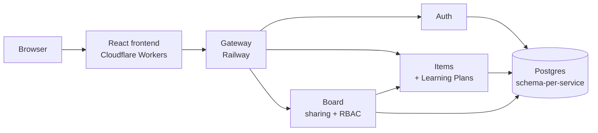

# Mehul's Study Hub

Curate and share system-design/interview-prep learning resources: save resources with
tags and notes, organize them into Learning Plans with progress tracking, and share a
curated board with a study partner under real role-based access control.

**Live**: [study-hub.mehul-patankar.workers.dev](https://study-hub.mehul-patankar.workers.dev)

## Demo

The full loop, recorded end to end against fresh accounts, nothing staged: adding
resources, organizing them into a Learning Plan, sharing a board — then, as the invited
recipient, opening the link, signing up, landing directly on the shared board, and saving
an item into their own library.

https://github.com/user-attachments/assets/5edb956a-f407-4b00-b817-120ab2fcdffd

Built as a personal project to rebuild hands-on system-design fluency — real service
boundaries, authentication/authorization, RBAC, and a real production deployment — ahead of
Senior EM/Director interviews. It's a fork of an earlier personal bookmark-manager project,
kept visible rather than hidden (see the Decision Log's #59).

## Architecture



Five independently deployable services — a stateless API Gateway, and four backend
services each owning its own Postgres schema — behind one public entry point. Full
diagrams and every service's responsibility: [`docs/learning-pack/01-system-architecture.md`](docs/learning-pack/01-system-architecture.md).

## Capabilities

- Manual resource curation — title, URL, notes, free-text multi-valued tags, tag-chip
  filtering, search, sort, list/grid views
- Learning Plans — named plans grouping resources with per-item status/priority/target
  date, a client-derived "Continue Learning" view
- Board sharing — real owner/viewer RBAC, invite links, a receiver can copy any shared
  item straight into their own library
- RS256 JWT authentication, refresh-token rotation with reuse detection, OAuth2
  client-credentials for service-to-service identity
- Deployed for real: Railway (backend) + Cloudflare Workers (frontend), auto-deploying on
  every push
- 174 backend tests across 5 services, plus real end-to-end verification via Playwright

## Notable technical decisions

- **Zero Trust between services** — the Gateway validates a JWT once, but every backend
  service independently re-verifies the same token rather than trusting the network path.
- **Schema-per-service Postgres, no cross-schema foreign keys** — the practical middle
  ground between a shared database and fully separate instances; cross-service references
  are soft (validated in code), not database-enforced.
- **A deliberate, named denormalization** — a shared board snapshots an item's display
  fields at add-time instead of calling the resource service live on every view, because
  that service can only ever answer "what's mine" — which breaks the moment someone else
  views a shared item. The trade-off (staleness) is explicit, not hidden.
- 94 decisions logged end to end — problem, options considered, what was chosen, why, and
  the trade-off accepted — not just a changelog of what shipped.

Full reasoning for every decision: [`docs/study-hub-architecture.md`](docs/study-hub-architecture.md).
A 30–45-minute interview-ready version of the whole system: [`docs/learning-pack/`](docs/learning-pack/).

## Running it locally

```bash
cp .env.example .env   # generate OAUTH_CLIENT_SECRET per the comment in that file
bash start-dev.sh
```

Full local setup, testing, and troubleshooting: [`docs/daily-startup.md`](docs/daily-startup.md).
Production deployment details: [`docs/deployment.md`](docs/deployment.md).

## Stack

Python/FastAPI/SQLAlchemy/Alembic backend, Postgres, React/TypeScript/Vite frontend,
Docker Compose locally, Railway + Cloudflare Workers in production.
