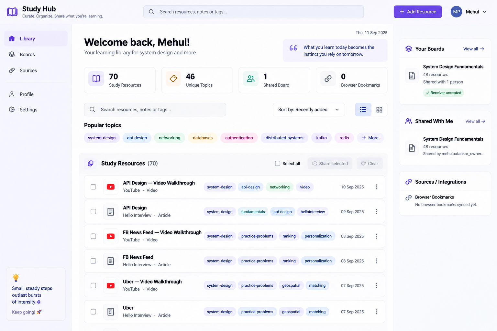

# Study Hub — UI/UX Redesign Implementation Specification

> **Status:** Implementation brief for Claude Code  
> **Purpose:** Transform the current functional Study Hub UI into a polished, portfolio-ready product without changing the existing business logic, service boundaries, sharing model, or RBAC behavior except where explicitly stated below.

## Visual reference

Use this image as **visual direction only**, not as a pixel-perfect contract:



### Critical interpretation rule

**Do not implement the visual mockup pixel-for-pixel. The current working product and architecture are authoritative. If the mockup implies functionality that the application does not currently support, omit or adapt that element rather than inventing backend functionality. Preserve business logic and RBAC first; improve presentation around it.**

---

## 1. Overall goal

Transform the current functional but prototype-looking UI into a clean, modern, portfolio-ready Study Hub that can confidently be shown:

- in a public GitHub README
- to recruiters
- during Engineering Manager / Senior EM interviews
- as a deployed personal learning product

The UI should feel like a lightweight modern developer/productivity tool.

**Design direction:** clean, calm, professional, minimal.

Think closer to **Linear / GitHub / Notion / modern SaaS developer tools**. Do **not** make it flashy, overly animated, glassmorphic, heavily gradient-based, or dashboard-heavy purely for appearance.

The application should continue to reflect the project's architectural philosophy: introduce complexity only when it solves a real problem.

---

## 2. Hard constraints

Do not change the following unless specifically required below:

| Area | Rule |
|---|---|
| Auth | Preserve current login/signup/token/refresh behavior |
| RBAC | Owner and Viewer behavior must stay exactly enforced |
| Sharing | Preserve current board creation/invite/share mechanics |
| Study resources | Preserve existing CRUD behavior |
| Tags | Preserve free-text multi-valued tags and filtering |
| Boards | Preserve owner Add Resources / Remove functionality |
| Viewer boards | Must remain read-only; owner actions must not render |
| Browser bookmarks | Keep as a secondary/dormant source |
| Twitter | Do not reintroduce Twitter UI |
| API architecture | Do not restructure service boundaries |
| State architecture | Do not introduce Redux/Zustand/TanStack Query |
| Styling | Stay with plain CSS; do not introduce Tailwind/MUI/Chakra/etc. |
| Routing | Keep existing React Router structure |

The project intentionally uses React Context, thin API modules, plain `fetch`, and plain CSS. Respect that architecture.

---

## 3. Small backend prerequisite: first name

Before the visual redesign, add `first_name` to the user identity.

This is the only intentional backend/data-model feature change in this UI pass.

### Auth database

Add:

```text
first_name TEXT NULL
```

to `auth.users`.

Requirements:

- Create a normal Alembic migration using the existing per-service migration conventions.
- Keep it nullable at DB level so existing seeded users continue working.
- Do not wipe/recreate dev data merely for this field.

### Signup contract

Update signup to collect:

```text
First name
Email
Password
```

`first_name` rules:

- trim leading/trailing whitespace
- reject newly submitted blank/whitespace-only values
- first name only; no last-name requirement
- no username
- no profile system
- no avatar upload

### Auth responses

Where the frontend gets the authenticated user's identity, include:

```ts
first_name: string | null
```

Update:

- ORM model
- migration
- Pydantic signup request/response schemas
- `/me` response
- frontend API types
- signup form

Do **not** add `first_name` to JWT claims merely for UI convenience unless the current architecture genuinely requires it. Prefer `/me` as the display-identity source.

### Existing users

For existing users where `first_name === null`, use a neutral fallback:

```text
Welcome back
```

Do not derive a display name from the email address.

### Seed data

If convenient, update the reproducible seed script so future demo accounts include simple first names. Do not hardcode the real user's name inside React components.

---

## 4. Global visual design system

Centralize reusable values in `index.css` using CSS custom properties.

Suggested starting point:

```css
:root {
  --color-bg: #f7f8fc;
  --color-surface: #ffffff;
  --color-surface-subtle: #fafaff;

  --color-text: #17171f;
  --color-text-secondary: #626579;
  --color-text-muted: #8b8ea3;

  --color-primary: #6750e8;
  --color-primary-hover: #5943d5;
  --color-primary-soft: #f0edff;

  --color-border: #e7e8ef;
  --color-border-strong: #d8dae5;

  --color-success: #24865a;
  --color-success-soft: #eaf7f0;

  --color-danger: #c54141;
  --color-danger-soft: #fff0f0;

  --radius-sm: 6px;
  --radius-md: 10px;
  --radius-lg: 14px;

  --shadow-sm: 0 1px 2px rgba(0,0,0,0.04);
  --shadow-md: 0 6px 18px rgba(30,30,60,0.07);

  --content-max-width: 1180px;
}
```

These exact hex values may be adjusted slightly, but preserve:

- one primary purple/indigo accent
- neutral surfaces
- subtle borders
- restrained shadows
- good contrast
- no unnecessary rainbow palette

---

## 5. Typography

Prefer:

```css
font-family:
  Inter,
  ui-sans-serif,
  system-ui,
  -apple-system,
  BlinkMacSystemFont,
  "Segoe UI",
  sans-serif;
```

Do not add a remote font dependency solely for Inter if system fonts are sufficient.

Suggested hierarchy:

| Element | Approx. size |
|---|---:|
| Product name | 20–22px |
| Main page heading | 28–32px |
| Section heading | 18–20px |
| Card/resource title | 14–16px |
| Body | 14px |
| Secondary/meta | 12–13px |
| Tags | 11–12px |

Suggested weights:

- page title: 700
- section heading: 650/700
- resource title: 600
- body: 400
- metadata: 400

Avoid making everything bold.

---

## 6. Authenticated application shell

Create a reusable shell for authenticated pages.

Likely components:

```text
AppLayout.tsx
AppHeader.tsx
Sidebar.tsx
```

Use the current architecture conventions and folder structure. Do not over-componentize trivial markup.

### Desktop structure

```text
-------------------------------------------------------
Top Header
-------------------------------------------------------
Sidebar | Main Content                  | Optional aside
-------------------------------------------------------
```

The right-side cards from the reference can either be part of a responsive grid or an aside. Do not make the app dependent on a fixed three-column desktop width.

---

## 7. Header

Replace the current floating title plus default Logout button.

### Left

Brand:

```text
Study Hub
Curate. Organize. Share what you're learning.
```

Subtitle may disappear on narrow screens.

Use a lightweight book/library icon if feasible. Prefer inline SVG or an already-existing icon solution; do not add a large icon dependency just for a few icons.

### Search

On the Library page, show:

```text
Search resources, notes or tags...
```

If global placement is awkward, keep search inside the Library content. Do not pretend it searches boards if it only searches Study Resources.

### Right

Primary action:

```text
+ Add Resource
```

Then user identity:

```text
[M]  Mehul  ▾
```

The menu only needs:

```text
Log out
```

Do not create Profile or Settings pages merely because they appeared in the visual mockup.

Avatar should derive from `first_name`, such as the first letter.

---

## 8. Sidebar

Authenticated desktop pages should share a simple sidebar.

Primary navigation:

```text
Library
Boards
```

Secondary section:

```text
Sources
  Browser Bookmarks
```

If Browser Bookmarks does not warrant a separate route, the Sources item may navigate/scroll to its section.

Do not create empty Profile/Settings pages.

Active item:

- soft purple background
- primary-colored icon/text

Approximate width:

```text
200–220px
```

---

## 9. Responsive behavior

This must not be desktop-only.

At roughly 900–960px and below:

- collapse sidebar or expose it through a menu
- switch content to one column
- move right-side/board summary cards below main content
- search becomes full-width
- metadata/tags may wrap
- controls remain usable

At mobile widths:

- hide nonessential subtitles
- reduce page padding
- cards remain readable
- tags wrap naturally
- primary action remains accessible
- dialogs fit within the viewport

Do not solve responsiveness with horizontal scrolling.

---

## 10. Dashboard / Library information hierarchy

The Library page should become the strongest page in the product.

Suggested order:

```text
Welcome
Summary metrics
Search + sort/filter
Popular topics
Study Resources
Boards / sharing summary
Sources / Browser Bookmarks
```

---

## 11. Welcome area

If `first_name` exists:

```text
Welcome back, Mehul!
Your learning library for system design and more.
```

Fallback:

```text
Welcome back
Your learning library for system design and more.
```

Never derive the user's name from email.

---

## 12. Affirmation widget

Keep the existing affirmation feature and its client-side/static behavior.

Restyle it from a full-width thin banner into a compact, integrated card:

```text
❝ What you learn today becomes the instinct
  you rely on tomorrow.
```

Use:

- soft purple surface
- modest radius
- subtle quote icon
- secondary typography

It should remain visually subordinate to Study Resources.

Do not change the existing 2.5-minute rotation logic.

---

## 13. Dashboard summary cards

Show up to four lightweight cards when the underlying data is already available:

```text
70
Study Resources

46
Unique Topics

1
Your Boards

0
Browser Bookmarks
```

Never hardcode values.

### Study Resources

Use `resources.length`.

### Unique Topics

Derive client-side:

```ts
new Set(resources.flatMap(r => r.tags)).size
```

No backend endpoint needed.

### Boards

Use the current owner-board list. Label semantics accurately; if the API returns all owned boards, use **Your Boards**, not **Shared Boards** unless they are all actually shared.

### Browser Bookmarks

Use already-loaded data. If this number would require a new API solely for a metric, omit the card instead.

Cards should not be clickable unless a clear navigation target exists.

---

## 14. Client-side Study Resource search

Add immediate client-side search for the current resource set.

Placeholder:

```text
Search resources, notes or tags...
```

Match case-insensitively against:

- title
- URL / hostname
- notes
- tags

Search must compose with tag filtering.

Example:

```text
active tag = networking
search = redis
```

should return only items matching both.

No submit button. No backend search endpoint at this scale.

---

## 15. Topic/tag filtering

Do not permanently show the entire tag vocabulary.

Show a curated/popular subset, e.g. top 7–9 by usage:

```text
Popular topics

system-design
api-design
networking
databases
authentication
distributed-systems
kafka
redis
+ More
```

Compute popularity client-side from loaded resources.

`+ More` should reveal a full topic selector or expandable area. Ideally include:

```text
Search topics...
```

Preserve current single-active-tag semantics unless current code already supports something else.

Active chip:

- primary/purple fill
- high contrast text

Inactive chip:

- subtle neutral or outlined style

Always retain an obvious reset such as `All`.

---

## 16. Study Resources toolbar

At list header:

Left:

```text
Study Resources (70)
```

Right:

```text
Select all
Share selected
Clear
```

Optional sorting:

```text
Sort by:
Recently added
Title A–Z
```

Only implement sorting supported by real fields already available or safely exposed from existing item data. If no reliable timestamp is in the frontend contract, omit Recently Added rather than inventing dates.

---

## 17. Resource rows

Keep current **collapsed-by-default** behavior.

Suggested collapsed layout:

```text
[ ] [source icon] API Design — Video Walkthrough
                  YouTube · Video

                  [system-design] [api-design]
                  [networking] [video]

                                             ⋮
```

Do not force all metadata onto one line.

---

## 18. Human-readable source/domain labels

Derive these client-side from URLs.

Examples:

```text
youtube.com         → YouTube
hellointerview.com  → Hello Interview
bytebytego.com      → ByteByteGo
github.io           → GitHub
```

Fallback to hostname.

Do not create a backend classification service.

---

## 19. Resource icon

Use a lightweight consistent source icon/favicons approach.

Examples:

- YouTube → recognizable video/source icon
- article → document/link icon
- known favicon where already available

Do not add metadata scraping or a remote enrichment service.

---

## 20. Expanded resource state

Expanded row should reveal:

```text
Notes
<user notes>

Open resource ↗

Edit
Delete
```

Title click must continue opening the original URL in a new tab.

Expansion arrow remains a separate control.

Do not make the whole row unexpectedly navigate away.

---

## 21. Button system

Replace all browser-default controls with consistent styles.

### Primary

Use for:

```text
Add Resource
Share selected
Add Selected
Create account
Log in
```

### Secondary

Use for:

```text
Edit
Cancel
Add Resources
```

### Danger

Use for:

```text
Delete
Remove
```

Prefer restrained danger treatment such as red text / soft red hover, not large bright red filled buttons everywhere.

Buttons should have consistent:

- height
- padding
- radius
- hover/focus states
- disabled states

---

## 22. Bulk selection

Preserve current mechanics.

When none selected:

```text
0 selected
Share selected disabled
Clear disabled
```

When selected:

```text
3 selected
Share selected
Clear
```

Keep Select All disabled when there are zero resources.

Optional: selected rows may use a subtle primary-soft background/border.

Selection must continue working while rows are collapsed.

---

## 23. Add/Edit Resource dialog

Reuse the current single dialog for both create and edit.

Do not split it into two components unless the current code genuinely benefits.

Suggested desktop width:

```text
520–600px
max-width: calc(100vw - 32px)
```

Fields:

```text
Title
URL
Notes
Tags
```

Use:

- labels above inputs
- 40–44px control heights
- larger textarea
- subtle border
- ~10px radius
- clear focus outline

For tags, use:

```text
Tags
Separate tags with commas.
```

Placeholder:

```text
system-design, distributed-systems
```

Do not build a sophisticated tag editor/autocomplete unless it is trivial and safe.

Buttons:

Create mode:

```text
Cancel      Add resource
```

Edit mode:

```text
Cancel      Save changes
```

---

## 24. Boards page

Boards should have much more visual prominence because they demonstrate sharing and RBAC.

Create/refine a Boards destination containing:

```text
Your Boards
Shared With Me
```

Use the existing Board APIs. Do not invent a new aggregation API.

---

## 25. Your Boards cards

Example:

```text
System Design Fundamentals
48 resources

Shared with 1 person
✓ Receiver accepted

Open board →
```

Do not expose raw backend concepts such as grant IDs or UUIDs unless intentionally needed for debugging.

For multiple recipients:

```text
Shared with 3 people
```

---

## 26. Shared With Me cards

Example:

```text
System Design Fundamentals
48 resources

Shared by Mehul
Open board →
```

If the owner has no first name, fall back to the existing owner email.

Do not expose any additional identity information beyond what the app already has.

---

## 27. Board page — common layout

Owner and Viewer pages share a common base layout.

Header:

```text
‹ Boards

System Design Fundamentals
48 resources
```

Then role-specific access information/actions.

Use the same general resource-row visual language as the Library where sensible. Avoid maintaining two unrelated visual systems.

---

## 28. Owner board page

Owner status:

```text
You own this board
Shared with 1 person
```

Primary owner action:

```text
+ Add Resources
```

Each board resource has:

```text
Remove
```

Remove must remain owner-only.

Do not render disabled owner controls for Viewer.

---

## 29. Viewer board page

Replace the current plain viewer text with a polished read-only access banner:

```text
👁 Read-only board
Shared with you by Mehul
```

Fallback:

```text
Shared with you by <owner email>
```

Viewer may see:

- board name
- resource list
- links

Viewer must not see:

- Add Resources
- Remove
- Edit
- Delete
- share-management controls

Do not render disabled versions of those controls.

---

## 30. Add Resources to Board dialog

Restyle the current functionality but preserve behavior.

Required:

- list only resources not already on board
- title/resource filtering
- checkbox selection
- Add Selected
- existing board resources should not appear merely disabled

Suggested layout:

```text
Add resources to "System Design Fundamentals"

Search resources...

[ ] API Design
    #system-design #api-design

[ ] Redis
    #databases #caching

Cancel                    Add 2 resources
```

If practical, reflect selected count in the action button.

---

## 31. Login page

The current login is visually the most prototype-like screen.

Redesign as a centered auth card.

Page background:

```text
light neutral gray
```

Card:

```text
white
~400px width
14px radius
subtle border/shadow
```

Above/inside:

```text
Study Hub
Organize what you're learning.

Welcome back

Email
[                        ]

Password
[                        ]

[        Log in         ]

New here? Create account
```

Preserve login logic and route-return behavior exactly.

---

## 32. Signup page

Same visual language as Login.

Fields:

```text
First name
Email
Password
```

Header:

```text
Create your account
```

Button:

```text
Create account
```

Footer:

```text
Already have an account? Log in
```

Preserve the return-path forwarding between login/signup and protected invite routes.

---

## 33. Browser Bookmarks / Sources

Do not remove Browser Bookmarks.

Visually de-emphasize it because the active product story is now Study Hub manual curation/sharing.

Possible treatment:

```text
Sources / Integrations

Browser Bookmarks
No browser bookmarks synced yet.
```

If bookmarks exist, retain their existing structure.

Primary product story should be:

```text
curate → organize → study → share
```

not “browser bookmark manager.”

---

## 34. Empty states

Replace plain italic text with intentional compact empty-state cards.

### Study Resources

```text
No study resources yet

Save articles, videos and system-design references
so your learning material stays in one place.

+ Add your first resource
```

### Boards

```text
No boards yet
Select resources from your Library and share them as a board.
```

### Shared With Me

```text
Nothing has been shared with you yet.
```

### Browser Bookmarks

```text
No browser bookmarks synced yet.
```

No giant illustrations required.

---

## 35. Loading states

Where a page currently renders blank while waiting, provide a minimal readable state:

```text
Loading resources...
```

or a few simple skeleton rows.

Do not introduce a skeleton framework.

---

## 36. Error states

Errors must be human-readable.

Avoid exposing raw strings such as:

```text
500
Failed fetch
undefined
```

Prefer:

```text
We couldn't load your resources.
Please try again.
```

Keep useful technical diagnostics in console/logging where appropriate.

---

## 37. URL presentation

Do not prominently show full URLs in every collapsed row.

Collapsed:

```text
Hello Interview · Article
```

Expanded:

```text
hellointerview.com/learn/system-design/...
```

or:

```text
Open original resource ↗
```

Use ellipsis for long URLs where appropriate.

---

## 38. Accessibility

This is not a purely cosmetic pass.

Ensure:

- visible focus states
- actions are actual `<button>` elements
- navigation URLs are actual links
- input labels are associated correctly
- modals have accessible titles
- icon-only controls have `aria-label`
- readable text contrast
- no inaccessible clickable `<div>` substitutes
- reasonable click target sizes

Common control height target:

```text
~36–40px minimum
```

---

## 39. Confirmation dialogs

Existing native browser confirmations may remain for Delete/Remove in this pass.

Do not build a custom confirmation-dialog framework solely for visual consistency unless the existing dialog infrastructure makes it very easy.

---

## 40. Dates

Only display dates when a reliable timestamp is genuinely supplied.

Use a readable format such as:

```text
10 Sep 2026
```

Never expose raw ISO timestamps or invent seeded dates.

If a suitable timestamp is not in the frontend API contract, omit dates from v1 of the redesign.

---

## 41. Icons

Use a small consistent icon vocabulary:

```text
Library
Boards
Source/link
Search
Add
More menu
Read-only
Book/resource
Video
Article
```

Prefer one visual style. Avoid random mixtures of emojis, outline icons, filled icons and unrelated SVG styles.

Site favicons/source marks may be used intentionally for resource source branding.

---

## 42. Animation

Keep movement minimal.

Allowed:

- subtle hover transitions
- button transitions
- modest modal fade/scale
- active-navigation transitions

Avoid:

- page fly-ins
- animated metric counters
- bouncing buttons
- parallax
- animated background gradients

---

## 43. Public portfolio consideration

Do not alter demo identities silently during this implementation, but flag that public README screenshots should ideally use neutral demo accounts rather than exposing a personal Gmail address.

Treat this as a follow-up unless explicitly approved.

---

## 44. CSS organization

Avoid one huge unstructured stylesheet.

Suggested organization:

```text
index.css
  global tokens
  base/reset
  generic buttons/inputs
  core layout primitives

component/page CSS
  component-specific styling
```

If the project currently uses one stylesheet, improve organization without adding CSS Modules or a styling library purely for this redesign.

---

## 45. Suggested component structure

Possible additions:

```text
components/
  AppHeader.tsx
  Sidebar.tsx
  StatCard.tsx
  TagChip.tsx
  ResourceRow.tsx
  EmptyState.tsx

layout/
  AppLayout.tsx
```

Do not create a component for every trivial span or wrapper.

Prefer improving/reusing existing components such as:

```text
StudyResources.tsx
ResourceFormDialog.tsx
MyBoards.tsx
SharedWithMe.tsx
BoardItemsList.tsx
AddItemsToBoardDialog.tsx
```

Preserve the existing separation between API, state, pages and components.

---

## 46. API/data-fetching rule

Before adding any new backend endpoint, first check whether the value can be derived from already-loaded frontend data.

These should stay client-side initially:

```text
resource count
unique tag count
popular tags
resource search
domain/source label
```

Do not add endpoints such as:

```text
GET /statistics
GET /popular-tags
GET /search
GET /dashboard-summary
```

for the current local dataset.

---

## 47. Architecture/Decision Log discipline

This redesign contains at least two real decisions worth logging:

- adding first name to User identity for product personalization
- introducing the Study Hub application shell / client-side search / condensed tag presentation

Use the **next actual decision numbers** in the current Decision Log; do not assume numbers from this document if newer decisions exist.

Follow `CLAUDE.md` exactly:

- read architecture doc first
- one decision at a time
- log real decisions
- never delete superseded decisions; mark supersession
- do not commit unless explicitly asked
- after implementation, provide a mechanics walkthrough

---

## 48. Backend tests

Add/update Auth tests for:

```text
signup accepts first_name
signup trims first_name
blank first_name rejected for new signup
/me returns first_name
existing nullable first_name response remains valid
```

Do not weaken current authentication/session coverage.

---

## 49. Frontend/regression tests

Verify at minimum:

```text
Signup captures first name
Login still works
Welcome uses first name
Null first name uses neutral fallback
Search filters title
Search filters notes
Search filters tags
Tag + search compose correctly
Popular tags are derived correctly
Create/edit/delete still update resource list
Selection/share still works
Owner board controls still render
Viewer board controls still do not render
Add Resources still excludes existing board items
Logout still works
Invite login/signup redirect still works
```

---

## 50. Update the existing manual-testing checklist

Extend `docs/manual-testing-checklist.md` rather than creating a second parallel checklist.

Add checks for:

```text
signup first name
welcome greeting
client-side resource search
More topics / full tag selector
responsive layout
owner board appearance
viewer read-only banner
auth-page appearance
```

Do not remove any existing RBAC/access-control checks.

---

## 51. Regression requirements

After redesign, all of these must still work:

| Flow | Expected |
|---|---|
| Login | Successful |
| Signup | Successful + first name |
| Refresh session | Successful |
| Logout | Redirect to login |
| Add resource | Immediate UI update |
| Edit resource | Immediate UI update |
| Delete resource | Immediate UI update |
| Filter tag | Correct items only |
| Search | Correct items only |
| Select multiple | Works while collapsed |
| Share selected | Creates board |
| Your Boards | Updates |
| Shared With Me | Correct |
| Owner board | Add/Remove visible |
| Viewer board | No mutation controls |
| Unauthorized board | Existing 404 behavior retained |
| Invite flow | Return-path behavior retained |
| Refresh while logged in | Session persists |
| Browser bookmarks | Existing behavior retained |

---

## 52. Implementation order

Follow this sequence:

1. Read `CLAUDE.md` and `docs/study-hub-architecture.md`; inspect actual current code before changing anything.
2. Add `first_name` end-to-end in Auth + frontend signup/API types.
3. Add/update tests for first name.
4. Introduce global visual tokens/base styles.
5. Build authenticated `AppLayout`, header and sidebar.
6. Redesign Login/Signup.
7. Redesign Library/Dashboard welcome + metrics.
8. Add client-side search and popular-topic treatment.
9. Redesign Study Resource rows and selection toolbar.
10. Restyle Add/Edit Resource dialog.
11. Build/refine Boards page using existing `MyBoards` and `SharedWithMe`.
12. Redesign owner Board page.
13. Redesign viewer Board page/read-only banner.
14. Restyle Add Resources dialog.
15. Restyle/de-emphasize Browser Bookmarks.
16. Add responsive behavior.
17. Update tests/manual checklist.
18. Update Decision Log.
19. Run frontend compile/lint and relevant backend suites.
20. Perform the existing owner/receiver manual browser flow.
21. Provide a concise mechanics walkthrough, file by file.
22. **Do not commit anything until explicitly asked.**

---

## 53. Definition of done

The redesign is complete only when all of the following are true.

### Visual

The app no longer looks like default browser controls around a CRUD prototype. Login, Library, Boards and dialogs share one coherent visual language.

### Functional

Study Resource CRUD, sharing, board management and RBAC are unchanged and pass regression testing.

### Personalization

New users enter a first name and the authenticated UI uses it appropriately.

### Architectural

No unnecessary APIs, state libraries, CSS frameworks or component libraries have been introduced.

### Portfolio-ready

A dashboard screenshot communicates within a few seconds that this is a real Study Hub with resources, topics, boards and sharing—not just a bookmark list.

### Explainable

Every meaningful change can still be defended through the project's decision-oriented architecture story.

---

# Claude Code execution prompt

Use this prompt when asking Claude Code to implement the redesign:

```text
Please implement the Study Hub UI/UX redesign described in:

  study-hub-ui-redesign-spec.md

The same directory contains the visual reference image:

  study-hub-ui-redesign-reference.png

Before changing anything:
1. Read CLAUDE.md completely.
2. Read docs/study-hub-architecture.md and treat it as the authoritative architecture/Decision Log.
3. Read docs/manual-testing-checklist.md.
4. Inspect the current code and verify the spec against the actual implementation. Do not assume filenames or behavior solely from the redesign document if the code has moved forward.

Critical instruction:
Do NOT try to implement the supplied visual mockup pixel-for-pixel. Treat the image as visual direction only. The current working product and architecture are authoritative. If the mockup implies functionality the application does not currently support, omit or adapt that element rather than inventing backend functionality. Preserve existing business logic, service boundaries, auth behavior, sharing flows and RBAC first; improve the presentation around them.

The redesign spec is intentionally detailed. Follow it closely, including the small first_name change to Auth/signup, but do not introduce extra frameworks, backend APIs, profile/settings features, or other functionality that the document explicitly says not to add.

Work in the implementation order defined in the spec. Make real decisions one at a time and update docs/study-hub-architecture.md using the project's existing Decision Log discipline. Never delete superseded decisions; mark them superseded if necessary.

Preserve all current regression-critical behavior, especially:
- login/signup/session refresh/logout
- invite return-path behavior
- Study Resource CRUD
- tag filtering
- selection and sharing
- Your Boards / Shared With Me
- owner Add Resources / Remove controls
- Viewer read-only behavior with no owner mutation controls rendered
- unauthorized-board 404 behavior
- Browser Bookmarks existing behavior

Derive dashboard counts, popular tags, resource search and source/domain labels client-side from already-loaded data wherever the spec says to do so. Do not add new statistics/search/tag APIs simply to match the mockup.

Run the relevant backend tests, frontend TypeScript/lint checks, and the existing owner/receiver browser/manual flow after implementation. Update docs/manual-testing-checklist.md with the new UI checks described in the spec.

After completing the work, give me:
1. a concise summary of what changed,
2. a file-by-file mechanics walkthrough,
3. the tests/checks you ran and their results,
4. any deliberate deviations from the redesign spec and why,
5. any remaining gaps or follow-up items.

Do NOT commit anything unless I explicitly ask you to commit.
```
