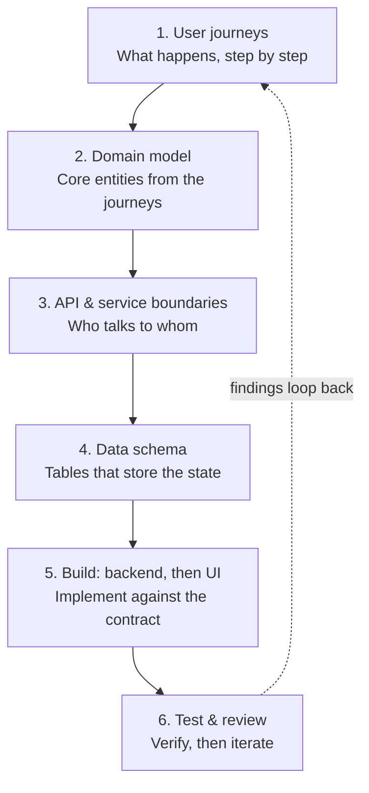
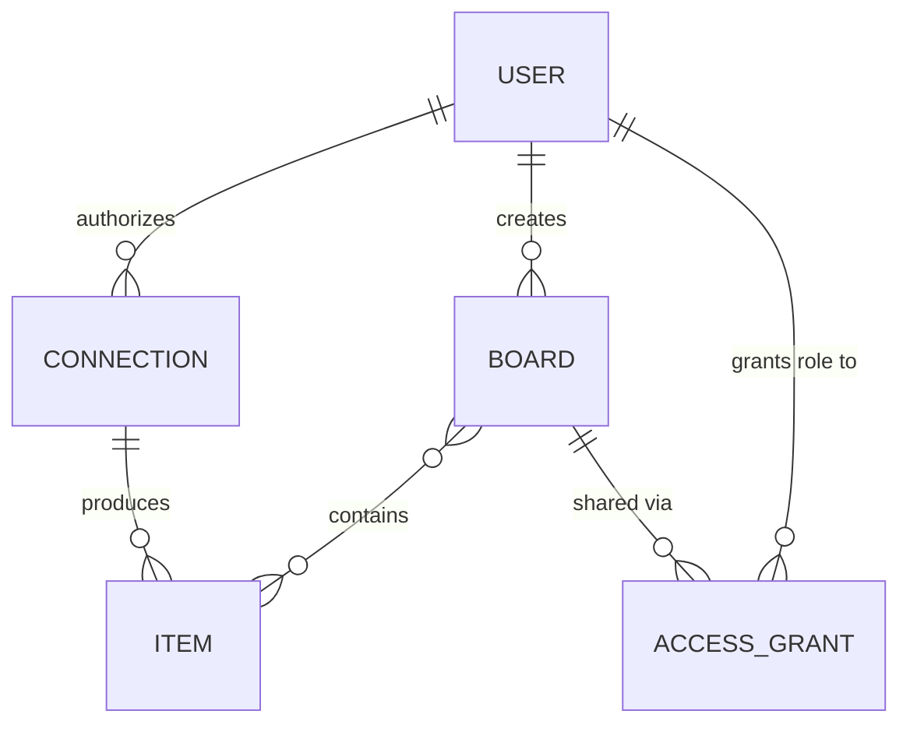
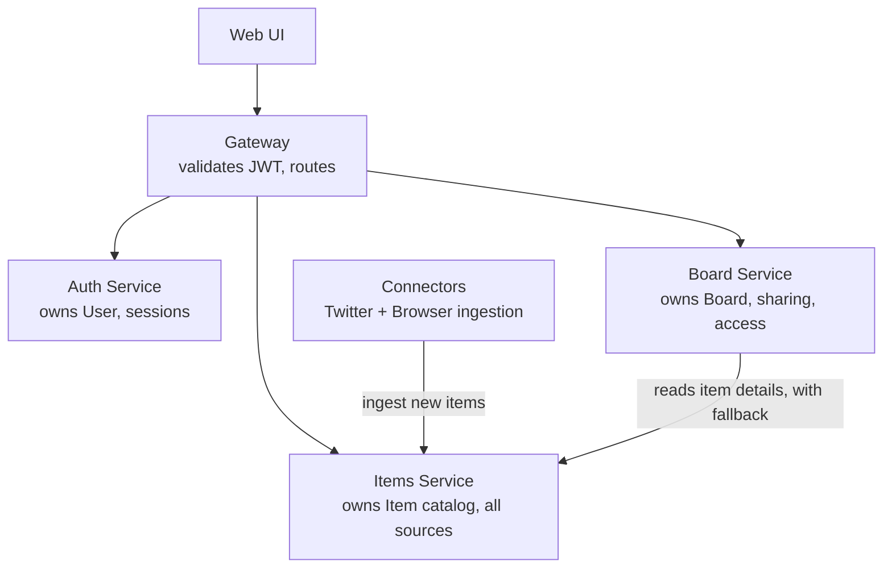

# Bookmarks Hub — Architecture & Decision Log

**Purpose of this doc:** A living record of every design decision made while building this project, and why. This is the primary artifact — the goal is to be able to defend each decision in an interview, not just to have working code. Update this doc every time a real decision is made, in Claude chat or in Claude Code.

**Project goal:** A personal, learning-focused project to rebuild hands-on system design fluency (architecture, microservices, auth/authz, RBAC, basic UI) ahead of Senior EM / Director interviews. Not a coding-skill exercise — the point is being able to explain and defend every architectural choice.

---

## Problem Scope

A personal "bookmarks hub" — a single place to view bookmarks saved across different sources (browser bookmarks first, Twitter/X later), displayed as tiles, organized by source, with the ability to share a curated board with another person under real Owner/Editor/Viewer permissions.

**In scope (in build order):**
1. Browser bookmarks (Chrome + Firefox, via a shared WebExtensions-based browser extension) — free, no third-party API cost
2. Tile dashboard, organized by source
3. Sharing with real RBAC (Owner / Editor / Viewer)
4. Twitter/X bookmarks (OAuth2 + PKCE) — added last, since it requires a paid X developer account

**Explicitly out of scope:** CVE/vulnerability tracking (dropped — kept the personal project personal, separate from work-adjacent content).

## How We're Building This (Process)

1. **User journeys** — what actually happens, step by step, from the user's point of view
2. **Domain model** — the core entities/nouns that fall out of those journeys
3. **API & service boundaries** — which service owns which verb, who talks to whom
4. **Data schema** — tables that store the state, designed only after 1–3 are settled
5. **Build: backend, then UI** — implement against the contract already defined
6. **Test & review** — verify, then loop findings back into step 1

Working style: step by step, one decision at a time. Each decision gets explained (what we chose, what the alternatives were, why) before moving to the next. No large chunks of generated code without understanding checkpoints.

## Hosting / Environment Decisions

- **Build phase:** entirely local via Docker Compose. No cost, fast iteration, no vendor quirks to learn alongside the architecture itself.
- **Twitter OAuth testing:** will need a public HTTPS callback — use a tunnel tool (ngrok / Cloudflare Tunnel) rather than deploying early.
- **Live demo deploy (near interview time, optional):** Render, using a paid Starter tier ($7/mo) or accepting cold starts on the free tier — avoiding Render's free Postgres, which auto-deletes after 30 days.
- **Tooling:** Claude Code (VS Code) for implementation once set up on the personal laptop (setup pending — previous integration was on the now-departing office Mac). Architecture/decision conversations continue here in Claude chat.

## Data Model (early sketch — will be refined at Step 4)

`Users`, `Boards`, `BoardItems` (normalized: title, url, thumbnail, source, tags, saved_at), `BoardShares` (board_id, user_id, role: Owner/Editor/Viewer)

## Open Design Questions

*(Previously open: "Where should RBAC be enforced — gateway-level only, or also independently per service?" — resolved by Decision #30: both. Gateway does coarse validation, backend services independently re-verify the JWT for fine-grained checks.)*

## Concepts Learned (for interview articulation)

- **Entity vs. code distinction:** something belongs in the data model (an entity/table) if a background process needs to read it again later, without the user present. If it only matters in the instant it's happening, it's code, not data. Example: the OAuth handshake with Twitter is code (runs once); the access token it produces is data (must persist so the ingestion connector can keep working weeks later without re-authorization) — hence `Connection` is an entity, not just logic.
- **Zero Trust Architecture (NIST SP 800-207):** never trust a service-to-service call just because of network location ("it's inside our VPC" is not a control). Every internal call gets authenticated and authorized independently. In production this is usually mTLS via a service mesh (Istio/Linkerd) with SPIFFE/SPIRE giving each workload a cryptographic identity, plus a policy engine (OPA) for authorization — full audit trail of real service identity, not just "someone with the key." This project approximates the same identity principle (short-lived, per-service, verifiable tokens) via OAuth2 client-credentials flow, without the mesh infrastructure — a deliberate scope trade-off worth stating explicitly as "how this scales at a real company" in an interview.
- **Debugging cross-boundary PATH resolution (WSL):** hit a real bug where `npm` was found but `node` wasn't. Root cause: WSL exposes Windows executables into its own PATH by default ("interop"), so a Windows-side Node.js install was leaking into the Linux environment inconsistently. Diagnosed with `which node` / `which npm` — showing one resolving to `/mnt/c/Program Files/...` (Windows) confirmed the cross-boundary leak. Fixed by installing Node natively via nvm, which takes PATH priority. Good general lesson: when two tools that should behave the same way don't, check *where* each one is actually resolving from before assuming either is broken.

## Step 2: Domain Model — DRAFT (pending further discussion)

Entities identified from the four journeys, and why each earns its own table rather than being folded into another:

- **User** — the account table. Appears in two different relationships (the owner who creates boards/connections, and a recipient who receives access) but it's the same entity both times — the relationship differs, not the underlying thing.
- **Connection** — one authorized link to a source (Twitter OAuth tokens + expiry, or the browser extension's registration + last-synced time). Needs its own entity because a background ingestion process reads it again on every future run.
- **Item** — the normalized shape of "one bookmark," regardless of source (title, url, source, folder path if applicable, preview data, saved_at). Lets one UI component render items from any source, and is what a Board actually references.
- **Board** — a purpose-built sharing container, created only when items are explicitly selected and shared. Not the same as the default Twitter/Browser dashboard views, which are just "all your own items, filtered by source" — no Board involved there, since the owner always sees everything directly.
- **Access Grant** — conceptually "a board grants a role to a user." Will split into two real states at schema time (Step 4): a pending invite keyed by email (with an expiring token, before the recipient has an account) and a settled share keyed by user_id once they've signed up.

Relationships in plain language:
`User` authorizes many `Connection`s → each `Connection` produces many `Item`s → `User` creates many `Board`s → `Board` contains many `Item`s (many-to-many) → `Board` is shared via many `Access Grant`s → each `Access Grant` grants a role to one `User` (the recipient).

No columns/types yet — that's Step 4 (data schema), after API/service boundaries (Step 3) are settled.

## Step 3: API & Service Boundaries — DRAFT (pending further discussion)

Four services, each with a single data owner:

- **Gateway** — owns no data. Validates the JWT once per request, attaches user identity, routes to the right service. Coarse-grained auth check only ("is this a valid logged-in user") — fine-grained role checks (can *this* user edit *this* board) live inside Board service, since only it knows the role for that specific board.
- **Auth service** — owns `User`. Verbs: signup, login, issue/refresh JWT.
- **Items service** — owns `Item`. Verbs: ingest (write a new normalized item — called by connectors), list/get items (called by the UI directly, and by Board service when composing a board view).
- **Connectors** (Twitter, Browser) — own `Connection`. Verbs: authorize, fetch/sync from the external source, normalize, then call Items service's ingest endpoint. Connectors do not store `Item` themselves — they're workers, not data owners, which keeps a single source of truth for items regardless of source.
- **Board service** — owns `Board`, the Board↔Item join, and `Access Grant`. Verbs: create board, add/remove items, invite, list board contents (composing item details from Items service — see Decision #11).

**Internal service-to-service auth (resolved):** OAuth2 client-credentials flow — see Decision #12.

## Step 4: Data Schema — DRAFT (pending further discussion)

**Data separation:** one Postgres instance, one schema per service (see Decision #13). **FK rule:** real foreign keys within a service's own schema; cross-schema references are plain UUID columns validated by application code, never a database-level FK (see Decision #14).

### `auth` schema
- **users**: id (uuid, PK, default `gen_random_uuid()` — requires the `pgcrypto` extension), email (text, unique, not null — lowercased by application code before every write/read, not `citext`), password_hash (text, not null — Argon2id via `argon2-cffi`, see Decision #18), created_at (timestamptz, default `now()`), updated_at (timestamptz, default `now()`, maintained by application code on every write)
  - *Migration note: schema creation and table DDL are managed via Alembic, one migration history per service — see Decision #19.*
- **refresh_tokens**: id (uuid, PK, default `gen_random_uuid()`), user_id (uuid, real FK → `users.id`, same schema), token_hash (text, unique, not null — the opaque refresh token is hashed before storage, never stored raw), expires_at (timestamptz, not null), revoked_at (timestamptz, nullable — set on logout *or* on rotation), replaced_by_id (uuid, nullable, real FK → `refresh_tokens.id`, same schema, self-referential — set only when rotation revoked this row), created_at (timestamptz, default `now()`)
  - *Design note: this table is what makes Decision #26 (DB-tracked, revocable refresh tokens) real — `/refresh` looks up the row by hash, checks `revoked_at IS NULL AND expires_at > now()`. `replaced_by_id` is what Decision #28 (rotation + reuse detection) adds: it's the difference between "revoked because rotated" (a theft signal if presented again) and "revoked because the user logged out" (expected).*

### `connectors` schema
- **connections**: id (uuid, PK), owner_user_id (uuid, soft ref → auth.users), type (`twitter` | `browser_chrome` | `browser_firefox`), auth_token (browser push auth, nullable), oauth_access_token / oauth_refresh_token / token_expires_at (Twitter only, nullable), last_synced_at, created_at
  - *Design note: one table with nullable type-specific columns rather than separate tables per connector type — simpler for v1, at the cost of some always-null columns depending on type.*

### `items` schema
- **items**: id (uuid, PK), owner_user_id (uuid, soft ref → auth.users), source (`twitter` | `chrome` | `firefox`), external_id (source's own bookmark ID), title, url, folder_path (nullable — browser only), preview_text / preview_media_url (nullable — Twitter), favicon_url (nullable — browser), saved_at (when bookmarked at the source), created_at (when ingested)
  - **Unique constraint:** `(owner_user_id, source, external_id)` — enables idempotent sync (diff, not full re-import) by letting the database reject duplicate ingests.

### `board` schema
- **boards**: id (uuid, PK), owner_user_id (uuid, soft ref → auth.users), name, created_at
- **board_items** (many-to-many join): board_id (real FK → boards.id, same schema), item_id (uuid, soft ref → items.items), added_at — composite PK (board_id, item_id)
- **access_grants**: id (uuid, PK), board_id (real FK → boards.id, same schema), invited_email, user_id (nullable, soft ref → auth.users — filled in once accepted), role (`viewer` | `editor`), invite_token (unique, signed), invite_token_expires_at, status (`pending` | `accepted`), created_at, accepted_at
  - *Design note: one table models both states of "Access Grant" from Step 2 (pending-by-email, settled-by-user_id) via nullable `user_id` + `status`, rather than two separate tables — the pending→accepted transition is a single row update.*
  - *FK note: `board_id` is a real FK (same-schema, Board service owns both); `user_id` is a soft reference (crosses into `auth` schema — see Decision #14).*

## Future Extensions / Backlog (deliberately out of v1 — captured here so nothing gets lost)

- **Books-read module**: track books read, with personal summaries/notes. Different in kind from the Twitter/Browser connectors — this needs an actual content *editor* (writing original text), not just an ingestion pipeline pulling from an external source. Will likely need its own entity (e.g. `ReadingEntries`: title, author, summary body, rating, date) and a text-editing UI, not a tile-preview UI. Worth revisiting whether "Board" stays generic enough to hold this, or whether it becomes its own module — decide when we get here.
- **Editor role at invite time** (see Decision #10) — role picker deferred, hardcoded Viewer for v1.
- **Add selection to an existing shared board** (see Decision #9) — deferred, v1 always creates a new board.
- **Google Sign-In as an additional login method** (see Decision #6) — deferred, own auth built first.
- **Real-time live sync + in-app alerts**: e.g. bookmarking a tweet in another tab should show up automatically with a notification, without a page refresh. Undecided whether this belongs in v1. Technical nuance worth remembering: browser bookmarks *can* genuinely be real-time (the extension can listen to native events like `chrome.bookmarks.onCreated` and push instantly), but Twitter *cannot* — X's API has no bookmark webhook, so any "live" Twitter updates would really be periodic polling made to look real-time, not a true push. Would also need a push channel to the open browser tab (WebSocket or Server-Sent Events) to deliver the alert.

---

## Decision Log

| # | Decision | Alternatives Considered | Rationale |
|---|----------|--------------------------|-----------|
| 1 | Personal bookmarks hub (browser bookmarks + Twitter, plugin-style connectors) instead of a compliance/CVE-focused SaaS | CVE/vulnerability tracker SaaS (multi-tenant) | Personal project stays authentically personal; connector/plugin pattern still gives strong microservices story |
| 2 | RBAC via a real (small) sharing feature — Owner/Editor/Viewer on boards | Leave RBAC as a design-only talking point | Real enforced code is more defensible in interviews than a stub |
| 3 | Browser bookmarks (Chrome + Firefox via extension) built before Twitter | Twitter first | Free, no developer account/approval friction, proves the pipeline end-to-end before spending money |
| 4 | CVE tracking dropped entirely from scope | Keep CVE as a later "branch" | Kept the project focused and personal |
| 5 | Local Docker Compose for build phase; cloud deploy only near the end, if at all | Deploy early to Railway/Fly.io | No free tiers left on those platforms; local-first avoids cost and cold-start noise while learning |
| 6 | Build own auth first (email/password, self-managed sessions); add Google Sign-In later as an optional additional sign-in method | Start with Google OAuth as primary login | Own auth teaches password hashing, session/JWT design, and invalidation — skills OAuth doesn't touch. Google OAuth would be redundant right now since the Twitter connector already requires building OAuth2+PKCE from scratch later. |
| 7 | Dashboard shows two top-level blocks: Twitter and Browser Bookmarks. Browser Bookmarks expands into Chrome/Firefox sub-folders, each preserving that browser's native folder structure (Bookmarks Bar, Other, custom folders). Twitter is a flat list (no folder concept). | Merge Chrome+Firefox into one flat block; or three flat top-level blocks | Chrome and Firefox are separate, unsynced bookmark stores (Chrome Sync uses Google account, Firefox Sync uses a separate Mozilla account — not the same data). Nesting reflects the real structure without losing it. |
| 8 | Source connection (browser extension install, Twitter OAuth) is a one-time owner/developer setup step, not a polished repeatable user-facing "Connect" flow with empty states | Build a general-purpose connection UX for arbitrary future users | Single-user app for source data; people boards get shared with never connect their own sources, so there's no real audience for a repeatable onboarding flow — building one would be scope for its own sake |
| 9 | Sharing works by selecting tiles (select-all + deselect, or individual picks) and always creates a brand-new board from that selection | Allow adding selection to an existing already-shared board | Keeps v1 simple — one sharing mechanism, no second "add to existing board" flow to design/build yet |
| 10 | Invite by email with a signed, expiring magic link; role is hardcoded to Viewer for v1 (no role picker) | Show a Viewer/Editor picker at invite time | Keeps v1 scope tight; Editor picker deferred to v2 since Viewer alone already proves the RBAC enforcement mechanism |
| 11 | Board service composes item details by calling Items service internally (server-to-server), with a short timeout and graceful fallback — if Items is unreachable, return the board (name, item IDs, sharing info) with affected items flagged "preview_unavailable" rather than failing the whole request | (a) Frontend calls both services and composes client-side, isolating failures naturally; (b) naive backend composition with no fallback | Keeps the frontend simple (one call to Board) while avoiding the cascading-failure trap where an Items outage would otherwise take down board rendering entirely, even though board metadata itself is unaffected |
| 12 | Internal service-to-service auth via OAuth2 client-credentials flow — each internal service has its own client_id/client_secret, requests short-lived JWTs from Auth service, and every internal call carries/verifies that token | (a) Static shared secret across all services; (b) full mTLS via a service mesh (Istio/Linkerd) with SPIFFE/SPIRE workload identity; (c) trusted network / no auth between services | Approximates the real industry pattern (per-service, short-lived, cryptographically verifiable identity — same principle as Zero Trust Architecture, NIST SP 800-207) without building full mesh infrastructure disproportionate to a solo project. Shared secret rejected: no per-service identity, poor audit trail, single point of compromise. Trusted-network rejected: violates Zero Trust, not defensible in a regulated-style story. Full mesh rejected for this project's scale but named explicitly as the production answer. |
| 13 | One Postgres instance, separate schema per service (auth, items, connectors, board) | (a) Fully separate physical database per service; (b) single shared schema, no enforced separation | Approximates the real database-per-service pattern (logical ownership, no cross-service joins) without running four separate Postgres containers locally — a proportionate middle ground several real companies also use in production |
| 14 | Foreign keys are used normally *within* a service's own schema (e.g. `access_grants.board_id` → `boards.id`, both owned by Board service); references that cross into another service's schema (e.g. `access_grants.user_id` → `auth.users.id`) are plain UUID columns validated by application code, never a real FK | Use real FKs everywhere, including cross-schema | A database-per-service split literally couldn't have a cross-database FK — keeping that discipline here (even though everything happens to share one Postgres instance) avoids a coupling the architecture isn't supposed to have. Within one service's own schema, a real FK is correct and desirable — that's what referential integrity is for. |
| 15 | Backend services built in Python with FastAPI | Node.js/Express; Java/Spring Boot | FastAPI gets built-in interactive API docs generated from code — useful given Step 3's contracts. Less ceremony than Spring Boot (faster to iterate, more time on decisions than boilerplate). Likely closer to existing daily-vulns automation experience than Node. |
| 16 | Dev environment: WSL2 + Ubuntu 24.04 on the personal Windows laptop, with Docker Desktop's WSL2 integration, and Node.js installed natively via nvm (not the Windows-side Node install, which was leaking into WSL's PATH via interop and causing a broken node/npm mismatch) | Work natively in Windows PowerShell; use the Windows-side Node install as-is | WSL2 matches the Linux-first tooling this whole stack assumes (bash scripts, Docker, Postgres) without fighting Windows path/tooling differences. A Windows-side Node install crossing into WSL via interop caused a real, confirmed bug (npm resolved, node did not) — nvm gives a clean, fully Linux-native runtime that takes PATH priority. |
| 17 | Finalized `auth.users` schema: `id` is a Postgres-generated UUID (`gen_random_uuid()` as the column default, via the `pgcrypto` extension) rather than app-generated; `email` uniqueness/lookup is case-insensitive by lowercasing in application code before every write/read, not the `citext` extension; `updated_at` is maintained by application code on every write, not a DB trigger | (a) App-generated UUIDv4/UUIDv7 instead of DB-generated; (b) `citext` column type for email; (c) a Postgres trigger to auto-update `updated_at` | Postgres-side UUID generation means the row's ID exists the instant it's INSERTed, no extra app step; UUIDv7's time-ordered-index benefit isn't worth the added complexity at this table's scale, but is the named "how this scales" answer. App-level email lowercasing avoids a second extension dependency and is easy to point to as "where is this invariant enforced" in an interview. App-side `updated_at` avoids a DB trigger for a single, simple, always-app-driven write path. |
| 18 | Password hashing via Argon2id (`argon2-cffi` in Python) | bcrypt; scrypt; PBKDF2 | OWASP's current first recommendation for new systems. Memory-hard by design (tunable memory cost, not just time cost) — the actual technical improvement over bcrypt, which is not memory-hard and more parallelizable on GPU/ASIC cracking rigs. Trade-off: three tunable parameters (memory cost, time cost, parallelism) vs. bcrypt's one cost factor, but OWASP publishes concrete recommended baselines, so this isn't guesswork. |
| 19 | Schema migrations managed via Alembic, with one independent migration history per service (not a single shared migration repo, and not plain SQL run once via `docker-entrypoint-initdb.d`) | (a) Plain SQL init script, run once at container creation; (b) one shared Alembic project across all services | A raw init script has no versioning or rollback story and can't safely evolve a table that already has data — "how do you manage schema migrations across environments" is a real, common interview question this needed an actual answer for, not just a working table. Per-service migration history mirrors the schema-per-service ownership from Decision #13 — Auth's migrations only ever touch the `auth` schema, which is what a true database-per-service split would require anyway. |
| 20 | `POST /signup` creates the account only and returns `{id, email, created_at}` (never the hash) with `201` — no JWT is issued. A separate `POST /login` call is required afterward to obtain a token. | Auto-issue a JWT on signup (auto-login UX in one call) | Matches the Step 3 verb split, which already treats signup, login, and issue/refresh JWT as three distinct Auth service verbs, not one combined action. Keeps JWT-issuance logic built and tested exactly once, inside `/login`, instead of duplicated across two endpoints. Trade-off: one extra round trip for the client right after signup, in exchange for a cleaner separation between "create an identity" and "establish a session." |
| 21 | Duplicate email at signup is handled by attempting the INSERT directly and catching the unique-constraint violation (`IntegrityError`), translated to `409` | Check-then-insert: `SELECT` by email first, return `409` if found, then insert | Insert-and-catch is race-free by construction — Postgres is the single source of truth for uniqueness, so there's no separate check that can go stale between the check and the write. Check-then-insert has a genuine TOCTOU race under concurrent signups with the same email, and a correct implementation still needs the same `IntegrityError` handling as a fallback, making it strictly more code for a worse guarantee. |
| 22 | Signup password validation is length-only (minimum 8 characters), no composition rules | Composition rules: require uppercase/lowercase/digit/symbol in addition to a minimum length | Matches current NIST SP 800-63B / OWASP guidance — composition rules push users toward predictable, guessable patterns (`Password1!`) without meaningfully increasing entropy, and are no longer the recommended default. Argon2id (Decision #18) already provides the offline-cracking resistance that composition rules were historically trying to approximate. |
| 23 | App layer (signup/login) talks to Postgres via SQLAlchemy ORM (declarative model classes + `Session`) | (a) SQLAlchemy Core (explicit `Table` objects + `engine.execute`, no model classes); (b) raw SQL via psycopg directly, no query-building layer | ORM is the most productive fit for CRUD-shaped endpoints like signup/login, keeping the code short and readable. This is independent of Decision #19/#17's choice to hand-write Alembic migrations as raw SQL (`target_metadata = None` in `env.py`) — migrations and the app's query layer are allowed to make different trade-offs, since Alembic autogenerate diffing was never a goal here. |
| 24 | User-facing JWTs (issued by Auth service, verified by Gateway) are signed with RS256 (asymmetric) — Auth holds the private key and signs; Gateway and other verifying services hold only the public key | HS256 (symmetric): one shared secret signs and verifies, distributed to both Auth and Gateway | Auth is the only service that should be able to *mint* a valid session; Gateway (and any other verifier) only needs to *check* one. A shared HS256 secret would give every verifying service forgery capability, not just verification — a real coupling that cuts against the least-privilege/Zero Trust reasoning already established in Decision #12 for service-to-service auth. RS256 also matches how real identity providers operate (SailPoint/IdentityIQ, Okta, Auth0: private key held by the issuer, public key/JWKS published for verifiers), at the cost of a key pair generation/distribution/rotation story HS256 wouldn't need. |
| 25 | Login issues a short-lived access JWT (minutes-scale) plus a separate, longer-lived refresh token, with a `/refresh` endpoint to mint new access tokens without re-entering credentials | A single long-lived JWT (e.g. 7 days), no refresh token or `/refresh` endpoint | Standard OAuth2-style pattern, already implied by Step 3's Auth service verb list ("issue/refresh JWT"). Continues the same short-lived-credential principle already applied to service-to-service auth in Decision #12, now applied to user sessions: if an access token leaks, the exposure window is minutes, not the token's full lifetime. Trade-off: a second token type and a `/refresh` endpoint to build, versus one simpler token with a much harder revocation story. |
| 26 | Refresh tokens are DB-tracked: a random opaque token (not a JWT), stored hashed in a new `auth.refresh_tokens` table keyed by `user_id`, with `expires_at` and `revoked_at` | Stateless refresh token: another JWT, verified the same way as the access token, no DB row | Revocation/logout is real IAM territory — "what does logging out actually invalidate" needs an honest answer. A stateless refresh JWT can't be invalidated before its natural expiry, so there's no working logout or "log out everywhere." DB-tracked makes logout a real operation (mark the row revoked) at the cost of a DB lookup per refresh and a new table — proportionate here since Postgres is already the datastore. |
| 27 | Auth service tests are a hybrid: pure unit tests for `security.py` (hashing, JWT encode/decode — no I/O), plus integration tests hitting real endpoints via FastAPI's `TestClient` against a dedicated test database | Fully mocked unit tests: fake the DB session and ORM objects, no real Postgres involved | Much of what this service actually does is database behavior by design — Decision #21's insert-and-catch relies on a real unique-constraint violation, Decision #26's revocation relies on a real row's `revoked_at`/`expires_at`. A fully mocked test would validate assumptions about a mock, not whether Postgres actually enforces what was designed. Testing against a real (dedicated, disposable) database costs setup/teardown complexity and slower test runs, in exchange for tests that mean what they claim to mean. |
| 28 | `/refresh` rotates the refresh token on every use: a new token is issued, the presented one is marked revoked with `replaced_by_id` pointing at its replacement. Presenting a token that's already been revoked *via rotation* (not via logout) is treated as evidence of theft and revokes every active token for that user, forcing full re-login | Leave refresh tokens unrotated: same token stays valid until natural 30-day expiry or explicit `/logout` | Surfaced by code review as a real, undocumented gap in Decision #26 rather than an intentional trade-off. Standard OAuth2 refresh token rotation pattern — the only way to actually *detect* a stolen refresh token (not just wait out its lifetime). `replaced_by_id` is what distinguishes "revoked because rotated" (a real theft signal — the legitimate client should already have the replacement, so this token should never be presented again) from "revoked because the user logged out" (expected, not suspicious) — same table, different meaning of `revoked_at`, disambiguated by whether `replaced_by_id` is set. |
| 29 | Gateway obtains Auth's public key via a JWKS-style HTTP endpoint on Auth service (`GET /.well-known/jwks.json`, publishing the key in JWK format), fetched by Gateway rather than read from a shared file | Shared key file: copy `public_key.pem` into Gateway's own directory or a Docker volume both services mount | Matches how real identity providers publish verification keys (SailPoint/IdentityIQ, Okta, Auth0 all expose a JWKS endpoint). Decouples the two services completely — Gateway never touches Auth's filesystem — and means a future key rotation on Auth's side doesn't require redeploying or reconfiguring Gateway, unlike a shared file which has to be manually redistributed everywhere it's used. |
| 30 | Gateway forwards the original JWT unchanged to backend services after its own coarse-grained validation; backend services independently re-verify it for their own fine-grained checks (resolves the previously-open "gateway-only vs. also per-service" RBAC question) | Gateway extracts the user identity and forwards it via a trusted internal header (e.g. `X-User-Id`); backend services trust it outright, never re-verify the JWT | Defense in depth, and consistent with Decision #12's Zero Trust premise that network location is never itself a trust signal — a trusted-header approach would mean backend services trust the network path rather than a verifiable credential. Also matches what Step 3 already implies: Board service doing fine-grained role checks ("can *this* user edit *this* board") requires it to independently verify identity, not just trust whatever Gateway forwarded. Cost: every backend service needs its own JWT-verification logic (holding the public key, calling a decode function) rather than trusting a header — small, since it's the same verification logic Gateway already has. |
| 31 | Gateway is a generic reverse proxy driven by a small routing table (`{path_prefix, target_service_url, auth_required}`) with one catch-all handler, rather than a hand-written route per backend endpoint | Explicit per-endpoint handlers in Gateway, each manually relaying to the right backend service | 📚 SailPoint Prep — Topic 17 (Load Balancer / API Gateway): this is genuinely how real API gateways route (Kong, Envoy, AWS API Gateway — declarative config, not hand-written glue per route). Matches Step 3's framing of Gateway ("owns no data... routes to the right service") — a generic proxy never needs to know Auth/Items/Board's request or response shapes. Adding Items or Board later is just new rows in the routing table; Gateway's code itself doesn't change. |

---

## Step 1: User Journeys — DRAFT (pending discussion)

### Journey 1a: One-time source setup (done once, by you, as owner — not a polished user-facing flow)
1. Install and authorize the browser extension locally, pointed at the app
2. Authorize Twitter via OAuth once, through a simple internal route
3. From this point on, both sources are connected server-side — no "Connect" button, empty state, or retry UX needed, since there's no other audience going through this

### Journey 1b: Everyday login (what happens every time)
1. Open browser, navigate to the app URL (e.g. `mehulsden.xyz` — placeholder)
2. Presented with login — own email/password auth (Google Sign-In deferred to later as an optional method, see Decision #6)
3. After login, dashboard shows two top-level blocks: **Twitter** and **Browser Bookmarks** — both already populated
4. Browser Bookmarks expands into **Chrome** / **Firefox** sub-folders, each preserving that browser's native folder structure (Bookmarks Bar, Other, custom folders) — see Decision #7
5. Twitter is a flat list/tile view (no folder concept)

**Note:** users you later share a board with (see Journey 3/4) never go through Journey 1a — they only ever see boards you've already populated, via Viewer/Editor access.

### Journey 2: Everyday use — browsing
1. **Twitter tab:** default view is tiles, each showing a lightweight preview (tweet text/media — comes free from the API response, no extra fetching)
2. Clicking a Twitter tile opens the original tweet on X in a new tab
3. **Browser tab:** default view is list (not tiles) — bookmark volume makes tiles impractical; each row shows title + URL + favicon only (no full-page preview thumbnails — not worth the extra fetch/caching complexity for a secondary view)
4. Clicking a browser bookmark opens the original URL in a new tab

### Journey 3: Sharing a board
1. Select tiles — either "select all" then deselect unwanted ones, or pick individual tiles one at a time
2. Selection always creates a brand-new board (see Decision #9) — named on the spot
3. Enter the recipient's email address
4. They receive an email with a signed, expiring "authorization" (magic) link
5. Role is hardcoded to Viewer for v1 — no picker (see Decision #10)

### Journey 4: Receiving a shared board
1. Recipient clicks the authorization link in the email
2. If they don't have an account yet, they set one up; if they do, they're logged in directly
3. They land directly on the shared board — no separate "accept invite" step
4. As Viewer: can see all items on the board and open the underlying links (tweets/bookmarked pages) in a new tab, same as owner browsing
5. Cannot add, remove, edit items, or manage sharing on the board
