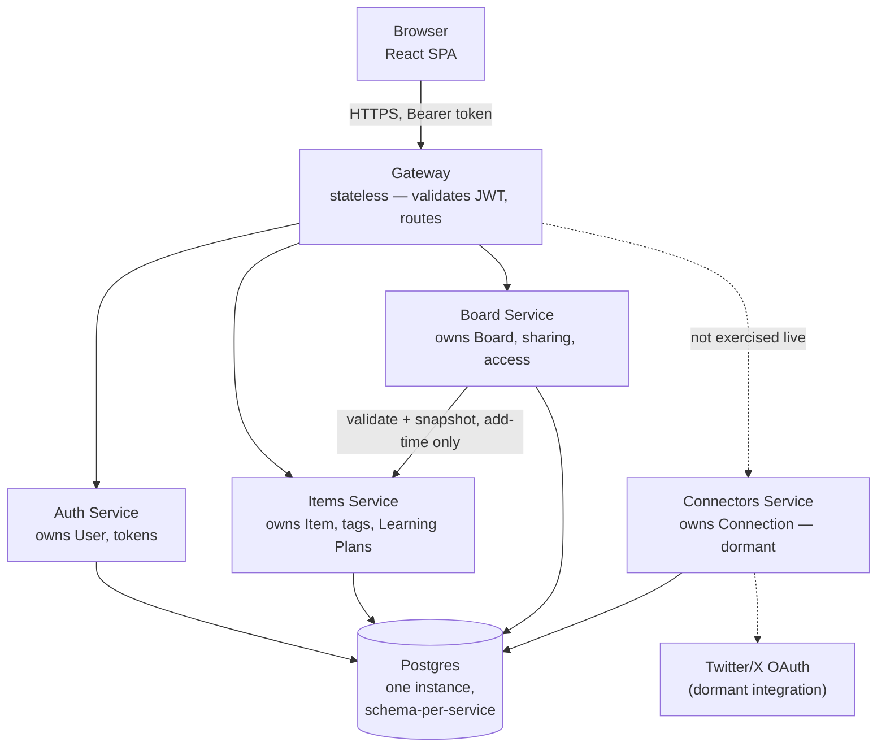

# Study Hub — System Architecture

*Part of the [learning pack](./). Previous: [00-project-overview.md](00-project-overview.md). Next: [02-service-boundaries.md](02-service-boundaries.md).*

## The picture

Everything from the browser goes through one door — the Gateway. Nothing calls a backend
service directly. The only exception inside the system is Board calling Items once, when an
owner adds an item to a board (explained below).

## What each component owns, and why it exists

| Component | Owns | Why it's separate |
|---|---|---|
| **Gateway** | Nothing — no database | A single, consistent entry point. Every request's coarse-grained auth check happens in one place instead of being duplicated (or forgotten) in five. |
| **Auth** | `User`, refresh tokens, service (OAuth2) client identities | Identity is a distinct concern from every other service's data — nothing else needs to know *how* a password is checked, only whether a token is valid. |
| **Items** | `Item`, tags, Learning Plans | The resource catalog. Plans live here too (not a separate service) because a plan is just a user's own items with extra state — no independent scaling or RBAC need to justify a new service. |
| **Board** | `Board`, board membership, access grants | Sharing is a genuinely different problem from owning resources — it needs its own RBAC model (owner/viewer), which justifies its own service in a way Plans didn't. |
| **Connectors** | `Connection` (OAuth tokens, extension registration) | A real, working integration surface (Twitter OAuth2+PKCE, a browser extension) — dormant in the live product, but built and demonstrated as its own service since a connector talking to an external system on a user's behalf is a distinct trust boundary from anything else here. |

## How services communicate

Plain HTTP/JSON, synchronous request-response — no message queue, no event bus. Two
patterns cover every call in the system:

1. **Browser → Gateway → one backend service.** The overwhelming majority of traffic. The
   Gateway inspects the URL path (`/auth/*`, `/items/*`, `/board/*`), forwards to the
   matching service, and relays the response back unchanged.
2. **Service → service, one specific case.** Board calls Items exactly once per item —
   when an owner adds an item to a board — to confirm the item is really theirs and to copy
   its display fields. After that, Board never calls Items again for that item; it reads its
   own stored copy.

Nothing else talks to anything else. Items never calls Board. Auth never calls anyone. This
is deliberate — most of what looks like it might need a live service-to-service call turned
out not to, once the data ownership was thought through (see [`02-service-boundaries.md`](02-service-boundaries.md)
and [`07-key-design-decisions.md`](07-key-design-decisions.md) for the Board-snapshot
trade-off specifically).

## Stateless vs. stateful

- **Gateway is fully stateless.** It holds Auth's public key in memory (fetched once at
  startup) and nothing else — no session, no request history. Any Gateway instance could
  handle any request.
- **Every other service is stateful**, in the sense that owns real persisted data in
  Postgres — but each one is independently stateless *as a process*: no in-memory session,
  no sticky-session requirement. A request to Items carries everything Items needs (a
  bearer token) to answer it, with no dependency on which Items instance handled the
  previous request.
- **The client (browser) holds the only real session state** — the access and refresh
  tokens, in `localStorage`. The backend never maintains a session object; it just verifies
  whatever token shows up.

## Where authentication is enforced

Authentication — *who are you* — is enforced **twice**, deliberately:

1. **Gateway**, on every request that isn't explicitly public (signup, login, refresh):
   verifies the JWT's signature against Auth's public key and that it hasn't expired. Fails
   fast, before the request ever reaches a backend service.
2. **Each backend service, independently, again.** Items, Board, and the rest don't trust
   that "it came through Gateway" is enough — each one fetches Auth's public key itself at
   startup and re-verifies the same token on every request it receives.

This is a direct, working instance of Zero Trust: the network path (having passed through
Gateway) is never treated as proof of anything. If Gateway were ever misconfigured, bypassed,
or compromised, every backend service would still independently reject a bad token.

## Where authorization/RBAC is enforced

Authorization — *what are you allowed to do* — is **coarse-then-fine**, split by who
actually has the information to answer it:

- **Gateway** only ever asks the coarse question: "is this a valid, logged-in user at all?"
  It has no concept of boards, roles, or ownership.
- **Board service** asks the fine-grained question, because it's the only service that
  knows the answer: for *this* board, is *this* user the owner, an accepted viewer, or
  nobody? Every board-mutating action (add item, remove item, invite) checks this
  independently, per request — role isn't cached or assumed from a prior check.
- **Items service** enforces its own, simpler authorization rule: you can only ever see or
  modify items you own — there's no sharing concept inside Items itself at all. Sharing is
  entirely Board's problem, layered on top.

## Deployed infrastructure

- **Frontend**: static React build, served from **Cloudflare Workers** (`wrangler.jsonc`,
  SPA routing so client-side routes survive a direct refresh)
- **Backend**: **Railway** — five services + one Postgres instance, private networking
  between services (no public internet hop for service-to-service calls), one public
  domain (the Gateway's) as the sole entry point
- Full detail, every environment variable, and the platform-specific gotchas hit getting
  here: [`06-deployment-and-runtime.md`](06-deployment-and-runtime.md) and
  `docs/deployment.md`
