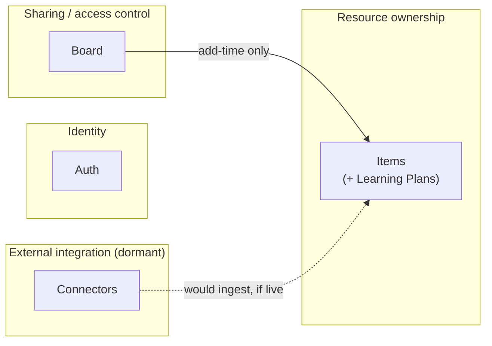

# Study Hub — Service Boundaries

*Part of the [learning pack](./). Previous: [01-system-architecture.md](01-system-architecture.md). Next: [03-data-model-and-erd.md](03-data-model-and-erd.md).*

## The five services

| Service | Responsibility | Owns Data | Main APIs | Calls | Why Separate |
|---|---|---|---|---|---|
| **Gateway** | Route + coarse auth | Nothing | `/{service}/*` (proxy) | Auth (JWKS, once at startup) | A single, consistent entry point and CORS boundary — not really a "domain" service at all |
| **Auth** | Identity, tokens | `User`, `RefreshToken`, `OAuthClient` | signup, login, refresh, logout, `/me`, JWKS, `/oauth/token` | Nothing outbound | Identity is a distinct concern nothing else should need to reimplement or trust blindly |
| **Items** | The resource catalog + Learning Plans | `Item`, `ItemTag`, `LearningPlan`, `PlanItem` | CRUD on items, CRUD on plans | Nothing outbound | The single source of truth for "what resources exist and who owns them" — everything else references it, it references nothing |
| **Board** | Sharing + access control | `Board`, `BoardItem`, `AccessGrant` | create/get board, add/remove item, invite, accept, list mine/shared | Items (validate + snapshot, add-time only) | Sharing has a genuinely different RBAC shape (owner/viewer) than plain ownership — worth its own service |
| **Connectors** | External-source integration | `Connection` | Twitter OAuth handshake, browser-extension push registration | Items (would ingest, if live) | A distinct trust boundary — acting on a user's behalf against an external system (X) is a different kind of risk than anything else here |

## Why these boundaries specifically

The real organizing principle: **split along data ownership and trust boundaries, not
along "feels like a module."** Concretely:

- Auth is separate because *no other service should need to know how a password is
  checked* — only whether a token is valid, which any service can verify independently
  with a public key.
- Items and Board are separate because they answer genuinely different questions with
  genuinely different authorization shapes: Items answers "what's mine," full stop; Board
  answers "who can see this, and what are they allowed to do to it" — a strictly harder
  question that needs its own state (`AccessGrant`) to answer.
- Connectors is separate because it's the one place the system reaches out to an external,
  untrusted system on a user's behalf — different enough in kind (holding a third party's
  OAuth tokens, proving CSRF-safety across a real browser redirect) that folding it into
  Items would blur what Items is actually responsible for.
- Learning Plans deliberately did **not** get its own service, even though it's a
  self-contained feature — it lives inside Items' schema. It has no sharing, no RBAC beyond
  plain ownership, and no scaling story different from Items itself. Giving it a service
  would have been boundary-drawing by feature, not by the actual criteria above.

## What would be different in a modular monolith

A modular monolith — one deployable, disciplined internal module boundaries (`auth/`,
`items/`, `board/`, `connectors/` as Python packages, not services) — would genuinely be
faster to build and entirely sufficient for what this app actually needs at its real scale
(a personal tool, a handful of users). Concretely, it would lose:

- **Real network boundaries.** A monolith's "service boundary" is just a function call —
  nothing forces the discipline of a real API contract, and nothing can partially fail.
- **Independent deployability.** Every change redeploys the whole app; there's no way to
  ship an Items fix without touching Board's running process too.
- **Service-to-service authentication as a real problem.** In a monolith, "Board calling
  Items" is just calling a Python function — there's no credential to design, nothing to
  get wrong.
- **Partial failure as a real, observable thing.** In this system, Items being down
  produces a real, visible `503` from Board when adding an item — a monolith can't
  produce that failure mode at all, because there's no network hop to fail.

## Where this architecture is deliberately over-engineered — and why that's fine here

This is a personal-scale app. Five independently deployed services, Postgres
schema-per-service discipline, and full JWT re-verification at every layer is genuinely
more than the actual traffic or team size needs. That's accepted on purpose — the project's
explicit goal is rebuilding hands-on fluency with these patterns before interviews, not
minimizing infrastructure for a single-user tool. The trade-off is named directly rather
than glossed over: more moving parts, more repeated boilerplate (each service independently
fetches and caches Auth's public key, for instance) than a single-user app structurally
needs.

What the project explicitly refused to over-engineer, on the same principle in reverse: no
Redis, no message queue, no Kafka, no Elasticsearch, no vector search, no container
orchestration — none of the roadmap ever produced a real workload those would solve. The
standing rule the whole way through: a new piece of infrastructure gets adopted only when a
real feature creates an actual reason for it, never because it's a common interview topic.

## Trade-offs this introduces

- **Latency**: every request crosses at least one network hop (Gateway → service) that a
  monolith wouldn't have; Board adding an item crosses two.
- **Operational surface**: five things can be individually down, individually
  misconfigured, individually need a new environment variable on a new host — verified
  directly during the real Railway deployment, where getting cross-service URLs right was
  one of the actual hard parts (see [`06-deployment-and-runtime.md`](06-deployment-and-runtime.md)).
- **Duplicated logic**: JWT verification code exists once per service, not once, system-wide.
- **Eventual inconsistency risk**: Board's item snapshot (see
  [`03-data-model-and-erd.md`](03-data-model-and-erd.md)) can go stale relative to Items'
  live data — a direct consequence of services owning their data independently rather than
  sharing one table.

## "Why did you split the system into these services?"

The answer that actually holds up under follow-up questions: *split along who owns the data
and who needs to authorize what, not along features.* Learning Plans looks like a natural
"service" from a product perspective but isn't one architecturally — it has no data anyone
else needs and no authorization model beyond plain ownership, so it stayed inside Items.
Board, by contrast, needed to exist as its own service the moment sharing entered the
picture, because "who can see this" is a materially different, harder question than "is
this mine" — and that's the actual dividing line used everywhere in this system, not
feature boundaries.
