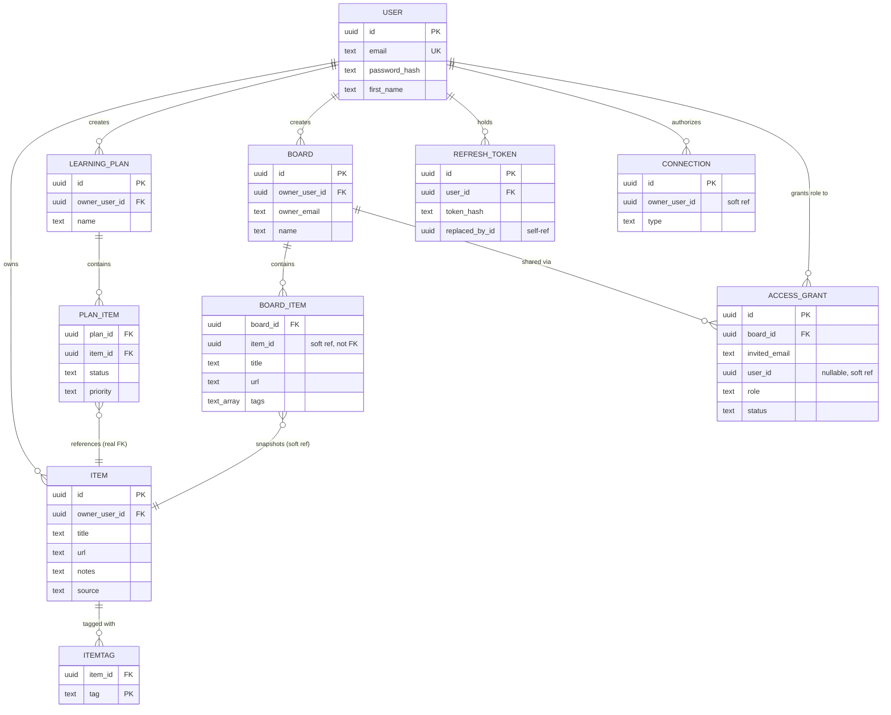

# Study Hub — Data Model & ERD

*Part of the [learning pack](./). Previous: [02-service-boundaries.md](02-service-boundaries.md). Next: [04-client-server-request-flow.md](04-client-server-request-flow.md).*

## The final ER diagram

Only the entities that matter for understanding the system are shown — no audit columns,
no `created_at`/`updated_at` clutter, no `OAuthClient`/`oauth_states` (real, but a detail
of one auth mechanism, not core to the data story).

## Entity purpose

- **User** — the account. One table, referenced by everything else, owned by Auth alone.
- **Item** — a saved study resource: title, URL, notes, tags. The thing both Learning Plans
  and Boards build on top of, owned by Items.
- **ItemTag** — a free-text tag on one item. No separate tag table/registry exists — a tag
  is just a string that exists the moment it's attached to an item, and stops existing
  (for that item) the moment it's removed. Nothing else references a tag directly.
- **LearningPlan / PlanItem** — a named grouping of a user's own items, each with its own
  progress state. Lives in Items' schema, not a separate service (see
  [`02-service-boundaries.md`](02-service-boundaries.md) for why).
- **Board / BoardItem** — a sharing container and its item membership. `BoardItem` is
  **not** a plain join row — it carries its own copy of the item's display fields (title,
  url, tags), captured once when the item is added.
- **AccessGrant** — models both states of "does this person have access" in one row:
  `pending` (invited by email, `user_id` still null) becomes `accepted` (`user_id` filled
  in) the moment the invite link is used. No separate "invite" and "membership" tables.
- **RefreshToken** — one row per issued refresh token; `replaced_by_id` is what makes
  rotation-with-reuse-detection real (see [`05-authentication-authorization-rbac.md`](05-authentication-authorization-rbac.md)).
- **Connection** — an authorized link to an external source (Twitter OAuth tokens, or a
  browser extension's registration). Real, but dormant — no live product path exercises it.

## Key relationships

- `User → Item`: one-to-many, real FK, same schema.
- `Item → ItemTag`: one-to-many, real FK, same schema — deleting an item cascades and
  removes its tags.
- `LearningPlan → PlanItem → Item`: `PlanItem.item_id` is a **real foreign key** into
  `items.items` — because Plans and Items share the same schema, Postgres itself enforces
  that a plan can never reference a nonexistent item. This is a genuine, concrete payoff of
  the "Plans stay inside Items" boundary decision.
- `Board → BoardItem → Item`: `BoardItem.item_id` is a **soft reference** — a plain UUID
  column, not a database-level foreign key, because Board and Items are different schemas
  (different services, in the schema-per-service model). Nothing at the database level
  stops it from pointing at a since-deleted item; application code is what validated it
  *once*, at add-time.
- `Board → AccessGrant → User`: `AccessGrant.user_id` is nullable and a soft reference too
  — it crosses from `board` schema into `auth` schema, and starts out null (pending invite)
  before ever pointing at a real user.

## Soft references vs. real FKs — the actual rule

**Real FK**: when the referencing table and the referenced table live in the *same*
service's schema. Postgres itself enforces the relationship — you cannot insert a
`PlanItem` pointing at an `Item` that doesn't exist, and cannot delete an `Item` out from
under a `PlanItem` without cascading.

**Soft reference**: when the referencing table's owning service is *different* from the
referenced table's owning service. Just a plain UUID column. Nothing at the database level
prevents it from going stale or pointing at nothing — the owning service validated it once,
at write time, using a real network call (Board asking Items "is this really this person's
item?" before attaching it), and that's the only guarantee that ever existed.

This is the direct, concrete cost of schema-per-service: you trade database-enforced
referential integrity across service boundaries for service independence. It's a real
trade-off, not a free lunch — see the next section.

## Why schema-per-service

One Postgres **instance**, but one **schema** per service (`auth`, `items`, `board`,
`connectors`), with a hard rule: real foreign keys only within a service's own schema,
never across schemas. This is the practical middle ground between two extremes — a single
shared schema (no real separation at all) and fully separate physical database instances
per service (the "textbook" microservices pattern, meaningfully heavier to operate for a
personal-scale project). It keeps the discipline that actually matters — no service reaches
into another's tables directly — without multiplying the number of database containers to
run and back up.

## Denormalization decisions

The one deliberate, load-bearing denormalization in the system: **`BoardItem` stores a
snapshot of an item's display fields (title, url, tags, favicon) captured at add-time,
instead of Board calling Items live every time someone views a board.**

Why: Items only ever answers "what are *your* items," correctly scoped to whoever's asking.
That's exactly right for the owner adding an item, but breaks the moment a *different*
person — someone the board was shared with — tries to view it; they're not asking about
their own items, and Items has no way to answer "show me this other person's item" safely.
Rather than build a whole new service-to-service read path just to fix that, Board keeps
its own copy of what it needs to display.

The cost, named directly rather than hidden: if the underlying item's title or tags change
later, the board's copy doesn't know — a real staleness gap, evaluated and explicitly left
unfixed (see [`07-key-design-decisions.md`](07-key-design-decisions.md) for the reasoning:
fixing it wouldn't even solve the actual felt problem, since there's still no way for a
viewer to *know* something changed).

## ERD explanation in interview language

> "Most of the relationships are boring, real foreign keys within one service's schema —
> a user owns items, items have tags, that's standard. The two interesting ones are both
> about crossing a service boundary. First, `PlanItem` pointing at `Item` is a real foreign
> key, because I deliberately kept Learning Plans inside the Items service rather than
> giving it its own microservice — since they share a schema, Postgres enforces that
> relationship for free. Second, `BoardItem` pointing at `Item` is a soft reference, not a
> foreign key, because Board is a genuinely separate service with its own schema — and
> instead of calling Items live every time someone views a board, `BoardItem` stores its
> own snapshot of the item's display fields, copied once when it's added. That's a real
> trade-off I can defend: it avoids a live cross-service call on every board view, at the
> cost of the board's copy being able to go stale if the original item changes later."
