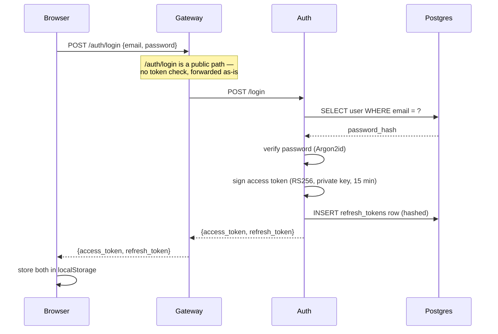
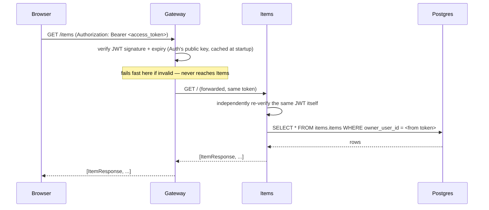
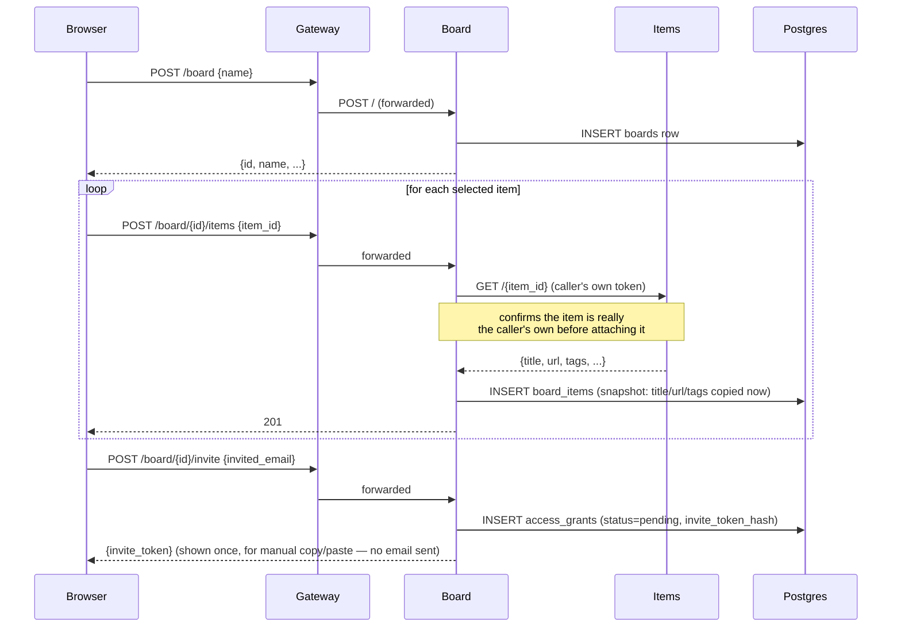
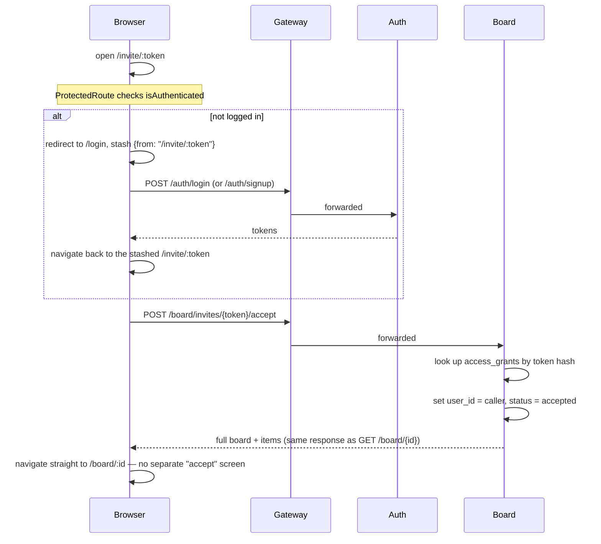
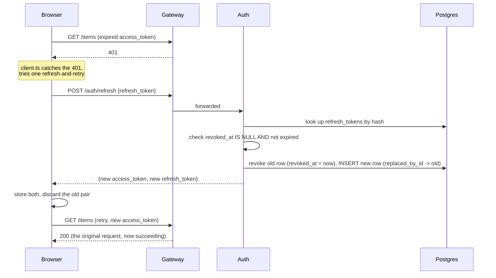

# Study Hub — Client/Server Request Flow

*Part of the [learning pack](./). Previous: [03-data-model-and-erd.md](03-data-model-and-erd.md). Next: [05-authentication-authorization-rbac.md](05-authentication-authorization-rbac.md).*

This is "what happens when a user clicks this button" — traced exactly, not approximated.

## Login

## Fetch study resources

The re-verification in Items isn't redundant by accident — it's the point (see
[`05-authentication-authorization-rbac.md`](05-authentication-authorization-rbac.md)).

## Create/share a board

## Receiver opens the invite

## Token refresh (a 401 mid-session)

If the refresh token is *also* invalid (expired, already used once via rotation — see next
doc), this fails, the browser clears its tokens, and the user is dropped back to `/login`.

## The mechanics behind every diagram above

- **Access token**: RS256 JWT, 15-minute lifetime, carries the user's id as `sub`. Never
  looked up in a database to verify — pure signature + expiry check.
- **Refresh token**: opaque random value, 30-day lifetime, **is** looked up in a database
  (`refresh_tokens`, by its hash) on every use — this is what makes it revocable, unlike
  the access token.
- **JWT validation**: Auth signs with its private key; every other service (Gateway, Items,
  Board, Connectors) holds only the *public* key, fetched from Auth's `/.well-known/jwks.json`
  once at startup and cached in memory for the process's lifetime.
- **Gateway validation vs. backend re-verification**: Gateway's check is coarse and
  fast-failing — a bad token never reaches a backend service at all. Each backend service's
  check is the same cryptographic verification, done again, independently — not a second,
  different check, but a deliberate refusal to trust that Gateway's pass-through implies
  validity (Zero Trust in practice, not just in name).
- **Client-side token storage**: both tokens live in `localStorage`, read/written only from
  `api/client.ts` — no other file in the frontend touches storage directly.
- **The 401 refresh-and-retry flow**: exactly one retry, not a loop. If concurrent requests
  all hit a 401 at once (e.g. the Library page loading items and boards in parallel right
  as the token expires), they share a single in-flight refresh call rather than each firing
  its own — a `refreshPromise` module-level variable is memoized while a refresh is
  underway, and every caller awaits the same promise.
