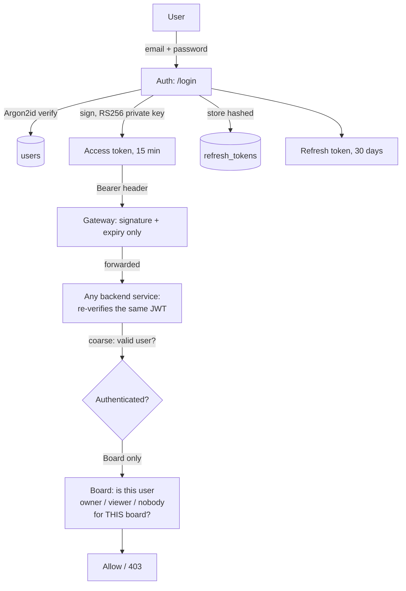

# Study Hub — Authentication, Authorization & RBAC

*Part of the [learning pack](./). Previous: [04-client-server-request-flow.md](04-client-server-request-flow.md). Next: [06-deployment-and-runtime.md](06-deployment-and-runtime.md).*

**Authentication = who are you?** **Authorization = what can you do?** Two separate
questions, asked at different layers, by different code, on purpose — conflating them is
the single most common mistake this doc is trying to head off.

## Compact flow

## Signup / login

- **Signup**: email + password (+ optional first name). Password is never stored — run
  through Argon2id (a slow, memory-hard hashing function, deliberately expensive to brute
  force) and only the resulting hash is persisted.
- **Login**: same email/password, re-hashed and compared to the stored hash.
  `verify_password_or_dummy` always pays the same Argon2id cost even when the email doesn't
  exist — verifying against a dummy hash rather than short-circuiting — so a timing
  side-channel can't reveal whether an account exists, on top of the generic "Invalid email
  or password" error message already not revealing it.

## RS256 JWTs — public/private keys, JWKS

RS256 is **asymmetric**: a private key signs, a public key verifies — unlike HS256, where
the same shared secret does both. **Only Auth ever holds the private key.** Every other
service — Gateway, Items, Board, Connectors — holds only the public key, fetched once at
startup from Auth's `/.well-known/jwks.json` (JWKS: JSON Web Key Set, the standard format
for publishing public keys) and cached in memory.

**Why this matters, concretely:** if Items were somehow compromised, an attacker holding
Items' key material could verify tokens — but could never *forge* one, because Items never
had the private key to begin with. With HS256, any service capable of checking a token
would also be capable of minting one. That asymmetry is the entire reason RS256 was chosen
here over the simpler shared-secret alternative.

## Access vs. refresh tokens

| | Access token | Refresh token |
|---|---|---|
| Lifetime | 15 minutes | 30 days |
| Format | RS256 JWT | Opaque random value |
| Verified by | Signature + expiry check, no DB lookup | **Database lookup**, every time |
| Revocable mid-lifetime? | No — it's valid until it expires, full stop | Yes — that's the entire reason it's DB-tracked |

The access token is deliberately short-lived and stateless (cheap to verify, nothing to
revoke). The refresh token is deliberately the opposite — long-lived, but every use hits
`refresh_tokens` to check `revoked_at IS NULL AND expires_at > now()`, which is what makes
logout and theft response actually work.

## Refresh-token rotation and reuse detection

Every `/refresh` call **replaces** the refresh token, not just the access token — the old
row is marked `revoked_at = now()` with `replaced_by_id` pointing at the new row, and a
brand-new refresh token is issued. The old one can never be used again.

**Reuse detection is what makes rotation worth doing, not just a rotation for its own
sake:** if a refresh token that was already rotated (`revoked_at` set *because of*
`replaced_by_id`, not because of a plain logout) is ever presented again, that's the
strongest signal available that it was stolen and copied — a legitimate client would only
ever hold the *newest* token, never an already-replaced one. When that happens, Auth
revokes **every currently-active refresh token for that user**, forcing a full re-login on
every device — not just rejecting that one request.

> **What I should understand, not just what the code does:** rotation alone (issue a new
> token, silently let the old one keep working for a grace period) doesn't detect theft —
> it just limits the damage window. Reuse detection is the piece that turns "an old token
> showed up again" into an actionable signal, because it shouldn't be *possible* for that
> to happen from a legitimate client at all.

## OAuth2 client credentials for service identity

A background job (Connectors, in the dormant integration) isn't a person — there's no login
session to reuse. Instead, it holds its own distinct credential: a `client_id`/`client_secret`
pair, generated once and stored by the service, exchanged at `/oauth/token` for a
short-lived **service token** — structurally the same kind of JWT as a user's access token,
but carrying a `client_id` claim instead of a `sub` claim, so every downstream check can
tell "this is a service acting on its own authority" apart from "this is user X."

## Gateway auth vs. service-level JWT verification

Both check the *same* JWT, the *same* way (signature + expiry against Auth's public key) —
deliberately redundant, not two different mechanisms:

- **Gateway** checks first, on every non-public path. A bad token never reaches a backend
  service at all.
- **Every backend service independently re-verifies**, fetching and caching Auth's public
  key itself, rather than trusting a header Gateway might attach saying "this request is
  fine." This is Zero Trust in the literal sense: the network path a request took (through
  Gateway) is never treated as proof of anything on its own.

## Board Owner vs. Viewer, Access Grants, invite tokens

- **Owner**: created the board. Can add/remove items, invite people, see everything.
- **Viewer**: accepted an invite. Can see everything the owner added, cannot change
  anything — no add/remove/invite controls even render for a Viewer, not just disabled.
- **Editor**: a reserved role value in the schema (`role IN ('viewer', 'editor')`) — no
  invite-time picker exists, so it's never actually assigned. A deliberate, named gap, not
  an oversight.
- **AccessGrant** is the row that makes a role real: created `pending` (keyed by email,
  `user_id` still null) at invite time, becomes `accepted` (`user_id` filled in) the moment
  the invite link is used.
- **Invite tokens** are opaque, high-entropy random values — **not JWTs, not signed**.
  Hashed before storage (same pattern as refresh tokens); the raw value is shown exactly
  once, at creation, for manual copy/paste.

## Email invitations — what the final system actually does

**There is no real email delivery.** The invite link is shown directly in the UI for the
owner to copy and send however they choose — a real transactional-email integration
(Resend) was designed in detail and explicitly declined, to keep the manual-share flow
simple. **The invite is not validated against the invited email at accept time either** —
whoever holds the link and is logged in as *any* account gets access, the same trust model
as a "anyone with the link" Google Docs share. The first person to actually use a given
link is the one it binds to; a second use of the same (now-claimed) link fails.

## 10 likely design questions

**1. Why RS256 instead of a simpler shared-secret (HS256) JWT?**
Asymmetric keys mean only Auth can *mint* a token; every other service can *verify* one
without ever being able to forge one. Compromising a downstream service can't be used to
impersonate users system-wide.

**2. Why does every backend service re-verify a JWT the Gateway already checked?**
Zero Trust: the network path is never treated as proof. If Gateway were ever bypassed or
misconfigured, every service still independently rejects a bad token — no single point of
failure for the whole system's security.

**3. Why are access tokens short-lived and refresh tokens long-lived, instead of one
long-lived token?**
A stolen access token is only useful for 15 minutes and can't be revoked mid-life at all —
that ceiling is the whole point. A refresh token is revocable (DB-tracked) precisely because
it lives much longer and needs a real "kill switch."

**4. How does refresh-token rotation detect theft, specifically?**
Every refresh marks the old token dead and mints a new one. A legitimate client only ever
holds the newest token. If an old (already-rotated) token is ever presented again, that can
only mean someone else has a stale copy — treated as a theft signal, revoking every active
token for that user.

**5. What's the difference between what Gateway checks and what Board checks?**
Gateway asks "is this a valid, logged-in user at all" — authentication, coarse, the same
check for every route. Board asks "is *this* user the owner or an accepted viewer of *this
specific* board" — authorization, fine-grained, and only Board has the data to answer it.

**6. Why is Editor a role that exists in the schema but is never assignable?**
Named explicitly as a deliberate, scoped-out gap (Decision #10) — the role model was
designed for it, the invite-time UI picker to actually grant it wasn't built. Distinguishes
"we didn't think of this" from "we thought about it and chose not to build it yet."

**7. How does a service prove its own identity, as opposed to a user's?**
OAuth2 client-credentials: a distinct `client_id`/`client_secret` traded for a short-lived
service token carrying a `client_id` claim, not a `sub` claim — structurally the same JWT
mechanism, a different kind of claim inside it.

**8. Why isn't the invite link checked against the invited email at accept time?**
A deliberate trade-off (Decision #39) — matching Google Docs' "anyone with the link" model
rather than forcing an account to exist at exactly the invited address before it's usable.
The first person to actually use it claims it; a second use of the same link fails.

**9. What actually stops a password from being recovered if the database leaks?**
Argon2id is one-way and deliberately slow/memory-hard — the stored hash can't be reversed,
and brute-forcing it is expensive by design, unlike a fast hash like plain SHA-256.

**10. Why hash refresh tokens and invite tokens before storing them, the same way passwords
are hashed?**
Same reasoning as passwords: if the database leaks, a raw stored token would be immediately
usable by whoever has it. Hashing means the leaked row alone isn't enough — same principle
applied consistently to every long-lived secret in the system, not just passwords.
