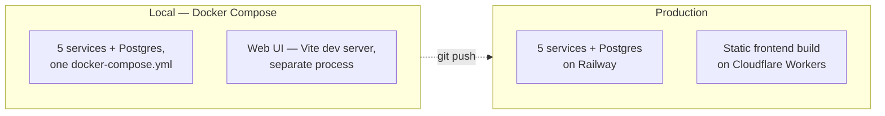
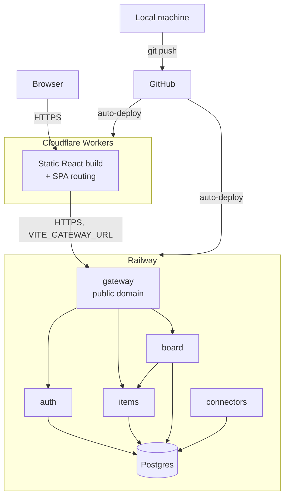

# Study Hub — Deployment & Runtime

*Part of the [learning pack](./). Previous: [05-authentication-authorization-rbac.md](05-authentication-authorization-rbac.md). Next: [07-key-design-decisions.md](07-key-design-decisions.md).*

Full operational detail (every environment variable, every platform gotcha hit getting
here) lives in `docs/deployment.md` — this is the compressed, quick-reference version:
what's deployed, where, and why, verified against the actual live system, not written
speculatively.

## Local vs. production

| | Local | Production |
|---|---|---|
| Backend | Docker Compose, one command (`bash start-dev.sh`) | Railway, 5 independent services, private networking |
| Database | Postgres container, `postgres_data` volume | Railway-managed Postgres |
| Frontend | Vite dev server, hot reload | Static build, served by Cloudflare Workers |
| Service URLs | Bare Docker service names (`http://auth:8001`) | `${{service.RAILWAY_PRIVATE_DOMAIN}}` reference variables |
| JWT keys | Real files on disk (`private_key.pem`) | Base64'd env vars, decoded by `entrypoint.sh` on container start |
| CORS origin | `http://localhost:5173` | The real Cloudflare Workers URL |

## Deployment architecture

## "How does code move from my laptop to production?"

1. Commit locally, `git push` to GitHub.
2. **Railway** and **Cloudflare Workers** are both GitHub-connected — a push to `main`
   triggers both to rebuild automatically, independently.
3. Railway rebuilds only the services whose own code actually changed (each service's
   **Root Directory** setting points at its own `services/<name>` subdirectory in the
   monorepo); each runs `alembic upgrade head` on container start before the app boots, so
   schema migrations apply themselves — no manual migration step.
4. Cloudflare runs `npm run build` (root directory `web`), then `wrangler deploy`, which
   reads a committed `wrangler.jsonc` and uploads the static build as a Worker with
   SPA-aware asset routing.
5. No manual server access at any point — no SSH, no manual restart. A revert is `git
   revert` + push, same as any other change.

## Frontend hosting

Cloudflare Workers, not classic Cloudflare Pages — Cloudflare moved static-asset deploys to
the unified Workers platform (a committed `wrangler.jsonc` replaces the old dashboard-only
output-directory config). `not_found_handling: "single-page-application"` matters
concretely: without it, a direct load or refresh of a client-side route like `/boards`
would 404 instead of serving `index.html` and letting React Router take over.

## Backend hosting

Railway — chosen after concretely ruling out AWS App Runner (no longer accepting new
customers), Fly.io (no free tier for new accounts), Render (free tier's shared-hours pool
can't cover 5 always-on services; free Postgres auto-deletes after 30-44 days), and
DigitalOcean App Platform (~$25/mo minimum before a database). Railway reads the existing
`docker-compose.yml`-shaped services directly and is usage-based, realistically ~$5-15/mo
for this workload.

## Domains, TLS/HTTPS

Both platforms provision HTTPS automatically on their own subdomains
(`*.up.railway.app`, `*.workers.dev`) — no certificate management, no custom-domain setup
was needed or done.

## Environment variables / secrets

Set per-service in each platform's dashboard, never committed. The one genuinely tricky
case: Auth's RS256 private/public key files don't exist in a fresh git clone (they're
`.gitignore`d, generated once locally) — `entrypoint.sh` writes them from base64-encoded
env vars on container start, but **only if the files aren't already present**, so local
`docker compose up` (where the files already exist on disk) is completely unaffected by
this code path.

## Service discovery / private vs. public networking

Only `gateway` has a public domain — every other service is reachable exclusively over
Railway's private network, using `${{service.RAILWAY_PRIVATE_DOMAIN}}` reference variables
rather than hardcoded hostnames (the bare Docker Compose service names like `http://auth:8001`
don't resolve on Railway at all — a real, live-debugged gotcha, not a hypothetical one).

## Migrations

Every service runs `alembic upgrade head` as the first step of its container's startup
command, before `uvicorn` starts — migrations apply automatically on every deploy, with no
separate manual migration step, locally or in production.

## Health checks

Each service exposes a lightweight endpoint Docker Compose's `healthcheck` (locally) polls
before marking a dependent service safe to start — e.g. Auth's own JWKS endpoint doubles as
its health check, since a healthy Auth by definition means it can serve its public key.

## CORS

Gateway's `CORSMiddleware` allow-list is exactly the frontend's real origin —
`http://localhost:5173` locally, the live Cloudflare Workers URL in production — plus a
regex covering the browser extension's own origin scheme (`chrome-extension://`,
`moz-extension://`), needed because Firefox (unlike Chrome) still sends a genuine CORS
preflight from an extension's own pages.

## Cold start / serverless behavior

Railway services are **not** serverless by default here — "Sleep Application" is
deliberately turned **off** for all 5, since they depend on each other synchronously and a
sleeping downstream service would break any request routed through it. Cloudflare Workers
*is* inherently request-driven/serverless, but at this traffic level that's invisible —
static asset serving has no meaningful cold-start cost.

## CI/CD

There isn't a separate CI/CD pipeline — GitHub-connected auto-deploy on both platforms
**is** the deployment pipeline. No test-gate currently blocks a deploy (tests are run
manually before pushing, not wired into a required check).
