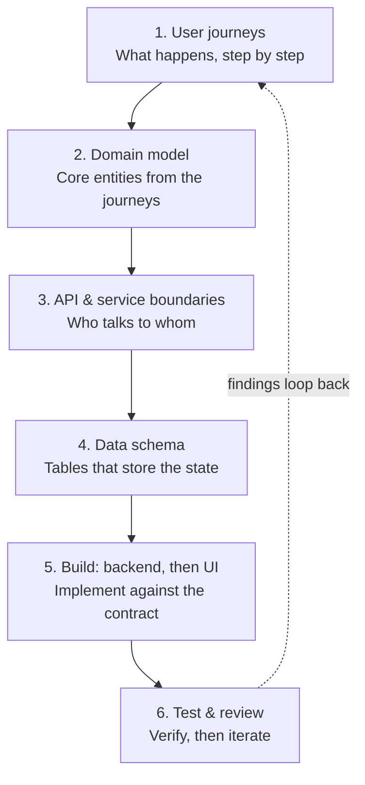
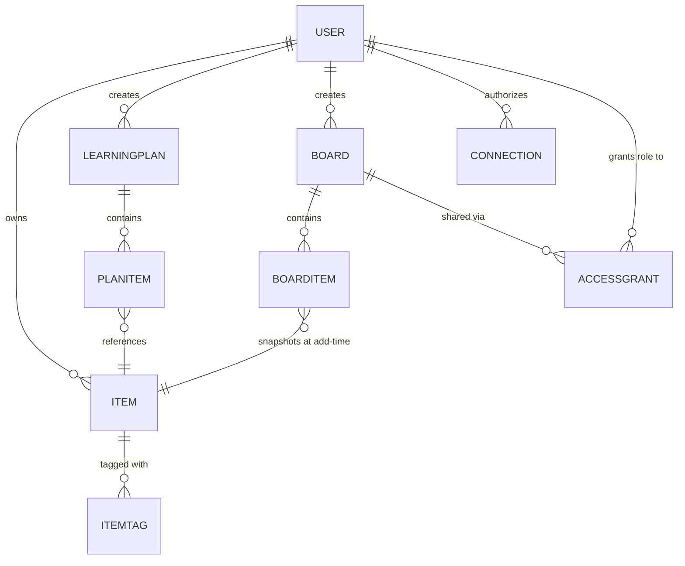
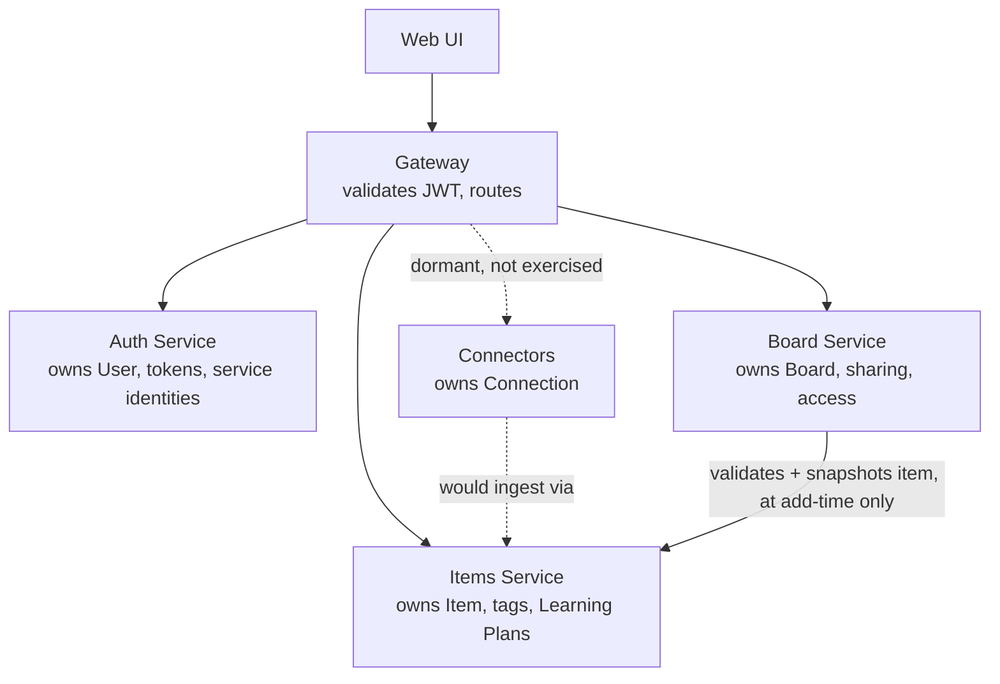
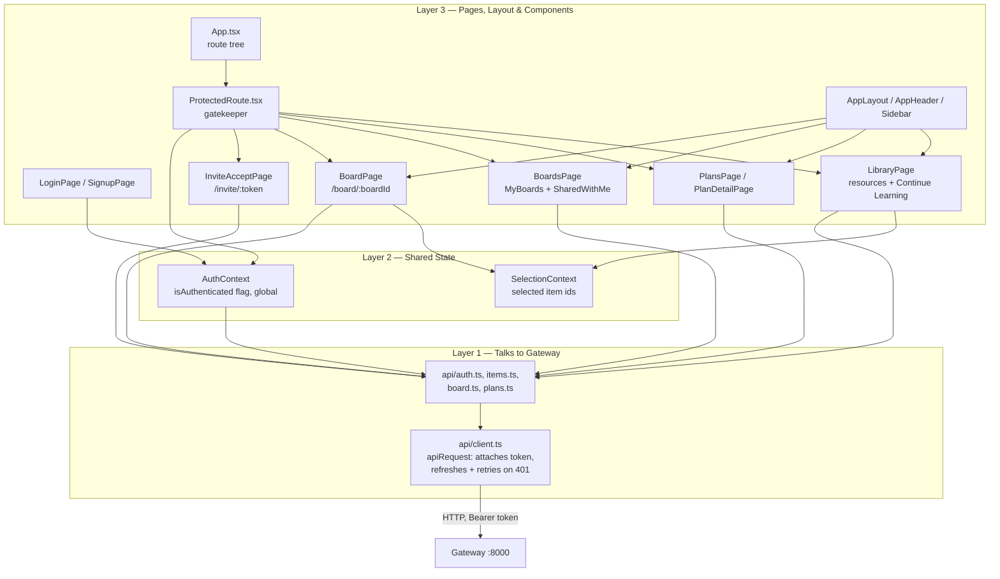

# Study Hub — Architecture & Decision Log

**Purpose of this doc:** A living record of every design decision made while building this project, and why. This is the detailed source of truth — the goal is to be able to defend each decision in an interview, not just to have working code. For a compact, interview-ready version of the same system, see **`docs/learning-pack/`** — that's the 30-45-minute-before-an-interview version; this file is the full history behind it.

**Status: feature-complete, scope frozen (2026-09-12).** Study Hub is done from a product-feature perspective. Work from here on is documentation, verification, and learning consolidation — see the **Near-Term Direction** section for what that superseded and why.

**Note on this document's history:** this project (now "Mehul's Study Hub") began life as `bookmarks-hub`, a personal bookmark manager, and was forked (full git history preserved, no remote link back) once real hands-on experience with the architecture made clear that a study-resource curation/sharing tool was a more compelling, honest product story for the same underlying engineering — Items and Board were already generic, not actually bookmark-specific. `bookmarks-hub` itself is untouched and continues on its own as a separate personal project. Decisions #1–58 below predate the fork and are kept as-is, unedited; the fork itself is logged as Decision #59.

**Project goal:** A personal, learning-focused project to rebuild hands-on system design fluency (architecture, microservices, auth/authz, RBAC, basic UI) ahead of Senior EM / Director interviews. Not a coding-skill exercise — the point is being able to explain and defend every architectural choice.

## Contents

- [Problem Scope](#problem-scope)
- [How We're Building This (Process)](#how-were-building-this-process)
- [Hosting / Deployment](#hosting--deployment)
- [Open Design Questions](#open-design-questions)
- [User Journeys (current)](#step-1-user-journeys-current)
- [Domain Model (current)](#step-2-domain-model-current)
- [API & Service Boundaries (current)](#step-3-api--service-boundaries-current)
- [Data Schema (current)](#step-4-data-schema-current)
- [Web UI — Structure & Layers (current)](#web-ui--structure--layers-current)
- [Architectural Learnings](#architectural-learnings)
- [Near-Term Direction — superseded, scope frozen](#near-term-direction--superseded-scope-frozen)
- [Future Extensions / Backlog — historical](#future-extensions--backlog--historical-several-items-since-built)
- [Decision Log](#decision-log) (#1–94)

---

## Problem Scope

A tool to curate and share system-design/interview-prep learning resources with study partners: save a resource (title, URL, personal notes, free-text tags) via manual entry, browse and filter your own library by tag, group resources into named Learning Plans with per-item progress, and share a curated board with someone else under real RBAC. Every resource enters manually today — there is no live scraping/fetching from any external source in the running product.

**What's actually live, as of the scope freeze:**
- Manual resource entry — title, URL, personal notes, free-text multi-valued tags, an optional image URL (Decisions #60, #62, #64, #84)
- Learning Plans — named plans grouping existing resources with per-item status/priority/target date, plus a "Continue Learning" view (Decision #85)
- Sharing — create/invite to a board under real RBAC (**Owner and Viewer are implemented and enforced; Editor is a reserved role, never assignable** — no role picker exists, Decision #10), a receiver can also copy any shared item straight into their own Library (Decision #92)
- Full deployment — Railway (backend) + Cloudflare Workers (frontend), see `docs/deployment.md`

**Real code that exists but is intentionally dormant, not deleted** (both are genuine, demonstrated engineering kept as part of the story, not currently exercised by the live product):
- The browser extension (Chrome + Firefox) — a secondary capture path, deferred not dropped (Decision #60)
- Twitter/X OAuth2+PKCE authorization (Decision #56) — the handshake works end to end against X's real servers; actually fetching tweets was never built and won't be (Decision #61). A pasted tweet/thread URL is just handled as a normal manually-entered resource instead.

**Explicitly out of scope:** CVE/vulnerability tracking (dropped in the original `bookmarks-hub` project — kept the personal project personal, separate from work-adjacent content). Real transactional email delivery — invite links are still shown in the UI for manual copy/paste (Decision #38), a Resend-based email flow was designed in detail and explicitly declined.

## How We're Building This (Process)

1. **User journeys** — what actually happens, step by step, from the user's point of view
2. **Domain model** — the core entities/nouns that fall out of those journeys
3. **API & service boundaries** — which service owns which verb, who talks to whom
4. **Data schema** — tables that store the state, designed only after 1–3 are settled
5. **Build: backend, then UI** — implement against the contract already defined
6. **Test & review** — verify, then loop findings back into step 1

Working style: step by step, one decision at a time. Each decision gets explained (what we chose, what the alternatives were, why) before moving to the next. No large chunks of generated code without understanding checkpoints.

## Hosting / Deployment

**Local development:** Docker Compose, one command (`bash start-dev.sh`) — see `docs/daily-startup.md`.

**Production:** deployed for real — Railway (5 backend services + Postgres) and Cloudflare Workers (frontend). Full setup, every environment variable, and every platform-specific gotcha hit along the way (private networking, JWT key encoding, the Cloudflare Pages→Workers migration) are documented in **`docs/deployment.md`**, verified against the actual live deployment, not written speculatively. Hosting research and the decision to land on Railway/Cloudflare is Decisions #87–#91 below.

**Twitter OAuth testing** (dormant feature, Decision #61): the OAuth callback needs a public HTTPS URL; a temporary tunnel (e.g. `ngrok http 8000`) is only needed if actually testing that flow — not part of normal deployment.

**Tooling:** implementation is done in VS Code with Claude Code. This document and the Decision Log can be reviewed independently of the coding tool.

## Open Design Questions

**Open, but scoped to the dormant browser extension only (not the live web product):** a browser profile, not a re-authenticated person, is what's actually trusted by the extension's push-token flow. The extension's push token (Decision #42) lives in that browser profile's local storage, tied to whoever set that connection up — not re-checked per use. Anyone who can open that same browser profile could push bookmarks into whichever account that profile's push token belongs to, with no additional authentication. Currently an accepted trade-off for a single-user personal project (the same "no real other audience" reasoning behind Decision #8's one-time source setup) — moot while the extension stays dormant (Decision #60); would need revisiting (a device/session list plus revocation, shorter-lived push tokens, or step-up re-auth) only if this capture path is ever reactivated for more than one person.

*(Resolved: "Where should RBAC be enforced — gateway-level only, or also independently per service?" — Decision #30: both. Gateway does coarse validation, backend services independently re-verify the JWT for fine-grained checks.)*

## Step 1: User Journeys (current)

### Journey 1: Sign up / log in — ✅ Built
1. Navigate to the app (Cloudflare-hosted URL in production, `localhost:5173` locally)
2. Sign up with email, password, and first name — or log in if you already have an account
3. Land on the Library page

### Journey 2: Adding and organizing resources — ✅ Built
1. "+ Add Resource," reachable from anywhere in the app — title, URL, personal notes, comma-separated tags, optional image URL
2. Library page: every resource, tag-chip filtering (a curated popular set plus a full searchable list), search box, sort, list/grid toggle
3. Edit or delete any resource inline, no page navigation required

### Journey 3: Learning Plans — ✅ Built
1. Create a named plan (e.g. "System Design — 4 Weeks")
2. Add existing resources to it; each gets its own status (not started/in progress/completed/skipped), optional priority and target date
3. Library page's "Continue Learning" section surfaces in-progress and due-this-week items across all plans, derived entirely client-side from data already fetched
4. Removing an item from a plan never deletes the underlying resource; deleting a plan never deletes its resources

### Journey 4: Sharing a board — ✅ Built
1. Select resources (checkboxes work even with rows collapsed) → "Share selected," or "Invite" to add another person to a board that already exists
2. Name a new board, or pick an existing one; enter the recipient's email
3. An expiring invite link is generated — opaque, high-entropy, **not signed, not a JWT** (Decision #36). **No real email is sent** (Decision #38) — the link is shown in the UI for manual copy/paste
4. Role is hardcoded to Viewer — no picker exists (Decision #10)

### Journey 5: Receiving and using a shared board — ✅ Built
1. Recipient opens the invite link — signs up or logs in if needed (return path preserved either way), lands directly on the board, no separate "accept" step
2. As Viewer: sees every item, opens underlying links in a new tab, cannot add/remove/edit/re-share — those controls don't render at all, not just disabled
3. Can copy any item straight into their own Library with one click, "Save to My Resources" (Decision #92) — a one-time copy, not a live link, tags included (Decision #94 closed a real gap where the first version shipped tag-less)
4. A dedicated Boards page lists every board owned and every board shared with you — no need to keep the original invite link around afterward

## Step 2: Domain Model (current)

- **User** — the account table.
- **Item** — a study resource: title, URL, personal notes, free-text tags, optional image. What Learning Plans and Boards both reference.
- **ItemTag** — a free-text, multi-valued tag on one Item. No separate tag registry or global vocabulary — a tag exists the moment it's used on an item, nowhere else.
- **LearningPlan** / **PlanItem** — a named grouping of a user's own Items, each with its own status/priority/target date. Lives inside Items' own schema and service — not a separate microservice (Decision #85).
- **Board** — a purpose-built sharing container, populated only by explicitly adding items.
- **BoardItem** — the Board↔Item join, carrying its own denormalized display snapshot (title/url/tags/etc., Decisions #37/#94) captured at add-time, not a live reference.
- **AccessGrant** — "a board grants a role to a user." One row spans both states: pending invite (keyed by email) becomes an accepted grant (`user_id` filled in) when claimed.
- **Connection** — one authorized link to a source (Twitter OAuth tokens, or the browser extension's registration). Real, built, but dormant — not exercised by the live product (Decisions #60/#61).

Relationships in plain language: `User` owns many `Item`s, each with multiple `ItemTag`s. `User` creates many `LearningPlan`s; each contains `PlanItem`s that reference (not copy) a real `Item`. `User` creates many `Board`s; each `Board` contains `BoardItem`s — a snapshot of an `Item`, not a live link. `Board` is shared via `AccessGrant`s, each granting one `User` a role. `Connection` exists but is dormant.

This section stays conceptual; concrete columns and constraints are in Step 4.

## Step 3: API & Service Boundaries (current)

**Five runtime services** — four own data, plus a stateless Gateway in front of them:

- **Gateway** — owns no data. Validates the JWT once per request, attaches user identity, routes to the right service. Coarse-grained check only ("is this a valid logged-in user") — fine-grained role checks (can *this* user edit *this* board) live inside Board service, since only it knows the role for that specific board.
- **Auth service** — owns `User`, `RefreshToken`, `OAuthClient` (service identities). Verbs: signup, login, issue/refresh/revoke JWTs, issue service tokens via client-credentials.
- **Items service** — owns `Item`, `ItemTag`, `LearningPlan`, `PlanItem`. Verbs: create/list/get/patch/delete items; the same for Learning Plans and their items. Ingest also accepts a service token (for Connectors), not just a user token.
- **Board service** — owns `Board`, `BoardItem`, `AccessGrant`. Verbs: create board, add/remove items (validates against Items at add-time using the caller's own token, then stores a display-field snapshot — Decisions #37/#94), invite, accept invite, list own/shared boards.
- **Connectors** — owns `Connection`. Real, working OAuth2+PKCE authorization against Twitter/X and a browser-extension push-token flow — but dormant in the live product (Decisions #60/#61); no live fetch/sync path is actually exercised today.

Note what the diagram does *not* show: no arrow from viewing a board back to Items — Board reads its own stored snapshot on every view. The only time Board ever calls Items is when an owner adds an item to a board.

**Internal service-to-service auth:** OAuth2 client-credentials flow (Decision #41) — a service holds its own `client_id`/`client_secret`, trades it for a short-lived service token carrying a `client_id` claim instead of a `sub` claim.

## Step 4: Data Schema (current)

**Data separation:** one Postgres instance, one schema per service (Decision #13). **FK rule:** real foreign keys within a service's own schema; cross-schema references are plain UUID columns validated by application code, never a database-level FK (Decision #14).

### `auth` schema
- **users**: id (uuid PK), email (unique, lowercased by application code), password_hash (Argon2id, Decision #18), first_name (nullable, Decision #73), created_at, updated_at
- **refresh_tokens**: id, user_id (real FK), token_hash (unique, hashed, never stored raw), expires_at, revoked_at (nullable — logout *or* rotation), replaced_by_id (nullable, self-referential FK — set only on rotation). `replaced_by_id` is the difference between "revoked because rotated" (a reuse of this exact row is a theft signal) and "revoked because the user logged out" (expected) — Decisions #26/#28.
- **oauth_clients**: id, client_id (unique, e.g. `"connectors-service"`), client_secret_hash (hashed like a password), client_name — what makes service-to-service auth real (Decision #41)

### `items` schema
- **items**: id, owner_user_id (soft ref), source (`manual` | `chrome` | `firefox` | `twitter`), external_id, title, url, folder_path (nullable, browser-only, dormant), preview_text / preview_media_url / favicon_url (nullable), notes (nullable, Decision #64), saved_at, created_at. **Unique constraint** `(owner_user_id, source, external_id)` — a duplicate insert is caught and returned as an idempotent success, not an error (Decision #33).
- **item_tags**: item_id (real FK), tag (text) — composite PK, free-text, no separate tag table (Decision #62)
- **learning_plans**: id, owner_user_id (soft ref), name, description (nullable), created_at (Decision #85)
- **plan_items**: plan_id (real FK), item_id (**real FK** — same schema, unlike Board's soft reference), status, priority (nullable), target_date (nullable), order_index, estimated_effort_minutes (nullable, not yet surfaced in the UI) — composite PK (plan_id, item_id)

### `board` schema
- **boards**: id, owner_user_id (soft ref), name, owner_email / owner_first_name (denormalized from Auth's `/me` at creation time — Decisions #70/#73), created_at
- **board_items**: board_id (real FK) + item_id (soft ref, composite PK) — **denormalized snapshot** (Decision #37, widened by Decision #94): title, url, favicon_url, preview_text, preview_media_url, tags (`text[]`) — copied from Items at add-time, never a live reference. Viewing a board never calls Items.
- **access_grants**: id, board_id (real FK), invited_email, user_id (nullable soft ref — filled in on accept), role (`viewer` | `editor`, **only `viewer` ever actually assigned** — Decision #10), invite_token_hash (unique, hashed — **not signed, not a JWT**, Decision #36), invite_token_expires_at, status (`pending` | `accepted`), created_at, accepted_at

### `connectors` schema (dormant — real code, not exercised by the live product)
- **connections**: one authorized source link (Twitter OAuth tokens + expiry, or a browser extension's push-token registration)
- **oauth_states**: short-lived PKCE state for the Twitter OAuth handshake, deleted the moment the callback consumes it

## Web UI — Structure & Layers (current)

The web UI (`web/`) is organized as three layers, each only trusting the one directly below it:

| Layer | File(s) | Role |
|---|---|---|
| 1 — API | `api/client.ts` | The only place that calls `fetch`. Owns token storage (localStorage), attaches the access token, does one refresh-and-retry on `401`. Fires `study_hub:logged_out` on a failed refresh. |
| 1 — API | `api/auth.ts`, `items.ts`, `board.ts`, `plans.ts` | Thin, specific calls built on `client.ts`. |
| — | `types/api.ts` | TypeScript interfaces mirroring the backend's Pydantic response shapes — compile-time contract-checking only, no logic. |
| — | `lib/` | Pure helpers: `filterResources.ts` (search/tag filter, shared between Library and its ShareBar), `tagColor.ts` (deterministic per-tag color, hashed not stored), `sourceLabel.ts`, `formatDate.ts`, `favicon.ts`, `folderTree.ts` (dormant browser-bookmarks path only). |
| 2 — Shared state | `auth/AuthContext.tsx` | The single `isAuthenticated` flag, global, via React Context. |
| 2 — Shared state | `dashboard/SelectionContext.tsx` | Selected item ids for sharing — page-scoped, not global. |
| 3 — Pages | `pages/LibraryPage.tsx` | The main resource list — search, tag filtering, sort, list/grid view, the Continue Learning section, the ShareBar selection flow. |
| 3 — Pages | `pages/PlansPage.tsx`, `PlanDetailPage.tsx` | Learning Plans list and detail (status/priority/target-date editing, Add Resources). |
| 3 — Pages | `pages/BoardsPage.tsx` | "Your Boards" + "Shared With Me," via `MyBoards.tsx`/`SharedWithMe.tsx`. |
| 3 — Pages | `pages/BoardPage.tsx` | `/board/:boardId` — one board's denormalized item snapshot plus the caller's role; owner-only Add/Remove/Invite controls, viewer-only Save to My Resources. |
| 3 — Pages | `pages/InviteAcceptPage.tsx` | `/invite/:token` — `ProtectedRoute` already guarantees a logged-in visitor; this just calls accept, then redirects to `/board/:id`. |
| 3 — Layout | `layout/AppLayout.tsx`, `components/AppHeader.tsx`, `components/Sidebar.tsx` | The shared shell (Decision #75) every protected page renders inside. |
| 3 — Components | `StudyResources.tsx`, `ResourceFormDialog.tsx`, `ContinueLearning.tsx` | Library's own building blocks. |
| 3 — Components | `PlanCards.tsx`, `PlanFormDialog.tsx`, `PlanItemsList.tsx`, `AddItemsToPlanDialog.tsx` | Learning Plans' building blocks. |
| 3 — Components | `BoardItemsList.tsx`, `AddItemsToBoardDialog.tsx`, `InviteToBoardDialog.tsx` | Board's building blocks. |
| 3 — Components | `BrowserBookmarks.tsx`, `FolderTree.tsx` | Dormant browser-bookmarks display path (Decision #60) — not reachable from the live product's normal navigation. |
| — | `AffirmationWidget.tsx`, `CornerNudge.tsx` | Small static, cosmetic-only widgets (Decisions #72/#83) — no backend, no state beyond a local timer. |

Full current file list: `web/src/` — `api/`, `auth/`, `components/`, `dashboard/`, `layout/`, `lib/`, `pages/`, `types/`.

## Architectural Learnings

A compact record of the strongest lessons from real decisions and real trial-and-error while building this — not a general system-design syllabus, just what actually happened here and why it mattered. Full reasoning for each lives in the Decision Log; this is the condensed, teachable version. A few examples below reference "bookmarks" — they happened pre-pivot, while this was still `bookmarks-hub`, but the underlying lesson is unchanged and applies identically to today's Items/tags/Learning Plans.

### Why separate services, not a simpler modular monolith?
**Problem:** This project exists partly to build real hands-on fluency in service boundaries and microservices. A modular monolith (one codebase, clean internal module boundaries) would be faster to build and would work fine for a single-user app.
**Options considered:** (a) a modular monolith with disciplined internal boundaries; (b) genuinely separate services behind a Gateway.
**Decision:** Real separate services (Auth, Items, Board, Connectors), each independently deployable, each owning its own data.
**Why:** A monolith can't teach what this project needs to teach — real network boundaries, independent deployability, service-to-service authentication, partial failure. Those only show up when services are truly separate processes, not modules in one codebase.
**Trade-off:** Meaningfully more operational overhead (more moving parts, more repeated boilerplate — see Decision #40) than a single-user app structurally needs. Accepted deliberately, because that overhead is the point of the exercise here.

### Why one Postgres instance with a separate schema per service?
**Problem:** True database-per-service (a separate physical database per service) is the "textbook" microservices pattern, but running several separate Postgres containers locally is heavier to operate than a learning project needs.
**Options considered:** (a) fully separate Postgres instance per service; (b) one shared schema, no real separation; (c) one instance, one schema per service, no cross-schema foreign keys.
**Decision:** Option (c) — Decisions #13 and #14.
**Why:** Schema-per-service keeps the discipline that actually matters (each service owns its own tables; no reaching into another service's data via a foreign key) without the operational cost of multiple database containers. This exact middle ground is also used by real companies in production, not just as a learning shortcut.
**Trade-off:** It's enforced by convention and code discipline, not by the infrastructure itself — nothing physically stops a cross-schema join the way separate databases would.

### Why Board stores an item snapshot instead of a live Items lookup on every view
**Problem:** The original design had Board call Items live, every time anyone viewed a board, to fetch each item's current display details.
**Options considered:** (a) keep the live per-view call, with a timeout/fallback if Items is unreachable (original Decision #11); (b) give Items a special service-only endpoint Board could call to read *any* user's items; (c) copy the display fields onto Board's own row once, when the item is added.
**Decision:** Option (c) — Decision #37.
**Why:** Items correctly scopes every read to "your own items only," which is exactly right for the owner but breaks the moment someone the board was *shared with* tries to view it — they're not asking about their own items. Building a whole new service-to-service read path to fix that was disproportionate, especially since nothing in the system ever edits a bookmark after it's saved, so a stale snapshot is a theoretical cost today, not a real one.
**Trade-off:** If a bookmark's title changed at the source after being added to a board, the board's copy wouldn't know. Acceptable now; worth revisiting if that ever becomes real.

### Why backend services re-verify JWTs even though Gateway already checked them
**Problem:** Gateway already validates a caller's JWT before forwarding a request. Should the destination service just trust that and skip checking it again?
**Options considered:** (a) trust Gateway's word (e.g. via a forwarded "this is user X" header, no re-verification); (b) every service independently re-verifies the token itself.
**Decision:** Option (b) — Decision #30.
**Why:** Trusting a request just because of where it came from ("it went through Gateway, so it must be fine") is exactly the assumption Zero Trust security rejects. Independent verification means no single service's security depends on every other piece of the system being configured correctly.
**Trade-off:** Small duplicated verification logic in every service, and a little repeated work per request — a deliberately cheap cost for a materially stronger guarantee.

### Why Connectors uses a real service identity instead of pretending to be a logged-in user
**Problem:** A background sync job needs to write bookmarks into Items on a real user's behalf, with no human present to provide a login session.
**Options considered:** (a) have Connectors hold and refresh a normal user access/refresh token, like a borrowed login session; (b) give Connectors its own distinct machine identity (`client_id`/`client_secret`, exchanged for a short-lived service token).
**Decision:** Option (b) — Decision #41.
**Why:** A background job impersonating a user session blurs who actually did what. A distinct service identity keeps that honest, and matches how real systems authenticate machine callers — this is literally SailPoint/IdentityIQ's own domain (a connector provisioning into a target system under its own credential, not a borrowed user's).
**Trade-off:** A second, different credential type to build, store, and eventually rotate — genuinely more work than reusing an existing session type.

### Why bookmark ingestion is idempotent
**Problem:** A sync can re-encounter a bookmark it already sent before — routine, expected, not a mistake. What should happen?
**Options considered:** (a) reject the duplicate as an error (`409 Conflict`); (b) silently overwrite the existing row with the new data (upsert); (c) recognize it's already there and return the existing item as a success, unchanged.
**Decision:** Option (c) — Decision #33.
**Why:** Repeat syncs are completely normal; treating every one as an error would make ordinary use look broken. Overwriting was considered but deferred — nothing today actually changes a bookmark's details after saving it, so there's no real scenario yet that needs update-on-duplicate behavior.
**Trade-off:** If a bookmark's title genuinely changed at the source, re-ingesting it today does not pick that change up — deliberately deferred, not an oversight.

### The real large-browser-sync timeout incident
**Problem:** A real user's first sync of an actual, long-used browser profile (hundreds of bookmarks) failed with a confusing client-side JSON-parsing error.
**Options considered:** once root-caused — fix only the visible symptom (the confusing error message), or fix the whole chain that was actually wrong.
**Decision:** Fixed all three real causes together (Decision #48): Connectors now syncs a batch concurrently instead of one bookmark at a time; Gateway now returns a proper error response if a backend call times out, instead of letting it leak through as an unhandled, non-JSON error page; the extension now reads an error response as text before assuming it's JSON.
**Why:** The real chain was: a slow, fully sequential sync → exceeded Gateway's timeout → Gateway's unhandled timeout produced a non-JSON error page → the extension crashed trying to parse it as JSON, surfacing a confusing, unrelated-looking error. Fixing only the visible symptom would have left the actual slow-sync problem in place for the next large batch.
**Trade-off:** None of the three fixes were free (a concurrency limit had to be chosen deliberately; defensive parsing is extra code for a case that ideally never happens) — but none of this was caught by any automated test beforehand. It only surfaced from real use with a realistically large dataset, which is itself the lesson: a test suite proves the logic is right, not that it survives real-world scale.

### Why an OAuth2 "Authorization Code" flow needs its own short-lived server-side storage (PKCE)
**Problem:** Building Twitter's OAuth2 login handoff, the browser leaves this app entirely (a real navigation to x.com) and comes back minutes later to a *different* endpoint, with no session or Bearer token attached at all. Two secrets need to survive that gap: PKCE's `code_verifier` (proves the app completing the exchange is the same one that started it) and "which of our users actually asked for this."
**Options considered:** (a) an in-process memory dictionary keyed by a random state value; (b) encode `code_verifier` directly inside a signed `state` parameter, avoiding server storage entirely; (c) a small database table, same shape as this project's other short-lived opaque tokens.
**Decision:** Option (c) — a new `oauth_states` table (state → user id + code_verifier), row deleted the moment the callback consumes it, whether the exchange that follows succeeds or fails.
**Why:** This project had already answered "how do we hold a short-lived, single-use, server-side secret" three times before — refresh tokens, invite tokens, push tokens — always the same shape: opaque value, DB-tracked, checked once, then done. Reusing that shape here rather than inventing a fourth mechanism was the more consistent choice, and it survives a service restart between the two steps, which in-memory storage wouldn't.
**Trade-off:** One more small table to maintain, and a bit of manual cleanup reasoning (expired-but-never-used rows just age out rather than being actively swept) — a real but minor cost, consistent with how this project already treats invite tokens the same way.

## Near-Term Direction — superseded, scope frozen

**Study Hub's functional scope froze on 2026-09-12.** The project is feature-complete; work from here is documentation, verification, and interview-readiness (see `docs/learning-pack/`), not new product features. The roadmap below is kept as historical record — do not treat it as active guidance.

**What actually happened, against this list:** Phase 1 (Learning Plans + Continue Learning) shipped in full (Decision #85). Phase 2 (real deployment) shipped in full — Railway + Cloudflare, verified live (Decisions #87–#91). Phases 3–7 below (completion/takeaways, Interview Prep Track content, the GitHub-push milestone as a distinct phase, Review queue, async enrichment) were **never started and will not be** — the freeze happened before reaching them, not after evaluating and rejecting each one. Separately, from the older backlog further below: board visibility on both sides of a share shipped (Decision #68), and inviting a second person to an existing board shipped (Decision #76) — both close gaps that list still describes as open.

The original roadmap text follows, unedited, for historical accuracy:

1. **Learning Plans + Continue Learning/This Week.** Named plans (e.g. "System Design Interview Prep — 4 Weeks"), existing resources added to a plan with status/order/priority/target date, plus a "what's next" view derived client-side from plan-item state. New tables in the existing Items service's schema (not a new microservice) — same precedent as tags/notes (Decisions #62/#64). Highest leverage, lowest architectural risk; everything below depends on this existing.
2. **First real deployment pass — pulled forward to right after Phase 1,** not left until after the whole roadmap. Deployment problems (real env vars per service, CORS against a real domain, migrations against a hosted Postgres) are cheaper to find and fix while the system is still five services and no new infra, and "learn deployment for real" is its own stated goal independent of feature completeness. Re-verify actual current hosting options/pricing at that point — don't reuse the known-stale Render note.
3. **Learning completion/takeaways + Topic-level progress.** Extends `items` directly with nullable takeaway/confidence/interview-question/reviewed-at fields (same "extend the owning table" pattern as `notes`, Decision #64) via the existing `PATCH /items/{id}`. Topic-level progress is a pure client-side rollup over tags + these new fields — no new endpoint, same derivation rule as Decisions #46/#75.
4. **Interview Prep Track (content, not new architecture).** The first real Learning Plan instance, populated from the already-curated 70 resources, grouped by the existing tag taxonomy (system-design, fundamentals, caching, databases, distributed-systems, etc.) rather than a new "section" concept, unless tag-grouping proves insufficient once actually tried.
5. **GitHub push — after Phase 1-3, not strictly last.** Secrets hygiene is already done (Decision #66 got ahead of this). The push's value is the story a stranger reads on the repo page; that story is meaningfully better with Learning Plans + completion/takeaways behind it than it is today. Deploying (step 2) before pushing means the eventual repo can link straight to a live demo.
6. **Review queue + Related resources.** Surfaces low-confidence/stale topics and tag-overlap discovery — both depend on step 3's data existing, both stay client-side, no new endpoints. Deliberately not spaced repetition (SM-2/Leitner) and not embeddings/vector similarity — tag overlap and a simple confidence/staleness filter are enough at this scale.
7. **Async URL metadata enrichment.** Auto-fetches title/favicon/description on save, via FastAPI's built-in `BackgroundTasks` (no new infrastructure — no queue, no worker process, no broker) so a slow/unreliable third-party fetch never blocks resource creation. The project's first real async-processing pattern, plus a real outbound-fetch security question (SSRF-adjacent validation: scheme allowlist, timeout, response-size cap) worth handling explicitly. A real job queue only becomes justified if this needs to survive a mid-fetch process restart or outgrows fire-and-forget — not built now.

**Explicitly not scheduled — reactive, triggered by a concrete condition, not a phase:**
- **Postgres full-text search** — once client-side search genuinely stops fitting (item count grows past what's reasonable to fetch whole, or search needs to reach content the client doesn't have loaded, e.g. fetched page text from step 7).
- **Redis** — nothing in this roadmap produces the workload it solves (every new progress/summary view above is client-side-derived or a cheap query over a small personal dataset). Only becomes real at genuinely large per-user datasets or real multi-tenant concurrent load.
- **Semantic/vector search** — no product need for meaning-based matching exists or is implied by anything above tag-overlap can't already do. The clearest case of a common interview topic that doesn't belong here yet.
- **CDN as its own decision** — not a decision at all; folds into step 2's hosting-provider choice, which almost certainly includes CDN-backed static asset serving by default.

**Standing rule:** a new technology or architectural pattern (a cache, a message queue, container orchestration, sharding, a different database, etc.) gets introduced only when a real feature or a real problem in this project creates an actual reason for it — never because it's a common system-design interview topic. `sailpoint-prep-coverage-map.md`'s "Topics to study separately later" section already names several such technologies deliberately left unbuilt, precisely so they don't get forced in artificially.

## Future Extensions / Backlog — historical, several items since built

Kept unedited below for history; **✅ notes added inline** where a later decision closed the gap. Everything without a ✅ note remains genuinely undone, and under the scope freeze above, will stay that way.

- **HIGH PRIORITY — Board visibility/audit views, on both sides of a share.** ✅ **Built — Decision #68.** Both views shipped: `GET /board/mine` (owner) and `GET /board/shared-with-me` (recipient), surfaced as `MyBoards.tsx`/`SharedWithMe.tsx` on the Boards page. Original text: Surfaced testing Stage 3 (receiving) end to end with a real second account: after accepting an invite and clicking "Back to dashboard," there is currently no way for that recipient to find their way back to the board again — no list, nothing. The only way back is re-visiting the original invite link, which still works (invites don't expire for 7 days, re-accepting is idempotent, Decision #39) but isn't a real answer. Two distinct views are needed, neither built yet:
  - **Recipient side — "Shared with me":** a list, on the dashboard, of every board this user has accepted an invite to (name, link to `/board/:id`).
  - **Owner side — "Boards I've shared":** a read-only view of every board this user owns that has active grants — board name, the items on it, who it's shared with, and when (invited-at / accepted-at timestamps). Right now an owner has *no visibility at all* into who has access to what they've shared, beyond remembering it themselves.
  Both need real backend work first — Board service currently has no "list my boards" endpoint at all (only create-one, get-one-by-id, add/remove item, invite, accept). 📚 SailPoint Prep — Topic 11 (IAM): the owner-side view in particular is a small-scale version of exactly what SailPoint IdentityIQ does — access visibility / entitlement review, "who has access to what, granted when" — worth explicitly building out as a real talking point, not just noting as a gap.
- **Books-read module**: genuinely never built, and now out of scope under the freeze. Track books read, with personal summaries/notes. Different in kind from the Twitter/Browser connectors — this needs an actual content *editor* (writing original text), not just an ingestion pipeline pulling from an external source. Will likely need its own entity (e.g. `ReadingEntries`: title, author, summary body, rating, date) and a text-editing UI, not a tile-preview UI. Worth revisiting whether "Board" stays generic enough to hold this, or whether it becomes its own module — decide when we get here.
- **Editor role at invite time** (see Decision #10) — role picker deferred, hardcoded Viewer for v1. Still true; now frozen, not just deferred.
- **Add selection to an existing shared board** (see Decision #9) — ✅ **Built — Decision #76.** An "Invite" button on `BoardPage.tsx` lets an owner add another person to a board that already exists, not just at creation time.
- **Google Sign-In as an additional login method** (see Decision #6) — deferred, own auth built first. Still true; now frozen, not just deferred.
- **Real-time live sync + in-app alerts**: genuinely never built, and now out of scope under the freeze. e.g. bookmarking a tweet in another tab should show up automatically with a notification, without a page refresh. Undecided whether this belongs in v1. Technical nuance worth remembering: browser bookmarks *can* genuinely be real-time (the extension can listen to native events like `chrome.bookmarks.onCreated` and push instantly), but Twitter *cannot* — X's API has no bookmark webhook, so any "live" Twitter updates would really be periodic polling made to look real-time, not a true push. Would also need a push channel to the open browser tab (WebSocket or Server-Sent Events) to deliver the alert.

---

## Decision Log

| # | Decision | Alternatives Considered | Rationale |
|---|----------|--------------------------|-----------|
| 1 | Personal bookmarks hub (browser bookmarks + Twitter, plugin-style connectors) instead of a compliance/CVE-focused SaaS | CVE/vulnerability tracker SaaS (multi-tenant) | Personal project stays authentically personal; connector/plugin pattern still gives strong microservices story |
| 2 | RBAC via a real (small) sharing feature — Owner/Editor/Viewer on boards | Leave RBAC as a design-only talking point | Real enforced code is more defensible in interviews than a stub. *Status: Owner and Viewer are built and enforced; Editor was deferred at invite-time — see Decision #10.* |
| 3 | Browser bookmarks (Chrome + Firefox via extension) built before Twitter | Twitter first | Free, no developer account/approval friction, proves the pipeline end-to-end before spending money |
| 4 | CVE tracking dropped entirely from scope | Keep CVE as a later "branch" | Kept the project focused and personal |
| 5 | Start local with Docker Compose; defer cloud deployment until the application is stable enough to make deployment itself the next learning step | Deploy early while core architecture is still changing | Local-first kept the early learning loop simple. **Current direction:** public deployment is now an explicit learning milestone (Git/GitHub → hosting → domain/HTTPS), not merely an optional demo. |
| 6 | Build own auth first (email/password, self-managed sessions); add Google Sign-In later as an optional additional sign-in method | Start with Google OAuth as primary login | Own auth teaches password hashing, session/JWT design, and invalidation — skills OAuth doesn't touch. Google OAuth would be redundant right now since the Twitter connector already requires building OAuth2+PKCE from scratch later. |
| 7 | Dashboard shows two top-level blocks: Twitter and Browser Bookmarks. Browser Bookmarks expands into Chrome/Firefox sub-folders, each preserving that browser's native folder structure (Bookmarks Bar, Other, custom folders). Twitter is a flat list (no folder concept). | Merge Chrome+Firefox into one flat block; or three flat top-level blocks | Chrome and Firefox are separate, unsynced bookmark stores (Chrome Sync uses Google account, Firefox Sync uses a separate Mozilla account — not the same data). Nesting reflects the real structure without losing it. |
| 8 | Source connection (browser extension install, Twitter OAuth) is a one-time owner/developer setup step, not a polished repeatable user-facing "Connect" flow with empty states | Build a general-purpose connection UX for arbitrary future users | Single-user app for source data; people boards get shared with never connect their own sources, so there's no real audience for a repeatable onboarding flow — building one would be scope for its own sake |
| 9 | ~~Sharing works by selecting tiles (select-all + deselect, or individual picks) and always creates a brand-new board from that selection~~ **Partially superseded by Decision #70** (initial share still always creates a new board; managing an *existing* board's contents afterward is now built) | Allow adding selection to an existing already-shared board | Keeps v1 simple — one sharing mechanism, no second "add to existing board" flow to design/build yet |
| 10 | Invite by email with a signed, expiring magic link; role is hardcoded to Viewer for v1 (no role picker) | Show a Viewer/Editor picker at invite time | Keeps v1 scope tight; Editor picker deferred to v2 since Viewer alone already proves the RBAC enforcement mechanism. *("Signed" was this decision's original, imprecise wording, written before Decision #36 settled the invite token's actual design — it's an opaque hashed token, not signed/JWT. "By email" was also aspirational — no real email-sending exists; see Decision #38.)* |
| 11 | ~~Board service composes item details by calling Items service internally (server-to-server), with a short timeout and graceful fallback — if Items is unreachable, return the board (name, item IDs, sharing info) with affected items flagged "preview_unavailable" rather than failing the whole request~~ **Superseded by Decision #37** | (a) Frontend calls both services and composes client-side, isolating failures naturally; (b) naive backend composition with no fallback | Keeps the frontend simple (one call to Board) while avoiding the cascading-failure trap where an Items outage would otherwise take down board rendering entirely, even though board metadata itself is unaffected. *Revisited once Board was actually built: a live per-view call to Items can't work for a Viewer reading a board they don't own, since Items correctly scopes every read to the requesting JWT's own user — see Decision #37.* |
| 12 | **Design intent:** use OAuth2 client credentials when a backend service needs to act as itself rather than as a logged-in user | (a) Static shared secret; (b) full mTLS/service mesh; (c) trusted network/no internal auth | The principle is short-lived, verifiable service identity without trusting network location. **Current implementation:** this is built for Connectors → Items (Decision #41). Not every internal call uses a service token: Board → Items at add-time deliberately forwards the owner's user JWT because Items is validating that owner's item. |
| 13 | One Postgres instance, separate schema per service (auth, items, connectors, board) | (a) Fully separate physical database per service; (b) single shared schema, no enforced separation | Approximates the real database-per-service pattern (logical ownership, no cross-service joins) without running four separate Postgres containers locally — a proportionate middle ground several real companies also use in production |
| 14 | Foreign keys are used normally *within* a service's own schema (e.g. `access_grants.board_id` → `boards.id`, both owned by Board service); references that cross into another service's schema (e.g. `access_grants.user_id` → `auth.users.id`) are plain UUID columns validated by application code, never a real FK | Use real FKs everywhere, including cross-schema | A database-per-service split literally couldn't have a cross-database FK — keeping that discipline here (even though everything happens to share one Postgres instance) avoids a coupling the architecture isn't supposed to have. Within one service's own schema, a real FK is correct and desirable — that's what referential integrity is for. |
| 15 | Backend services built in Python with FastAPI | Node.js/Express; Java/Spring Boot | FastAPI gets built-in interactive API docs generated from code — useful given Step 3's contracts. Less ceremony than Spring Boot (faster to iterate, more time on decisions than boilerplate). Likely closer to existing daily-vulns automation experience than Node. |
| 16 | Dev environment: WSL2 + Ubuntu 24.04 on the personal Windows laptop, with Docker Desktop's WSL2 integration, and Node.js installed natively via nvm (not the Windows-side Node install, which was leaking into WSL's PATH via interop and causing a broken node/npm mismatch) | Work natively in Windows PowerShell; use the Windows-side Node install as-is | WSL2 matches the Linux-first tooling this whole stack assumes (bash scripts, Docker, Postgres) without fighting Windows path/tooling differences. A Windows-side Node install crossing into WSL via interop caused a real, confirmed bug (npm resolved, node did not) — nvm gives a clean, fully Linux-native runtime that takes PATH priority. |
| 17 | Finalized `auth.users` schema: `id` is a Postgres-generated UUID (`gen_random_uuid()` as the column default, via the `pgcrypto` extension) rather than app-generated; `email` uniqueness/lookup is case-insensitive by lowercasing in application code before every write/read, not the `citext` extension; `updated_at` is maintained by application code on every write, not a DB trigger | (a) App-generated UUIDv4/UUIDv7 instead of DB-generated; (b) `citext` column type for email; (c) a Postgres trigger to auto-update `updated_at` | Postgres-side UUID generation means the row's ID exists the instant it's INSERTed, no extra app step; UUIDv7's time-ordered-index benefit isn't worth the added complexity at this table's scale, but is the named "how this scales" answer. App-level email lowercasing avoids a second extension dependency and is easy to point to as "where is this invariant enforced" in an interview. App-side `updated_at` avoids a DB trigger for a single, simple, always-app-driven write path. |
| 18 | Password hashing via Argon2id (`argon2-cffi` in Python) | bcrypt; scrypt; PBKDF2 | OWASP's current first recommendation for new systems. Memory-hard by design (tunable memory cost, not just time cost) — the actual technical improvement over bcrypt, which is not memory-hard and more parallelizable on GPU/ASIC cracking rigs. Trade-off: three tunable parameters (memory cost, time cost, parallelism) vs. bcrypt's one cost factor, but OWASP publishes concrete recommended baselines, so this isn't guesswork. |
| 19 | Schema migrations managed via Alembic, with one independent migration history per service (not a single shared migration repo, and not plain SQL run once via `docker-entrypoint-initdb.d`) | (a) Plain SQL init script, run once at container creation; (b) one shared Alembic project across all services | A raw init script has no versioning or rollback story and can't safely evolve a table that already has data — "how do you manage schema migrations across environments" is a real, common interview question this needed an actual answer for, not just a working table. Per-service migration history mirrors the schema-per-service ownership from Decision #13 — Auth's migrations only ever touch the `auth` schema, which is what a true database-per-service split would require anyway. |
| 20 | `POST /signup` creates the account only and returns `{id, email, created_at}` (never the hash) with `201` — no JWT is issued. A separate `POST /login` call is required afterward to obtain a token. | Auto-issue a JWT on signup (auto-login UX in one call) | Matches the Step 3 verb split, which already treats signup, login, and issue/refresh JWT as three distinct Auth service verbs, not one combined action. Keeps JWT-issuance logic built and tested exactly once, inside `/login`, instead of duplicated across two endpoints. Trade-off: one extra round trip for the client right after signup, in exchange for a cleaner separation between "create an identity" and "establish a session." |
| 21 | Duplicate email at signup is handled by attempting the INSERT directly and catching the unique-constraint violation (`IntegrityError`), translated to `409` | Check-then-insert: `SELECT` by email first, return `409` if found, then insert | Insert-and-catch is race-free by construction — Postgres is the single source of truth for uniqueness, so there's no separate check that can go stale between the check and the write. Check-then-insert has a genuine TOCTOU race under concurrent signups with the same email, and a correct implementation still needs the same `IntegrityError` handling as a fallback, making it strictly more code for a worse guarantee. |
| 22 | Signup password validation is length-only (minimum 8 characters), no composition rules | Add uppercase/lowercase/digit/symbol rules; or raise the minimum length | **Implemented state:** 8-character minimum, no composition rules. The no-composition-rule choice remains aligned with modern guidance. **Standards note:** current NIST SP 800-63B-4 requires 15 characters when a password is the sole authentication factor (8 may be used when it is part of MFA), so the current minimum should be revisited when Auth is next changed rather than silently presented as current best practice. |
| 23 | App layer (signup/login) talks to Postgres via SQLAlchemy ORM (declarative model classes + `Session`) | (a) SQLAlchemy Core (explicit `Table` objects + `engine.execute`, no model classes); (b) raw SQL via psycopg directly, no query-building layer | ORM is the most productive fit for CRUD-shaped endpoints like signup/login, keeping the code short and readable. This is independent of Decision #19/#17's choice to hand-write Alembic migrations as raw SQL (`target_metadata = None` in `env.py`) — migrations and the app's query layer are allowed to make different trade-offs, since Alembic autogenerate diffing was never a goal here. |
| 24 | User-facing JWTs (issued by Auth service, verified by Gateway) are signed with RS256 (asymmetric) — Auth holds the private key and signs; Gateway and other verifying services hold only the public key | HS256 (symmetric): one shared secret signs and verifies, distributed to both Auth and Gateway | Auth is the only service that should be able to *mint* a valid session; Gateway (and any other verifier) only needs to *check* one. A shared HS256 secret would give every verifying service forgery capability, not just verification — a real coupling that cuts against the least-privilege/Zero Trust reasoning already established in Decision #12 for service-to-service auth. RS256 also matches how real identity providers operate (SailPoint/IdentityIQ, Okta, Auth0: private key held by the issuer, public key/JWKS published for verifiers), at the cost of a key pair generation/distribution/rotation story HS256 wouldn't need. |
| 25 | Login issues a short-lived access JWT (minutes-scale) plus a separate, longer-lived refresh token, with a `/refresh` endpoint to mint new access tokens without re-entering credentials | A single long-lived JWT (e.g. 7 days), no refresh token or `/refresh` endpoint | Standard OAuth2-style pattern, already implied by Step 3's Auth service verb list ("issue/refresh JWT"). Continues the same short-lived-credential principle already applied to service-to-service auth in Decision #12, now applied to user sessions: if an access token leaks, the exposure window is minutes, not the token's full lifetime. Trade-off: a second token type and a `/refresh` endpoint to build, versus one simpler token with a much harder revocation story. |
| 26 | Refresh tokens are DB-tracked: a random opaque token (not a JWT), stored hashed in a new `auth.refresh_tokens` table keyed by `user_id`, with `expires_at` and `revoked_at` | Stateless refresh token: another JWT, verified the same way as the access token, no DB row | Revocation/logout is real IAM territory — "what does logging out actually invalidate" needs an honest answer. A stateless refresh JWT can't be invalidated before its natural expiry, so there's no working logout or "log out everywhere." DB-tracked makes logout a real operation (mark the row revoked) at the cost of a DB lookup per refresh and a new table — proportionate here since Postgres is already the datastore. |
| 27 | Auth service tests are a hybrid: pure unit tests for `security.py` (hashing, JWT encode/decode — no I/O), plus integration tests hitting real endpoints via FastAPI's `TestClient` against a dedicated test database | Fully mocked unit tests: fake the DB session and ORM objects, no real Postgres involved | Much of what this service actually does is database behavior by design — Decision #21's insert-and-catch relies on a real unique-constraint violation, Decision #26's revocation relies on a real row's `revoked_at`/`expires_at`. A fully mocked test would validate assumptions about a mock, not whether Postgres actually enforces what was designed. Testing against a real (dedicated, disposable) database costs setup/teardown complexity and slower test runs, in exchange for tests that mean what they claim to mean. |
| 28 | `/refresh` rotates the refresh token on every use: a new token is issued, the presented one is marked revoked with `replaced_by_id` pointing at its replacement. Presenting a token that's already been revoked *via rotation* (not via logout) is treated as evidence of theft and revokes every active token for that user, forcing full re-login | Leave refresh tokens unrotated: same token stays valid until natural 30-day expiry or explicit `/logout` | Surfaced by code review as a real, undocumented gap in Decision #26 rather than an intentional trade-off. Standard OAuth2 refresh token rotation pattern — the only way to actually *detect* a stolen refresh token (not just wait out its lifetime). `replaced_by_id` is what distinguishes "revoked because rotated" (a real theft signal — the legitimate client should already have the replacement, so this token should never be presented again) from "revoked because the user logged out" (expected, not suspicious) — same table, different meaning of `revoked_at`, disambiguated by whether `replaced_by_id` is set. |
| 29 | Gateway obtains Auth's public key via a JWKS-style HTTP endpoint on Auth service (`GET /.well-known/jwks.json`, publishing the key in JWK format), fetched by Gateway rather than read from a shared file | Shared key file: copy `public_key.pem` into Gateway's own directory or a Docker volume both services mount | Matches how real identity providers publish verification keys (SailPoint/IdentityIQ, Okta, Auth0 all expose a JWKS endpoint). Decouples the two services completely — Gateway never touches Auth's filesystem — and means a future key rotation on Auth's side doesn't require redeploying or reconfiguring Gateway, unlike a shared file which has to be manually redistributed everywhere it's used. |
| 30 | Gateway forwards the original JWT unchanged to backend services after its own coarse-grained validation; backend services independently re-verify it for their own fine-grained checks (resolves the previously-open "gateway-only vs. also per-service" RBAC question) | Gateway extracts the user identity and forwards it via a trusted internal header (e.g. `X-User-Id`); backend services trust it outright, never re-verify the JWT | Defense in depth, and consistent with Decision #12's Zero Trust premise that network location is never itself a trust signal — a trusted-header approach would mean backend services trust the network path rather than a verifiable credential. Also matches what Step 3 already implies: Board service doing fine-grained role checks ("can *this* user edit *this* board") requires it to independently verify identity, not just trust whatever Gateway forwarded. Cost: every backend service needs its own JWT-verification logic (holding the public key, calling a decode function) rather than trusting a header — small, since it's the same verification logic Gateway already has. |
| 31 | Gateway is a generic reverse proxy driven by a small routing table (`{path_prefix, target_service_url, auth_required}`) with one catch-all handler, rather than a hand-written route per backend endpoint | Explicit per-endpoint handlers in Gateway, each manually relaying to the right backend service | 📚 SailPoint Prep — Topic 17 (Load Balancer / API Gateway): this is genuinely how real API gateways route (Kong, Envoy, AWS API Gateway — declarative config, not hand-written glue per route). Matches Step 3's framing of Gateway ("owns no data... routes to the right service") — a generic proxy never needs to know Auth/Items/Board's request or response shapes. Adding Items or Board later is just new rows in the routing table; Gateway's code itself doesn't change. |
| 32 | ~~Items service's `ingest` endpoint authenticates with the same user access token as `list`/`get`, writing `owner_user_id` from the token's `sub` claim ("ingest an item for yourself") — not Decision #12's OAuth2 client-credentials flow~~ **Superseded by Decision #41** | Build Decision #12's client-credentials flow for real now: a service-token type, client registration in Auth, ingest verifies a service token instead of a user token | No real Connector exists yet to call ingest as a service on a user's behalf — building the client-credentials flow now would have nothing genuine to prove itself against, the same problem Gateway had before `/me` existed, except substantially more work to fix. Proportionate to where the project actually is: Decision #8 already established source-connection as a one-time personal setup, not a real multi-tenant concern yet. Deferred, explicitly: client-credentials auth for ingest becomes its own decision once a real Connector (Twitter or Browser) is actually being built. *Resolved: that Connector is now being built — see Decision #41.* |
| 33 | `ingest` is idempotent: calling it again with an `(owner_user_id, source, external_id)` that already exists returns `200` with the existing, unchanged item — not an error, not an update | (a) `409 Conflict` on duplicate, matching signup's duplicate-email pattern; (b) upsert — update the existing row's fields to the newly ingested values | Correct idempotent-API design: a connector re-encountering a bookmark it already ingested during routine syncing is expected, benign behavior, not a conflict — treating it as `409` would make ordinary repeat syncs look like errors. Upsert was considered (a bookmark's title/folder genuinely can change at the source between syncs) but adds complexity around which fields are mutable. The Browser Connector now exists, but repeat syncs still deliberately return the existing item unchanged; update-on-resync remains a future decision if preserving source-side edits becomes important. |
| 34 | Each service's Alembic `env.py` scopes its own version-tracking table to its own schema (`version_table_schema="auth"`, `"items"`, etc.) instead of the unscoped default `public.alembic_version`, and creates that schema itself (`CREATE SCHEMA IF NOT EXISTS`) before Alembic tries to touch the version table — so no manual bootstrap step is needed for a fresh database | Leave the default unscoped `public.alembic_version` (one shared table for every service) | Real bug, caught by actually running a second service's migration against the shared Postgres instance: with the unscoped default, Auth's and Items' Alembic histories collided on the *same* table — Auth's migrations had already advanced it to `0003`, so Items' Alembic saw `0003` and had no idea what that meant in a history that only goes up to `0001`. This is Decision #19's "one independent migration history per service" not actually being independent at the version-tracking level. Schema-scoping the version table hits a chicken-and-egg problem on a truly fresh database (Alembic ensures the version table exists *before* running the first migration, which is what would otherwise create the schema) — solved by having `env.py` itself create the schema first, so the fix is fully self-contained rather than relying on a human remembering a setup step. |
| 35 | All three app services (Auth, Items, Gateway) are containerized in `docker-compose.yml` alongside Postgres — each with its own `Dockerfile`, healthcheck, and `depends_on: condition: service_healthy` to sequence startup (Postgres → Auth → Items → Gateway) — so the whole stack starts with one `docker compose up`, on a completely fresh volume, with no manual setup step | (a) Containerize only Items, leave Auth/Gateway on manual `uvicorn`; (b) leave all three on manual `uvicorn`, Compose stays Postgres-only | Manual per-service `uvicorn` commands don't scale as more services get added, and leaving the stack half-containerized (only Postgres, or only one app service) would be a more inconsistent state than the fully-manual starting point. `depends_on` alone (without a health condition) only waits for a container to *start*, not for the app inside it to actually be ready — since Items and Gateway both fetch Auth's JWKS during their own startup lifespan, a real healthcheck-gated dependency is what prevents a crash-loop on a cold start, not just container-start ordering. Verified by a full `docker compose down -v` + `up --build` from a completely empty Postgres volume, confirming Decision #34's auto-bootstrap actually delivers a true zero-manual-steps clone experience. *Historical milestone: this decision was recorded when the system had three application services; Board and Connectors were added later.* |
| 36 | Board's invite ("magic link") token is a DB-tracked opaque token — a random high-entropy string, hashed before storage, looked up by hash against the `access_grants` row — not a signed JWT | Signed JWT: board_id/role/invited_email baked into signed claims, verified via Auth's public key like access tokens | Same reasoning as Decision #26 (refresh tokens), applied consistently: the invite's validity always requires a real DB lookup anyway (to check `status` — has it already been accepted or revoked?), so a signed JWT's self-contained-verification property doesn't actually buy anything here. Also avoids making Auth's private key sign a second, differently-scoped kind of token it doesn't currently sign for anything but user access tokens. Revisits the original schema draft's vague "signed" wording for `invite_token`, written before Decision #26 set a real precedent to follow. |
| 37 | Board denormalizes a display-data snapshot (title, url, favicon_url, etc.) onto `board_items` at add-time, fetched via a normal, already-correctly-scoped call to Items using the *owner's own* token. Viewing a board (owner or viewer) never calls Items — it reads Board's own stored copy. **Supersedes Decision #11.** | Build Decision #12's OAuth2 client-credentials flow for real: Items gets a new internal, non-user-scoped endpoint only Board can call with a genuine service credential, keeping Decision #11's live-composition-with-fault-tolerance design intact | Discovered while actually building Board's view-a-shared-board path: Items correctly scopes every read to the requesting JWT's own user, which means a live per-view call to Items — Decision #11's original design — literally cannot work for a Viewer reading a board they don't own, without something else changing first. The client-credentials option is the architecturally "correct" fix and was seriously considered, but it's substantial new infrastructure (a second credential type, client registration, a carefully-guarded unscoped endpoint) built for a staleness scenario the system still cannot trigger today — the Browser Connector can ingest items, but Decision #33 deliberately returns an existing item unchanged rather than updating it on re-sync. Denormalizing removes the cross-service read entirely, so there's no live call left to build fault tolerance around; the cost is that a board's copy of an item's display fields can drift from Items' live data if the source item is later edited, which today never happens. Worth revisiting if a connector later starts updating existing item display data. |
| 38 | `POST /{board_id}/invite` returns the raw invite link/token directly in the API response — no real email is sent | Build actual email delivery now (SMTP or a provider API like SendGrid) so the invite is genuinely emailed | No email-sending infrastructure exists anywhere in this project, and building one now would be a meaningfully different kind of work (external service integration) than the backend architecture this project is actually tracking against the SailPoint prep plan. Something has to hand the recipient the URL regardless of whether it's emailed or not, so returning it in the response is necessary either way — real delivery (or a UI-phase mail integration) can be layered on top later without changing this endpoint's actual logic. |
| 39 | Accepting an invite requires only being logged in and possessing the (secret, high-entropy) invite token — Board does not verify the accepting user's email matches `invited_email` | Require an exact email match between the authenticated user and `invited_email`, rejecting otherwise | The unguessable token is already the real access control (same entropy reasoning as Decisions #26/#36) — matches how link-based sharing commonly works elsewhere (e.g. Google Docs' "anyone with the link"). An email-match check would need Board to resolve the accepting user's actual email, which the access token doesn't carry (only `sub`/user id) — a new cross-service lookup for a check the token's own secrecy already provides. Once a token is claimed by a user, it stays locked to that same user (a different user presenting the same token afterward is rejected) — so this isn't "anyone, forever," just "whoever gets there first." |
| 40 | Every service stays fully independent (its own venv, its own copy of the JWT-verification bootstrap, `db.py`, the Alembic schema-bootstrap, and test-subprocess-supervision code) — duplication across services is accepted, not centralized into a shared internal package | Introduce a shared internal package for the repeated boilerplate (JWT verification, `db.py`, Alembic bootstrap, test fixtures) | Surfaced explicitly by code review (three independent passes converged on the same duplication). Keeping services independent is consistent with the genuine microservices-independence principle this project has followed throughout — no shared deployable artifact, no coupling beyond the network. The real cost, named plainly rather than ignored: a fix to shared logic (e.g. Decision #34's migration-path bug, immediately below) has to be manually reapplied to every copy and can silently drift. Revisit if a fourth or fifth service makes the duplication cost clearly outweigh the independence benefit. |
| 41 | Items' `ingest` moves to Decision #12's OAuth2 client-credentials flow for real: Auth gains a client registry (`auth.oauth_clients`) and a `POST /oauth/token` endpoint that exchanges a `client_id`/`client_secret` for a short-lived **service token** (claims `{client_id, iat, exp}` — no `sub`, since there's no user); Items' `ingest` branches on which claim is present — a `sub` means a user token (ingest for yourself, existing behavior), a `client_id` means a service token, and `owner_user_id` must then be supplied explicitly in the request body, since the token itself carries no user identity. Connectors holds its `client_id`/`client_secret` and fetches its own service tokens before calling `ingest`. | Keep using a normal user access token for Connectors, refreshed like any client session | Resolves Decision #32's explicit deferral now that a real Connector is being built. Matches the project's Zero Trust framing in Step 3 and Decision #12 — a background sync process authenticating as a genuine service identity, not borrowing a user's login session, which is exactly the distinction Zero Trust reasoning cares about. No refresh-token analog is needed for the client secret itself — unlike a user's password, a client secret is already a long-lived, securely-stored credential, so the client can just re-request a token with the same secret whenever needed; the equivalent "how does this get revoked" story here is client-secret rotation, not token rotation. 📚 SailPoint Prep — Topic 11 (IAM): this is the closest this project gets to SailPoint's own product domain — real machine-to-machine API clients authenticating to provision/sync with a target system, the same pattern IdentityIQ/IdentityNow connectors use. |
| 42 | The browser extension authenticates its pushes to Connectors with a dedicated, per-connection push token — a random high-entropy string, hashed before storage on the `connections` row, separate from any real login credential | The extension holds and uses real login credentials (email/password, or a user refresh token) to authenticate as the account owner on every push | Same entropy/hashing reasoning as refresh tokens (Decisions #26/#36), applied to a genuinely different trust boundary: a browser extension runs in a far less controlled environment than a server, so a leaked push token should only grant push access to one connection, never full account access. Also avoids the extension having to handle 15-minute access token refresh entirely client-side — the push token doesn't expire the way a login session does, only revokes. |
| 43 | `POST /connections` is a real API endpoint, protected by a normal user access token — the extension's options page has you log in once with real credentials, immediately registers the connection, and receives the push token; the real login is never needed again afterward | A manual admin script (same pattern as `create_oauth_client.py`) that inserts the row directly and prints the token to paste in by hand | A `Connection` is fundamentally tied to a specific account owner choosing to authorize it — unlike an OAuth client (infrastructure, registered by whoever deploys the system), there's a real user behind this action, so using their actual login to authorize it is the more honest mechanism. Matches Journey 1a's own "install and authorize the browser extension" framing as a real, if minimal, flow rather than an out-of-band script — and it's barely more work, since Auth's login endpoint already exists. |
| 44 | The extension's sync endpoint (`POST /connections/{id}/sync`) accepts a batch of bookmarks in one request, looping through them internally and reporting per-item success/failure independently in the response — not a single all-or-nothing outcome | One bookmark per push call, mirroring Items' `ingest` shape 1:1, no partial-failure semantics to design | A first sync of a real, existing bookmark collection could easily be hundreds of items — one HTTP round trip per bookmark from the extension would be slow and needlessly chatty. Partial failure has to be answered honestly once batching exists: one malformed bookmark in a batch of 200 must not block the other 199, so each item's outcome is reported independently rather than the whole batch succeeding or failing together. Real, defensible bulk-endpoint design question (interview-relevant on its own), not just a Connectors-specific detail. |
| 45 | Gateway skips its own coarse-grained JWT check for a specific pattern of paths (`OPAQUE_CREDENTIAL_PATH_PATTERNS`, currently just `/connectors/connections/{id}/sync`) where the real credential is a resource-scoped opaque push token (Decision #42), never an Auth-issued JWT — these paths still require a real credential, just not one Gateway itself can verify | Extend `PUBLIC_PATHS` to cover `/sync` too | Real bug, caught by testing the Connectors flow through the actual running Gateway rather than assuming the routing table's addition was sufficient: Gateway's coarse check always tries to JWT-decode the bearer token, so a legitimately-presented push token failed that decode and got rejected with `401` before ever reaching Connectors, where the correct verification already existed and passed its own tests. `PUBLIC_PATHS` (exact-string match, "no credential needed at all") can't express this case honestly — the path has a dynamic `connection_id` segment, and more importantly this isn't public, it's authenticated with a different credential type Gateway has no way to check (it only ever holds Auth's public key). A regex-matched exemption list says precisely that: "don't attempt verification here, defer entirely to the destination service" — confirmed the endpoint still rejects a request with no token at all, since Connectors' own auth still runs. |
| 46 | The browser extension's v1 sync is a manual "Sync Now" button — no background listeners, no automatic event-driven syncing | Real-time, event-driven sync via `chrome.bookmarks.onCreated` etc. in a persistent background service worker | Same staged approach used for every other service this session (Auth: signup → login/refresh → me; Board: core → sharing) — get the simplest version working and proven end to end (browser → Connectors → Items) before adding complexity. Real-time sync is a genuine, technically-sound v2 enhancement already named in the Future Extensions backlog (browsers, unlike Twitter, can actually push bookmark events instantly) — deferred deliberately, not because it's a bad idea, but because a persistent background context with its own listener-lifecycle and offline/retry story is meaningfully more to get right on a first pass. |
| 47 | The browser extension is plain vanilla JS/HTML/CSS, Manifest V3, no build step — no bundler, no TypeScript, no npm tooling | A bundler (Vite/webpack) with TypeScript compilation | Same proportionate-tooling reasoning as Decision #15 (FastAPI over Spring Boot): the extension is a popup, an options page, and one script calling a REST API already fully understood — real build infrastructure would be disproportionate to that scope. A useful side effect of Decision #46 (manual sync, no background listeners): the manifest needs no `background` service worker at all for v1, which also sidesteps the Chrome/Firefox MV3 background-syntax differences entirely. Calls go through Gateway (`http://localhost:8000/connectors/...`), not directly to Connectors — the extension is a genuine external client, same as a future web UI, consistent with the reasoning already established when Connectors was wired into Gateway's routing table. |
| 48 | Connectors processes a sync batch concurrently (bounded to 10 at a time via a semaphore), not sequentially; Gateway wraps its upstream proxy call in real error handling (`504`/`502` with a JSON body on timeout/failure, not an unhandled exception) and its timeout moved from 10s to 30s; the extension's fetch wrappers read an error body as text before attempting `JSON.parse`, so a non-JSON error response produces a readable message instead of crashing on the parse itself | Leave the sequential loop and the 10s timeout as they were, and let clients handle malformed error bodies themselves | Real bug, found by an actual user syncing an actual long-used browser profile — no test caught it, because no test used a large enough batch to make the sequential loop slow enough to exceed Gateway's timeout. The failure mode was a genuinely bad one: an unhandled `httpx.TimeoutException` in Gateway produced Starlette's default plain-text 500 page, which the extension's `response.json()` call then crashed trying to parse, surfacing as a cryptic "Unexpected token" error with no indication of the real cause. Three layers each got a real fix, not just the one that happened to be visible: Connectors' concurrency addresses the root cause (a slow batch), Gateway's error handling addresses "an upstream failure should never leak as an unparseable page" as a general robustness property (not specific to this one cause), and the extension's defensive parsing means the next unanticipated error shape still surfaces a readable message instead of a crash. |
| 49 | The web UI is built with React + Vite | (a) Vanilla JS, no framework, same philosophy as the browser extension; (b) another framework (Vue, Svelte, htmx) | The extension stayed vanilla because it was genuinely simple (three small pages, no shared state, no routing). The web UI is a different shape: a login screen, a dashboard with two source blocks, tile-vs-list rendering per source (Decision #7), a board view with owner/viewer-aware controls, and a sharing flow — all sharing one login session, with real client-side navigation between views. Hand-rolling routing/state management at that scale costs more than it teaches, unlike backend auth/RBAC which was itself the point. React is also the most standard, most transferable choice — the one most likely to match what "full-stack" means to an interviewer. |
| 50 | The React UI is written in TypeScript | Plain JavaScript, matching the extension's choice | Consistent with how the whole backend was built — Pydantic schemas and SQLAlchemy `Mapped[...]` annotations mean every API contract is already strongly typed on the server side. TypeScript interfaces mirroring those response shapes catch a frontend/backend contract mismatch at compile time rather than as a runtime bug discovered by clicking around. No OpenAPI-to-TypeScript codegen in this pass — interfaces are hand-written to mirror the Pydantic schemas, which is its own future decision if the two start drifting. |
| 51 | The web UI's supporting stack, chosen together as one proportionality pass: `react-router-dom` for client-side routing; React's built-in Context API (not Redux/Zustand) for auth state; plain `fetch` wrapped in a small `apiRequest` helper (not TanStack Query) for data fetching; plain CSS (not a component library or Tailwind); access/refresh tokens in `localStorage` (not httpOnly cookies) | Redux/Zustand for state; TanStack Query for server-state caching/fetching; a component library or Tailwind for styling; httpOnly cookies for token storage | Same proportionality thread as Decision #15 (FastAPI over Spring Boot) and #47 (vanilla-JS extension): each alternative solves a real problem this app doesn't have yet — Redux/Zustand earn their weight with state shared across many disconnected parts of a tree, TanStack Query earns its weight with complex caching/invalidation across many endpoints, a component library earns its weight with a large, visually complex surface. The UI here is one auth flag plus a handful of `fetch` calls — routing is the only piece with no reasonable hand-rolled substitute, hence the one real dependency. localStorage over httpOnly cookies isn't a security-first choice, it's a consequence of Auth's actual response shape (Decision #24): tokens come back in a JSON body today, not `Set-Cookie`, so something client-side has to hold them; revisiting this is its own future decision if Auth's response shape ever changes. |
| 52 | Gateway gets real CORS support — FastAPI's `CORSMiddleware`, allowed origins read from a `CORS_ALLOWED_ORIGINS` env var (set in `docker-compose.yml`, currently just `http://localhost:5173`), `allow_credentials` left off since the web UI authenticates via an `Authorization` header, not cookies | A wildcard origin (`allow_origins=["*"]`); hardcoding the origin directly in `main.py` instead of an env var | Real bug, caught immediately on the first actual browser login attempt through the real UI: signing in failed with a generic "Failed to fetch," which is the browser's error for a CORS-blocked request, not a network failure — confirmed by checking Gateway's response headers directly with curl and finding no `Access-Control-Allow-Origin` at all. The browser extension (Decision #47) never hit this because Manifest V3's `host_permissions` exempts extension code from CORS entirely *in Chrome* — a plain webpage on its own origin (`localhost:5173`, a different port than Gateway's `8000`, hence a different origin) gets no such exemption. (**Correction, see Decision #54:** this Chrome-only exemption was assumed to hold in Firefox too — it doesn't. Firefox still sends a real CORS preflight from an extension page, so the extension needed its own allowlist entry after all.) Wildcard was ruled out on top of being unnecessarily broad: browsers reject a wildcard origin combined with a credentialed request outright, so it wouldn't even satisfy the immediate need. Env var over hardcoding, to match how Gateway already receives every other service URL (`AUTH_SERVICE_URL`, etc.) — and because the origin will need to change again once the UI is actually deployed somewhere other than localhost. |
| 53 | The extension's Chrome-vs-Firefox detection (`shared.js`'s `CONNECTION_TYPE`) checks for `browser.runtime.getBrowserInfo`, a real WebExtensions API Firefox implements and Chrome never has — not `typeof browser !== "undefined"` | Keep the broad `typeof browser` check; detect via `navigator.userAgent` instead | Real bug, found from an actual user's real Chrome browser mislabeling every synced bookmark as Firefox — confirmed by inspecting the live database directly (`connectors.connections.type` was `browser_firefox` for a connection authorized from real Chrome, and all 970 of that account's `items` rows carried `source: 'firefox'`). Root cause: the original heuristic assumed only Firefox defines a global `browser` object, which was true when Decision #47 was written but is no longer true — Chrome now defines one too, so `typeof browser !== "undefined"` stopped being Firefox-specific. The bug wasn't in the sync loop itself — `CONNECTION_TYPE` is computed once, at connection-authorization time, then stored on the `connections` row and applied to every item in every subsequent sync batch from that connection, which is exactly why one bad detection silently mislabeled hundreds of items over multiple real syncs before being noticed. Fixed by checking a *feature* only Firefox actually implements instead of an object whose mere presence is no longer browser-specific — same feature-detection philosophy as before (Decision #47's own comment), just pointed at a signal that's still true. `navigator.userAgent` was passed over as the classic string-sniffing approach this codebase had otherwise avoided; a feature check stays consistent with how `browserApi` itself is already chosen one line above. Existing mislabeled data (the one connection's `type`, all 970 `items` rows) was corrected directly against the running database — a one-time backfill, not something the running services needed to handle going forward, since the mistake can no longer happen once new connections stop being created wrong. |
| 54 | Gateway's CORS config adds `allow_origin_regex=r"^(chrome\|moz)-extension://.*$"` alongside the exact-match `CORS_ALLOWED_ORIGINS` allowlist from Decision #52 — so the browser extension's own origin is always allowed, no matter which browser or which random per-install UUID it gets | Add each specific `moz-extension://<uuid>` origin to `CORS_ALLOWED_ORIGINS` by hand; broaden to `allow_origins=["*"]` | Real bug, found testing the extension in actual Firefox for the first time: Decision #47 assumed `host_permissions` fully exempts extension-page fetches from CORS, which holds in Chrome but turned out false in Firefox — Gateway's own access logs showed a genuine preflight `OPTIONS /auth/login` arriving with `Origin: moz-extension://<uuid>`, rejected with `400 Bad Request: "Disallowed CORS origin"` since only `localhost:5173` was allowlisted. An exact-match entry per extension install doesn't work here: a temporarily-loaded (unsigned, dev-mode) add-on gets a fresh random UUID in its `moz-extension://` origin on every reload, so today's allowed origin would already be wrong tomorrow. A regex matching any `chrome-extension://` or `moz-extension://` origin is narrower than a full wildcard despite looking broad: an extension origin is only reachable by code the browser has already let the user install and grant `host_permissions` to — a fundamentally different, much smaller threat surface than "any website," which is what `allow_origins=["*"]` would actually open up. Verified with three cases against the live Gateway: a `moz-extension://` origin (now allowed), the web UI's real origin (still allowed), and an arbitrary untrusted origin (still rejected). |
| 55 | `LoginPage`'s "Sign up" link and `SignupPage`'s "Log in" link both pass `state={location.state}` to `<Link>`, forwarding whatever `from` ProtectedRoute stashed there rather than dropping it | Leave the cross-links as plain `<Link to="/signup">`/`<Link to="/login">` with no state | Real bug, found testing the invite-accept flow with an actual second account for the first time: pasting an invite link while logged out correctly redirected to `/login` with `from` set to the invite URL — the return-path mechanism itself worked — but the recipient had no account yet and clicked "Sign up" — a plain `<Link>` with no `state` prop, which silently dropped `from` on that hop. Signup then succeeded but landed on the plain dashboard instead of the shared board, since `SignupPage` had nothing left to return to. The return-path mechanism was only tested as "logged out, has an account, logs in" — the "logged out, no account yet, signs up" branch goes through an extra hop (`/login` → `/signup`) that a first pass missed entirely. General lesson: a state-passing mechanism between two routes needs checking at every link that connects them, not just the ones on the direct path first tested. |
| 56 | Twitter's OAuth2 + PKCE authorization handshake: two new Connectors endpoints (`GET /twitter/authorize`, authenticated; `GET /twitter/callback`, public) and a new `connectors.oauth_states` table (state token → owner_user_id + PKCE code_verifier, 10-minute expiry, deleted on first use whether the exchange succeeds or fails) | Hold the PKCE `code_verifier` and CSRF `state` in an in-process memory dict instead of a DB table; encode `code_verifier` inside a signed `state` param instead of storing it server-side at all | The browser leaves this app entirely (a real navigation to x.com) and returns minutes later to a *different* endpoint with no Bearer token attached — `code_verifier` and "which user asked for this" both have to survive that gap somewhere. A DB table matches this project's own established pattern for every other short-lived, opaque, server-side-tracked secret (refresh tokens #26, invite tokens #36, push tokens #42) rather than introducing a new, less consistent mechanism. In-memory was rejected for the same reason Decision #26 rejected a stateless refresh token: a restart between authorize and callback would silently lose it, and DB storage costs almost nothing extra since Postgres is already the datastore. X requires PKCE's S256 method on *every* app, confidential or public — not only the "public client can't hold a secret" case PKCE is usually taught for; this project's confidential client (Connectors holds `TWITTER_CLIENT_SECRET` server-side) still has to do the full PKCE dance. Verified live: an authorize call produces a correctly-shaped URL and a real pending row; a callback with an unknown state cleanly 400s; a callback with a valid state but a fake code reaches X's real token endpoint (confirmed by getting a genuine rejection back, not a connection error) and still deletes the state row — proving single-use holds even on failure. |
| 57 | ~~X's OAuth client secret lives in a new, gitignored root `.env` file, referenced from `docker-compose.yml` via `${TWITTER_CLIENT_SECRET}` substitution — not hardcoded in `docker-compose.yml` the way the project's own internal `OAUTH_CLIENT_SECRET` already is~~ **Superseded by Decision #66** | Hardcode it directly in `docker-compose.yml`, matching the existing internal secret's precedent | The two secrets have genuinely different risk profiles, even though they look similar: the internal `OAUTH_CLIENT_SECRET` (Decision #41) is one this project generated itself, fully controls, and can rotate freely — it only grants access to this project's own Items ingest endpoint. X's client secret is issued by a third party, tied to a real external developer account, and leaking it could let someone act as that app against X's real API (and real pay-per-use billing) on the account owner's behalf. Not every secret in a codebase needs the same handling — the right call depends on what it actually protects and who else's stakes are attached to it. *Revisited once a real public GitHub push (Phase 6) became an actual, near-term plan rather than a hypothetical — see Decision #66: this reasoning held for a private local-only repo, which stopped being the operating assumption.* |
| 58 | `start-dev.sh` starts the backend stack (`docker compose up -d`) and the web UI's Vite dev server together, in one idempotent command | Keep them as two separate manual steps, relying on `daily-startup.md`'s documentation alone | Real gap, not hypothetical: mid-session, the web UI dev server had quietly died (most likely a WSL/Docker restart) while the backend stack and ngrok tunnel were both fine — the Twitter OAuth test failed with a generic "unable to reach that url" before we found the actual cause. The step to restart it was already correctly documented in `daily-startup.md`, but documentation alone didn't prevent the miss, because Vite is deliberately separate from Compose (Decision #49) and nothing ties restarting one to restarting the other — it's easy to check "is Docker healthy" and stop there. One script that starts both removes the need to remember two independent things instead of one. |
| 59 | Forked `bookmarks-hub` (via `git clone`, full history preserved, no remote link back) into a new, independent project — "Mehul's Study Hub," a tool to curate and share system-design/interview-prep learning resources with study partners — reusing the same architecture (five services, RS256 JWTs, OAuth2, RBAC, schema-per-service Postgres) under a different product story | (a) Keep building `bookmarks-hub` as-is and present it to interviewers as a personal bookmark manager; (b) start a brand-new repo from scratch for the study-hub idea | "Personal bookmark manager" doesn't read as a compelling CV/portfolio project on its own, even though the engineering underneath (real service boundaries, Zero Trust-style auth, RBAC) is genuinely deep — Items and Board were already generic, not actually bookmark-specific, so almost nothing about the architecture needed to change, only the product framing. Forking (not starting over) preserves the full Decision Log as real, defensible history rather than losing it; starting fresh would have meant re-deriving decisions already made and tested. `bookmarks-hub` stays untouched as a separate, ongoing personal project. |
| 60 | Study Hub's resource-input mechanism: manual entry via the web UI is the primary path (staged first); browser-extension-style capture is deliberately deferred to a real later phase, not dropped | (a) Keep the browser extension's full-bookmark-tree sync as the primary/only input path, unchanged; (b) design and build both manual entry and a reworked capture extension together before shipping either | Manual entry fits "curate and share" far better than passively mirroring an entire existing bookmark collection ever did, and is mechanically cheap here: Items' `ingest` endpoint already accepts a normal user JWT, not just a connector's service token (Decision #41), so this is close to "add a web UI form + widen the `source` enum," not new backend infrastructure. Staging (manual first, capture later) keeps with this project's established "simplest version working end to end before adding complexity" pattern (same reasoning as Decisions #46/#49) rather than blocking the demo-ready product on a heavier extension rework. **Trade-off:** the existing browser extension only knows how to sync a whole bookmark tree (Decision #44), not capture an individual page/article — repurposing it into a "save this page as a study resource" clipper is real, undesigned future work, not a relabel. |
| 61 | Twitter/X repurposed as generic link-paste (any URL, including a tweet/thread link, goes through manual entry) instead of building live X API bookmark-fetching; the already-built, verified OAuth2+PKCE handshake (Decision #56) and its `TWITTER_CLIENT_SECRET` handling (Decision #57) are left in place, unused, rather than removed | (a) Finish the X API integration as originally planned, now under the study-hub framing (Twitter threads on system design are legitimate study resources); (b) delete the OAuth connector code and `oauth_states` table entirely since nothing will call them going forward | Live X API fetching was already blocked on purchasing API credits and unbuilt (Decision #56's own notes); link-paste covers the identical end-user need — saving a tweet/thread as a study resource — without that cost or the OAuth complexity, so there's no real reason left to finish the connector. Keeping the existing code rather than deleting it: it's real, verified, working engineering (a full OAuth2+PKCE handshake tested end to end against X's real token endpoint) with genuine interview value, and this project's own standing rule is to mark decisions superseded, not erase them. **Trade-off:** dead code sits in the `connectors` service indefinitely (`twitter_client.py`, the `/twitter/authorize`/`/callback` endpoints, the `oauth_states` table) — acceptable since it's small, self-contained, and already tested; revisit deletion if it ever becomes actively confusing rather than just unused. `TWITTER_CLIENT_SECRET` drops out of Phase 3's secrets-hygiene scope as a result — it's no longer part of the live credential surface. |
| 62 | Study resources get free-text, multi-valued tags rather than a single category field: a new `items.item_tags` join table (`item_id` real FK → `items.items.id`, `tag` text, composite PK `(item_id, tag)`) — no separate `tags` identity table. Tags are lowercased by application code before every write, mirroring how `auth.users.email` is already handled (Decision #17). The existing `folder_path` column is left untouched — still browser-specific and dormant pending Decision #60's deferred capture-extension rework, not repurposed into "category" | (a) Rename/repurpose `folder_path` into a single `category` column; (b) a new single-valued `category` column (flat, one per item), separate from `folder_path`; (c) a fixed enum of categories, DB-enforced; (d) a fully normalized `tags` table (own `id`) plus a `item_id`/`tag_id` join table | Tags fit "curate by topic" better than a literal folder-path mirror or one flat category — a resource like "designing a URL shortener" genuinely spans multiple topics (System Design *and* Distributed Systems), which a single-valued field can't express without picking one arbitrarily. Free text (over a fixed enum) avoids a schema migration every time a new topic comes up, consistent with not designing for hypothetical future needs; the web UI will autocomplete from previously-used tags (`SELECT DISTINCT tag`) rather than enforcing a controlled vocabulary at the DB level. A separate `tags` identity table was passed over as unneeded structure — nothing here needs tag metadata or an atomic rename-everywhere operation, so the extra table and join would be built ahead of an actual need. Lowercasing before storage reuses an already-established, working pattern (Decision #17) instead of inventing a new one, and avoids `"System Design"` and `"system design"` silently becoming two different tags in autocomplete and browse-by-tag grouping. **Trade-off:** tags always display lowercase (no `"System Design"`, only `"system design"`) unless the UI re-capitalizes cosmetically; a simple join table means renaming a tag everywhere is a bulk `UPDATE` by string match, not a single-row edit — acceptable at this scale, revisit if it becomes a real pain point. |
| 63 | Manually-entered items use `source="manual"` with `external_id` set to the pasted URL itself, exact string — reusing the existing `(owner_user_id, source, external_id)` unique constraint for duplicate-URL protection with no new logic. `"twitter"` is retired as a `source` value going forward (a pasted tweet/thread link is just `source="manual"` like any other URL); this is a clean-slate choice since no item has ever actually been created with `source="twitter"` — tweet-fetching was never built (Decision #56) | (a) Generate a synthetic id (e.g. a UUID) for `external_id` on manual items, no dedup; (b) keep `"twitter"` as a distinct `source` value for pasted tweet/thread links even though they go through the same manual-entry endpoint | Using the URL as `external_id` fits the column's existing meaning ("the source's own id for this thing") more naturally than inventing a synthetic id, and gets free duplicate-URL protection from a constraint that already exists rather than writing new dedup logic. Retiring `"twitter"` as a source keeps the source axis meaning "how did this item get ingested" (connector vs. manual) rather than trying to also encode "what kind of URL is this," which categorization/tags (Decision #62) already covers better. **Trade-off:** exact-string matching on `external_id` won't catch near-duplicate URLs (trailing slash, a different tracking query param) as the same resource — accepted for now, matches this project's general pattern of deferring refinement until a real duplicate actually causes friction (same reasoning as Decision #33's deferred update-on-resync). |
| 64 | Items service gains real `PATCH`/`DELETE` endpoints, scoped to the caller's own items (same JWT-`sub` scoping as existing `ingest`/`list`), alongside a new nullable `notes` text column for personal commentary on a resource | (a) Add `DELETE` only, no edit — fix a mis-saved item by removing and re-adding it; (b) create-only for this pass, defer all editing to a later phase | Manual entry without the ability to fix a mistake is a half-finished feature — re-pasting a resource to correct a typo is a real, expected workflow, not a hypothetical one. This differs from why connector re-ingest was deliberately left as an immutable idempotent upsert (Decision #33): that was about a *background sync* re-encountering the same item, with no user-facing "edit" concept in play at all; manual entry is a human directly authoring and revising their own data, a genuinely different scenario. Building PATCH/DELETE now, while Items is already being touched for Decisions #62/#63, is more proportional than a second pass later. `notes` gets its own nullable column — same shape as the schema's other optional per-source fields — since it's the first field with no precedent: pure user-authored commentary, distinct from a resource's own title or preview text. **Trade-off, flagged not resolved:** this quietly invalidates part of Decision #37's own reasoning — Board's denormalized item snapshot was deliberately not kept live specifically because nothing in the system ever edited an item after saving it; that stops being true the moment `PATCH` exists, so a board's copy of an edited item's notes/tags/title can now genuinely drift from Items' live data. Not addressed here — worth revisiting once Board and editable items actually interact (Phase 2+), not before. |
| 65 | Full naming-consistency pass, requested after Phase 2's UI was confirmed working: renamed every remaining "Bookmarks Hub"/`bookmarks_hub` reference that means *this* project — including the Postgres user/database itself (`bookmarks_hub` → `study_hub` in `docker-compose.yml`, every service's test `conftest.py`, `run-tests.sh`, `.env`/`.env.example`), the web UI's localStorage keys and `study_hub:logged_out` event, the browser extension's manifest/HTML titles, `web/package.json`'s `name`, `check-dev-env.sh`, and doc titles | (a) Rename only user-facing/product branding (web UI text, extension), leave internal infrastructure identifiers (the DB user/name) as `bookmarks_hub` since nobody outside the project ever sees a Postgres username | Chose full consistency (option not listed above, i.e. everything) at the user's explicit request over the narrower, lower-risk option — even though the DB identifier itself has zero product or interview-story value, leaving one deliberately-inconsistent internal name after an otherwise-complete rebrand was judged worse than the cost of fixing it. Also fixed a genuine pre-existing bug surfaced while auditing every reference: `daily-startup.md`'s own copy (in this repo) still told you to `cd /home/mehul/projects/bookmarks-hub` and referenced a `bookmarks-hub-postgres-1` container — both wrong for this repo, leftover from the clone, now corrected to this project's own path/container name. Every reference to `bookmarks-hub` that actually names the real, separate sibling project (`CLAUDE.md`, `start-dev.sh`'s sibling-detection logic, the fork note, Decision #59) was deliberately left untouched — renaming those would make the docs describe a project that doesn't exist. Decisions #1–58 and the Problem Scope section's original "personal bookmarks hub" framing were also left untouched — those are historical record and a content rewrite respectively, neither of which this naming pass was meant to touch. Option (a) was rejected as a real trade-off, not a non-choice: it would have left the project's own Decision Log (#13/#19, schema-per-service Postgres) describing a database that no longer matches what the rest of the project calls itself, a small but real inconsistency for a project whose whole point is being defensible in detail. **Trade-off:** required recreating the Postgres container and volume (`docker compose down -v` + `up`), wiping all dev data that existed at the time — acceptable here since the database held nothing but disposable test/smoke-test accounts from Phase 1/2 testing; the same rename attempted after Phase 4 seeds real demo data would need an actual in-place migration (`ALTER USER`/`ALTER DATABASE` plus a data copy) instead of a fresh volume, a meaningfully more careful operation. |
| 66 | Phase 3 secrets hygiene: `POSTGRES_PASSWORD` and `OAUTH_CLIENT_SECRET` both move out of `docker-compose.yml` into the root `.env` file (gitignored) via `${VAR}` substitution, joining `TWITTER_CLIENT_SECRET`'s existing pattern (Decision #57) — a new tracked root `.env.example` documents the shape. `OAUTH_CLIENT_SECRET`'s value is genuinely rotated, not just relocated: regenerated via the existing `create_oauth_client.py` script, convenient timing since the `oauth_clients` table was already empty (wiped along with the rest of the dev database by Decision #65's container/volume recreation) — Connectors' auth to Items was actually broken before this fix, not just theoretically due for rotation. `POSTGRES_PASSWORD`'s value itself is unchanged, only relocated — rotating it wasn't asked for and the dev password has no real stakes attached | (a) Leave `OAUTH_CLIENT_SECRET` hardcoded, per Decision #57's original reasoning (self-generated, fully controlled, low-stakes); (b) rotate `POSTGRES_PASSWORD`'s value too, not just relocate it | Supersedes Decision #57's "not every secret needs the same handling" conclusion for `OAUTH_CLIENT_SECRET` specifically: that reasoning explicitly leaned on this being a private, local-only repo — true when #57 was written, no longer the operating assumption now that Phase 6 (push to GitHub) is a real, near-term plan rather than a hypothetical. A hardcoded secret that's fine in a repo only you can see becomes a real leak the moment that repo goes public, regardless of how low-stakes the secret seemed at the time. `POSTGRES_PASSWORD` wasn't rotated because nothing asked for that specifically and the dev database (Decision #65) currently holds nothing but disposable test data — relocating it out of version control is what actually matters before a public push; the value itself can rotate later if there's ever a real reason to. **Verified:** all six Docker services healthy on the new `.env`-sourced values; the rotated secret confirmed live against Auth's real `/oauth/token` endpoint (not just checked for presence); `docker exec ... printenv` confirmed the actual running containers received the substituted values, not just that a copied value happened to work. |
| 67 | Phase 4 demo data: seeded two real accounts (`mehulpatankar_owner@gmail.com`, `mehulpatankar_receiver@gmail.com`) with 70 genuine system-design study resources curated from a personal Excel interview-prep checklist (ByteByteGo/Hello Interview/YouTube links, real "what to know" notes), and a "System Design Fundamentals" board (48 items) shared owner-to-receiver and accepted end to end. A new `scripts/seed_demo_data.py` + `scripts/system_design_resources.csv` (curated: URL/topic/notes only, no personal Completed/Status/Priority tracking columns) make this reproducible — the source `.xlsx` itself stays local and gitignored. Two rounds of manual patches found during verification (3 URLs referenced by more than one topic silently losing one topic's tags to Decision #33's idempotent-ingest behavior; several slug-derived titles colliding or mis-cased) were folded back into the script's own logic — general tag-merging on duplicate URLs, a small explicit `TITLE_OVERRIDES` table for the handful of cases general slug-derivation can't disambiguate on its own, and acronym/product-name casing fixes — rather than left as one-off fixes the script itself wouldn't reproduce | (a) Add resources through the web UI by hand (73 clicks); (b) commit the raw `.xlsx` as-is rather than curating a stripped CSV; (c) leave the manual post-seed patches as separate one-off scripts instead of folding them into the main generation logic | Manually clicking 73 times through a UI that already existed and was already tested would have tested nothing new and wasted the one advantage a script has — real reproducibility if the dev database gets wiped again, which has already happened twice this session (Decisions #65, #66). The raw `.xlsx` carries personal progress-tracking data (which topics are actually done) that has no reason to become public in Phase 6, separate from whether the resources themselves are worth publishing — a curated CSV cleanly separates "data worth committing" from "data that's personal," the same instinct behind Decision #57's original secret-handling distinction. Folding the manual fixes into the script's own logic rather than layering patch scripts on top means the *script* is the reproducible source of truth, not "the script plus tribal knowledge of what to run after it" — verified by diffing the script's pure output against the live, already-patched database state until zero mismatches remained. **Trade-off:** the `TITLE_OVERRIDES` table is a real, explicit exception list, not a fully general algorithm — honest about being that rather than over-engineering a general rule to cover 4 known cases out of 70. |
| 68 | Board visibility backlog item (queued since it was first surfaced, pre-fork): two new Board endpoints, `GET /mine` (owner: every board you own, item count, and each access grant's email/status/role/invited-and-accepted timestamps) and `GET /shared-with-me` (recipient: every board with an *accepted* grant, item count, accepted-at) — both registered before `GET /{board_id}` in `main.py` since Starlette matches routes in registration order and `/{board_id}` (typed `uuid.UUID`) would otherwise structurally match `/mine` first and 422 on UUID coercion rather than ever reaching the literal route. Web UI: `MyBoards.tsx` and `SharedWithMe.tsx`, wired into `DashboardPage.tsx`, with the share flow refreshing "Boards I've Shared" immediately after a new board is created rather than waiting for a reload | (a) `GET /mine` filters to only boards with at least one grant, matching the backlog note's literal wording ("boards that have active grants"); (b) a single combined "my boards" endpoint returning both owned and shared-with-me boards in one response, role-discriminated | Chose showing *all* owned boards, not just ones with a grant, over (a): every board today is created as part of the same create-then-invite flow (Decision #9), so the distinction is moot in practice, and filtering would only ever hide information from the owner, never add correctness. Two separate endpoints over (b): the owner and recipient views have different shapes (grants list vs. accepted-at) and different access patterns (an owner's own boards vs. a cross-user query by accepted grants) — forcing one response shape for both would need a discriminated union for no real benefit, since the web UI already renders them as two separate sections anyway. **Verified:** 37 Board tests pass (2 pre-existing intermittent subprocess-startup flakes, unrelated — both isolated tests pass individually and the full suite passed clean twice in a row); both endpoints confirmed live against the real Phase 4 demo data (owner sees the "System Design Fundamentals" board with the receiver's accepted grant, receiver sees the same board back); TypeScript and oxlint clean. |
| 69 | Study Resources rows collapse by default — only the expand arrow, title, and tags show until clicked; notes and Edit/Delete appear on expand, per-row, local component state (not persisted). The checkbox stays visible either way | (a) Leave every row fully expanded (previous behavior); (b) collapse by tag-group instead of by row; (c) persist expand/collapse state (e.g. localStorage) across reloads | Surfaced directly from a real screenshot during the browser-verification pass: with all 70 seeded demo items showing full detail at once, the dashboard was ~8180px tall — mostly scrolling, not reading. Row-level collapse over (b): tags are multi-valued and already have their own filter mechanism (Decision #62), so grouping by tag would either duplicate an item across groups or force picking one — collapsing the existing flat list is simpler and doesn't fight that design. No persistence (c): collapse state resets on reload/re-filter, which is fine for a within-session scanning aid and avoids a new storage mechanism for something with no real cost to re-deriving (every row starts collapsed, same starting point every time). **Verified:** live screenshot before/after confirms full-page height dropped from ~8180px to ~6040px with all rows collapsed; a real expand/collapse click cycle confirmed via DOM query (`.resource-notes`/`.resource-actions` count going 0 → 1 → 0), not just visual inspection. |
| 70 | Owner-side board management, found missing during the user's own manual-testing round: `BoardPage.tsx` gains an "Add Resources" dialog (`AddItemsToBoardDialog.tsx` — lists the owner's own resources, excluding whatever's already on this board from the list entirely rather than just blocking the click) and a "Remove" button per item, both gated on `role === "owner"`; a Viewer gets the identical read-only list with zero controls, not disabled ones. Partially supersedes Decision #9 — the initial share still always creates a new board (that part stands), but a board's contents are no longer fixed at share-time. Bundled with a related one-line fix from the same testing round: `ShareBar`'s "Select all" now disables when there are no items, instead of being clickable against an empty list | (a) Allow re-selecting an already-on-board item and let Board's existing idempotent add-item behavior (Decision #33's pattern) silently no-op it; (b) a single "manage board" page reusing the dashboard's `SelectionContext` instead of a purpose-built dialog | Excluding already-added items from the list entirely (not (a)) was the user's own explicit ask: a duplicate succeeding silently server-side is correct API behavior, but a checkbox in a picker for something already added is still a real UX bug — the confusion shouldn't be reachable in the first place, not just harmless once reached. A dedicated dialog over (b): `SelectionContext` is deliberately dashboard-scoped (its own doc comment says so) for the share-from-dashboard flow; reusing it here would mean either a different selection set living in the same global context (fragile) or threading two unrelated concerns through one context. This also makes RBAC visible, not just enforced — the whole reason this was worth building now rather than staying deferred: an owner revisiting their own board previously looked identical to a Viewer's view, which meant there was nothing to contrast the Viewer's restrictions against. **Verified live:** owner adding an item (48→49) and removing it again (49→48) both confirmed against the real Phase 4 board; the added item correctly stops appearing in the add-dialog's own list on a second open; a Viewer confirmed to see zero Add/Remove controls. |
| 71 | Owner's email shown on the receiver's side (Decision #68 already showed the receiver's email to the owner, via `access_grants.invited_email`, no gap there) — `boards.owner_email`, denormalized once at board-creation time via a new `GET /me` call to Auth using the *owner's own* token, not a new "resolve any user's email" capability. Surfaces in `SharedWithMe.tsx`'s list row and `BoardPage.tsx`'s "Viewing as {role} — shared by {owner_email}" line | (a) Have Auth expose a general internal "resolve a user id to an email" endpoint, authenticated via a Board-owned service credential (the Decision #41/#12 client-credentials pattern); (b) resolve it live, per-request, in `list_shared_with_me`/`get_board` instead of storing it | Option (a) would give Board a real new capability — reading an arbitrary other user's email — that nothing about this feature actually needs; every board's owner is knowable only from within a request the owner themselves is making (at creation time), so "ask Auth about yourself" (the same carve-out `/me` already exists for) covers the real requirement without opening a lookup surface that becomes a privacy/enumeration question the moment it exists. Denormalizing at creation (not (b)) follows Decision #37's own precedent directly: nothing about a user's email changes mid-session in a way this project needs to track, so a live cross-service call on every board read would trade a real, if small, live-availability dependency for a freshness guarantee this feature doesn't need. **Trade-off:** if an owner's email ever changed, existing boards would keep showing the old one — same class of staleness Decision #37 already accepted for item display fields, for the same reason (nothing today actually triggers the case). Migration backfills the one pre-existing board via a one-time cross-schema `UPDATE` (a data fix, not a persisted FK — Decision #14 only forbids the latter). **Verified:** live query confirms the demo board's `owner_email` backfilled correctly; both display locations confirmed live in the browser (`SharedWithMe` row text, `BoardPage`'s viewing-as line) against the real Phase 4 accounts; 38 Board tests pass including two new ones (`owner_email` set on create, present in `/shared-with-me`, and a 503-on-Auth-unavailable case mirroring `add_item`'s existing Items-unavailable handling). |
| 72 | A small "daily affirmation" widget at the top of the dashboard — a static, curated array of ~18 proverbs/affirmations in `AffirmationWidget.tsx`, cycling to a new one (never immediately repeating) every 2.5 minutes via a client-side `setInterval`. No backend, no DB table, no external API | (a) A DB-backed table + endpoint, so affirmations could be added/edited without a redeploy; (b) call a real external quotes API live for genuine variety | User-requested feature, but the *how* was worth a real decision: (a) and (b) were both considered and explicitly declined by the user in favor of the static option — consistent with this project's own repeated pattern (Decisions #15, #47, #51) of not building infrastructure a feature doesn't actually need. A DB table for ~18 short strings that change by hand, rarely, is disproportionate; an external API would be this project's second-ever external dependency (after Twitter's OAuth, which was a deliberate architecture-learning exercise, not "fetch some content") — a real uptime/rate-limit/possible-API-key risk for a decorative widget. Content sourcing: mixed a handful of genuinely well-established, safely-attributed quotes (Lao Tzu, Mandela, MLK, Napoleon Hill — all quotes with essentially undisputed public attribution, deliberately avoiding the many quotes that circulate online with confidently-wrong attributions) with unattributed proverbs and original short affirmations, rather than attributing anything uncertain. **Verified:** the never-immediately-repeat selection logic (`randomIndexExcluding`) unit-tested directly (10,000 trials, zero repeats, always in bounds — no browser needed for pure logic); the real refresh behavior confirmed live via Playwright's clock control (`page.clock.fastForward`), proving the actual 2.5-minute interval genuinely swaps the displayed text and keeps cycling on subsequent intervals, without an agent needing to wait 2.5 real minutes to find out. |
| 73 | `first_name` added to `auth.users` (nullable) as the first step of a broader UI/UX redesign (a written spec, `docs/study-hub-ui-redesign-spec.md`) — `TEXT NULL`, trimmed and rejected-if-blank-when-provided by a Pydantic validator, but genuinely *optional* in `SignupRequest` (omitting it entirely leaves it `null`), not just nullable at the DB level. `/me` and the signup response both return it; the frontend's `AuthContext` now fetches `/me` on becoming authenticated and holds the result as `currentUser`, the single display-identity source — deliberately not decoded from the JWT | (a) Make `first_name` a required field in `SignupRequest` (no default), matching the redesign spec's signup form always collecting it; (b) put `first_name` in the JWT's claims so the header/welcome text could read it without a `/me` round-trip | Option (a) would have broken every other service's test suite in one shot: `services/{items,board,connectors,gateway}/tests/conftest.py` all call Auth's `/signup` directly to create test users, none of them pass `first_name`, and none of them have any reason to start caring about it. Making the *field* optional while the real signup *form* still always collects it (client-side `required` on the input) gets the product behavior the spec wants without touching four unrelated services' test fixtures — the same "nullable so existing users keep working" reasoning the spec itself applies to the DB column, just extended one layer further to cover any caller, not only pre-migration rows. Option (b) was rejected because the spec explicitly says not to add it to JWT claims "merely for UI convenience unless the current architecture genuinely requires it," and it doesn't: `/me` already exists, is already the one endpoint whose entire job is "who is this," and using it keeps the JWT's claim set unchanged (no re-signing story, no token-size creep) for a value that's fine to fetch once per session. **Trade-off:** one extra request after login/signup before the header can show a real name (falls back to "Welcome back" with no name until it resolves) — acceptable, matches how `isAuthenticated` itself was already true before `currentUser` existed at all. **Verified:** 44 Auth tests pass (6 new: accepts/trims/rejects-blank first_name, `/me` returns it, both the with-and-without-first_name signup shapes produce valid responses); live-tested through the real Docker stack — the existing pre-migration demo account correctly returns `first_name: null`, a fresh signup with a name trims correctly, and a signup omitting it entirely (simulating every other service's test fixtures) still returns `201` with `first_name: null`, confirming no cross-service regression. |
| 74 | `boards.owner_first_name` added, extending Decision #71's already-established `owner_email` mechanism one field further now that Auth's `/me` returns `first_name` (Decision #73, built minutes earlier in the same session) — same denormalize-at-creation-time pattern, same "ask about yourself" call (`fetch_own_identity`, renamed from `fetch_own_email`), backfilled for the one pre-existing board via a one-time cross-schema `UPDATE` joining `auth.users`. Surfaces in `MyBoards.tsx`'s and `SharedWithMe.tsx`'s share-status text and `BoardPage.tsx`'s viewer read-only banner ("Shared with you by {name}"), falling back to `owner_email` and then a generic "the owner" if both are absent | (a) Also resolve and store the *receiver's* first name on `access_grants`, so `MyBoards.tsx`'s per-grant "✓ accepted" line could show a name instead of the invited email; (b) leave `owner_first_name` out of this pass and let the redesign's "Shared by Mehul" example text stay aspirational until a later, separate decision | Option (a) was deliberately declined: the redesign spec's own section 26 explicitly cautions against exposing "any additional identity information beyond what the app already has," and resolving a receiver's name would mean looking up an identity *other than the acting user's own* — crossing the same Zero-Trust-consistent boundary Decision #71's rationale relied on ("every board's owner is knowable only from within a request the owner themselves is making") in the direction that boundary was drawn to prevent. `owner_first_name` doesn't cross it: it's the *acting user's own* identity, captured via their own `/me` call, exactly like `owner_email` already was. This produces an intentional asymmetry — the owner-side card shows a real name for who shared it, the receiver-grant-list shows an email, not a name — accepted as correct rather than papered over, since the two cases aren't actually symmetric under the app's existing trust boundary. Declining option (b) instead of (a): this is a small, already-justified extension of a mechanism built the same session, not new backend functionality, so there was no reason to defer it. **Trade-off:** same staleness class Decision #71 already accepted for `owner_email` — if an owner's name changed, existing boards would keep showing the old one. **Verified:** 40 Board tests pass (2 new: `owner_first_name` set on create, present in `/shared-with-me`; plus a test-fixture fix after the `fetch_own_email` → `fetch_own_identity` rename broke an existing 503-on-Auth-unavailable test's monkeypatch target); live-verified via `psql` that the real "System Design Fundamentals" board's `owner_first_name` backfilled to "Mehul" correctly after the `0002 → 0003` migration; end-to-end confirmed live via Playwright against a fresh owner/receiver pair — the receiver's board page correctly rendered "Read-only board — Shared with you by {owner's first name}". |
| 75 | Full visual/UX redesign per `docs/study-hub-ui-redesign-spec.md`: a CSS custom-property design-token system (`:root` in `index.css`), a shared `AppLayout`/`AppHeader`/`Sidebar` shell replacing the old per-page `.dashboard` markup, a new dedicated `/boards` route (`BoardsPage.tsx`), and — the one requiring an explicit boundary decision — resource search, tag popularity, source/domain labels, and all dashboard stat counts computed **client-side from already-loaded data** (`StudyResources.tsx`, `sourceLabel.ts`), not via any new backend endpoint | (a) Add real backend endpoints (`GET /statistics`, `GET /popular-tags`, `GET /search`) so filtering/counting could scale past the current in-memory dataset and follow a more conventional "search is a query, not a client-side filter" shape; (b) a global app-wide search bar in `AppHeader` (as the spec's own mockup visually suggests) searching across boards and resources together | Option (a) is explicitly the thing the redesign spec forbids ("do not add new statistics/search/tag APIs simply to match the mockup") and, more importantly, doesn't match reality: the whole item list is already fetched in full on page load (Decision-era assumption unchanged since Phase 1), so a "search API" would just be moving an already-trivial in-memory filter over the network for no behavioral gain — the kind of infrastructure-a-feature-doesn't-need pattern this project has repeatedly declined (Decisions #15, #47, #51, #72). Option (b) was declined using the spec's own stated escape hatch ("if global placement is awkward, keep search inside the Library content") — a header-level search box would visually imply it searches boards too, which it can't do without inventing a real boards-search capability nothing in the product needs; keeping search scoped to `StudyResources.tsx` avoids promising a capability that doesn't exist. Cross-page UI triggers (header's "+ Add Resource", sidebar's "Browser Bookmarks" scroll-to) reuse the existing `navigate(path, {state})` pattern `ProtectedRoute` already established for its own `from` redirect, rather than introducing a new global UI-state store — consistent with the spec's hard constraint against adding Redux/Zustand/TanStack Query. **Trade-off:** search/tag/stat computation happens on every relevant render rather than being cached or paginated server-side; acceptable at the current (~70-item) real-data scale and consistent with the project's standing preference for the simplest thing that's actually needed today. **Verified:** `npx tsc -b` clean; `npm run lint` shows only the two pre-existing accepted `only-export-components` warnings (a third, new `set-state-in-effect` warning was investigated and deliberately kept rather than "fixed" — restructuring it into a `useState` initializer was tried and found to be a genuine regression, since a same-route `navigate(state)` doesn't remount the component and the initializer would then only run once; confirmed live via Playwright that the effect-based version correctly reopens the Add-Resource dialog on repeat header clicks while the initializer-based version silently stopped working); full backend suite (146 tests: 44 Auth, 40 Board, 32 Items, 13 Connectors, 17 Gateway) passes; a complete live Playwright run against a fresh owner/receiver pair confirmed signup-with-name, the personalized welcome heading, all 4 stat cards, client-side search, tag chips, Add/Edit/Share dialogs, the Boards page, owner and viewer board pages (including the viewer correctly rendering zero owner-only controls), an unauthorized-board error state, and the ~400px mobile layout including the collapsible sidebar — one real mobile-layout bug (the header's brand text overlapping the "Add Resource" button below ~640px, caused by the title lacking `overflow`/`text-overflow` handling) was found and fixed during this pass, not left for the user to find. |
| 76 | A new "Invite" button on the owner's `BoardPage.tsx` (next to "Add Resources"), opening `InviteToBoardDialog.tsx` — a small email-in, invite-link-out dialog — so an owner can add a second (or third, etc.) person to a board that already exists, without creating a duplicate board | (a) Build a new backend endpoint specifically for this; (b) fold this into `ShareDialog.tsx` itself with a mode flag, rather than a separate component | No backend change needed at all: `POST /{board_id}/invite` already existed and was already exercised (Board's own test suite already covers the owner-only 403 case) — it was just never reachable from the UI for a board that already exists, since the only prior "Share" entry point (`ShareDialog.tsx`, from the Library's selection flow) always creates a brand-new board first (the still-standing part of Decision #9) and calls the same endpoint internally as a one-time step. This was a real, user-noticed product gap: without it, sharing the same board with a second person required re-selecting the same resources and creating a duplicate board, which is confusing and pollutes both the owner's and the new recipient's board lists. A separate `InviteToBoardDialog` over folding into `ShareDialog` (not (b)): `ShareDialog`'s whole shape (board-name field, item-selection dependency) is wrong for this case — a board already exists and already has its items — so a mode flag would mean threading unrelated props through one component for two genuinely different flows, the same "don't overload one component for two unrelated concerns" reasoning already applied when Decision #70 kept `AddItemsToBoardDialog` separate from the dashboard's `SelectionContext`. **Verified:** `tsc -b` clean, lint unchanged (still only the 3 known/accepted warnings); live-tested via Playwright against the real "System Design Fundamentals" board — the Invite button is owner-only (matches the existing `isOwner` gate already used for "Add Resources"), a real invite link is generated, and the Boards page immediately reflects "Shared with 2 people" with the new grant correctly shown as `(pending)` alongside the existing accepted one; no duplicate-invite dedup exists server-side (inviting the same email twice creates two grant rows) — a pre-existing gap in the endpoint this reuses, not introduced by this change, and left alone rather than silently patched without being asked. |
| 77 | Closed the duplicate-invite gap flagged in Decision #76: `create_invite` now rejects (`409 Conflict`, `"This board is already shared with that email"`) if a non-expired `AccessGrant` already exists for that `board_id` + `invited_email` (case-insensitive), whether that grant is still pending or already accepted. An expired prior invite does *not* block a fresh one | (a) Silently reuse/refresh the existing grant's token instead of rejecting; (b) block only when the existing grant is already `accepted`, allow re-inviting freely while still `pending` (e.g. to regenerate a lost link) | Rejecting (not (a)) keeps the fix minimal and the failure mode obvious — a 409 with a plain-English reason, surfaced as-is in `InviteToBoardDialog.tsx` since `apiRequest`'s existing error handling already threads a `detail` message straight into the thrown `Error` (no new frontend error-mapping code needed). Blocking on any non-expired grant, not just accepted ones (not (b)): a still-pending invite is still a live, working link for that email — a second one would just be a second live link doing the same job, so it's a duplicate by the same definition whether or not it's been claimed yet; if a link is genuinely lost, the existing one is still valid until it expires (`INVITE_TOKEN_TTL`), and re-inviting after expiry is already allowed by the "expired doesn't block" carve-out. Judged worth doing *now* rather than deferred, unlike most of this project's declined-speculative-features pattern: Decision #76 made the duplicate path newly reachable and likely (a dedicated "Invite" button whose entire purpose is "add someone else" invites exactly the mistake of clicking it twice for the same person), so this isn't hardening against a hypothetical, it's closing a gap the previous decision itself just widened. **Verified:** 3 new Board tests (duplicate pending invite rejected including a case-insensitive variant, duplicate rejected after the first was accepted, two different emails on the same board both still succeed) — 43 Board tests pass total; live-tested via Playwright against the real board: a second invite to an email already invited shows "This board is already shared with that email" inline in the dialog, the form stays open and editable rather than closing on error. |
| 78 | Fixed a real user-found bug: `ShareBar`'s "Select all" ignored the active tag/search filter entirely, selecting every one of a user's resources (all 70 in the demo account) even while a filter showed only a handful. Filter state (`activeTag`, `searchQuery`, `sortBy`) moved from `StudyResources.tsx`'s own local state up to `LibraryPage.tsx`, which now computes the filtered/sorted list once via a new shared `lib/filterResources.ts` and passes it down to both `StudyResources` (what to render, as a `visibleItems` prop) and `ShareBar` (`allItemIds` — what "Select all" should select). `StudyResources` itself becomes a controlled component for search/tag/sort (`activeTag`/`onActiveTagChange` etc.), keeping only its purely-local UI state (`tagPanelOpen`, `tagSearch`, `expandedIds`) | (a) Keep filter state inside `StudyResources` and instead lift up just the *computed filtered ids* via a `useEffect` callback prop; (b) leave "Select all" selecting everything and instead just relabel it to make the scope obvious (e.g. "Select all 70") | Option (a) was tried mentally and rejected before writing code: a child calling a parent's setter inside a `useEffect` keyed on a freshly-`.filter()`-ed array (a new reference every render) reliably produces a render loop — the parent's state update re-renders the child, which recomputes a new-but-content-identical array, which the effect sees as "changed" again. Lifting the *filter criteria* instead of the *computed result* sidesteps this entirely: `LibraryPage` computes the filtered list directly during render (no effect needed at all), and passing it down as a prop is just an ordinary parent→child data flow. Option (b) was rejected as not actually fixing anything — it documents the bug instead of closing it, and the user's own request was specifically to select matching items, not to be told how many would be selected instead. A real, if small, behavior change came along with this fix: browser-bookmark items (individually selectable via `FolderTree`'s own checkboxes, same shared `SelectionContext`) were previously swept into "Select all" too, since the old `allItemIds` was the full unfiltered `items` list including them; "Select all" is now scoped to the Study Resources list it's visually attached to, and no longer reaches into the separate "Sources / Integrations" section below it — individual browser-bookmark checkboxes are unaffected and still work. **Verified:** `tsc -b` clean, lint unchanged (still only the 3 known/accepted warnings); live-tested via Playwright against the real 70-item demo account — filtering by a 3-item tag (`kafka`) then "Select all" selects exactly 3, not 70; clearing the tag filter afterward leaves the selection at 3 (selection persists across filter changes, it isn't filter-scoped itself); "Select all" with no filter active still correctly selects all 70, confirming the unfiltered case is unchanged. |
| 79 | A "Copy" button on the invite link shown in both `ShareDialog.tsx`'s and `InviteToBoardDialog.tsx`'s "done" step — new shared `CopyableLink.tsx`, `navigator.clipboard.writeText`, brief "Copied" feedback (icon + label swap, resets after 2s) | (a) Add the button inline in each dialog separately, since the two "done" steps aren't otherwise shared components; (b) a toast/snackbar notification instead of in-place button feedback | A shared `CopyableLink` over duplicating (not (a)): the two dialogs' invite-link markup was already identical (`<code className="invite-token">{inviteLink}</code>`) before this change, so adding a stateful copy button to both independently would mean two copies of the same `useState`/`setTimeout` logic to keep in sync — a small, genuine duplication worth extracting, not the kind of speculative shared-component-for-one-user abstraction this project otherwise avoids. In-place button feedback over a toast (not (b)): no toast/notification system exists anywhere in this app, and building one for a single "copied" confirmation would be infrastructure the feature doesn't need — the same proportionality reasoning as Decisions #15/#47/#51/#72; swapping the button's own icon and label is a smaller, self-contained change that needs nothing new elsewhere. **Verified:** `tsc -b` clean, lint unchanged (still only the 3 known/accepted warnings); live-tested via Playwright (with clipboard permissions granted to the browser context) against both dialogs — clicking "Copy" puts the exact invite link on the clipboard, the button swaps to a checkmark + "Copied," and reverts to "Copy" after 2 seconds; confirmed in both `ShareDialog`'s "Board created" step and `InviteToBoardDialog`'s "Invite created" step. |
| 80 | Tag autocomplete in `ResourceFormDialog.tsx`'s Tags field — as the user types, a dropdown suggests matching *existing* tags (from across their own resources), filtered to whatever's being typed after the last comma, excluding tags already added in the current entry. Picking one replaces just that segment and appends `", "`, ready for the next tag. Purely a UI suggestion — any free text is still accepted as a tag, nothing new is validated or rejected | (a) A proper multi-select tag-chip input (tags render as removable pills inside the field, not comma-separated text) instead of suggestions layered on the existing plain-text input; (b) fetch suggestions from a new backend endpoint (e.g. `GET /tags`) instead of deriving them from resources already loaded on the page | Option (a) would be a real, if arguably nicer, redesign of the whole field — but it's a bigger change than what was asked for, touches `parseTags`'/the comma-separated storage format's UI contract, and Decision #62's free-text tag design never required pill-style input; layering suggestions onto the existing plain-text field gets the actual ask (help find existing tags while typing) without changing how tags are entered or stored. Option (b) is exactly the kind of new-endpoint-for-already-loaded-data pattern this project has repeatedly declined (Decisions #46/#75's client-side-derivation rule, #15/#47/#51/#72's proportionality precedent) — `LibraryPage` already has every manual item's tags in memory to render the Study Resources list itself, so deriving the existing-tag set is a one-line `Array.from(new Set(...))`, not a network round trip. Matching only the *active segment* (text after the last comma), not the whole field, mirrors how `StudyResources.tsx`'s own tag-more-panel search already treats a single tag as the atomic search unit. Prefix match (`startsWith`), not substring (`includes`) — the initial substring version surfaced results a user typing "s" wouldn't expect (e.g. "api-design," matched on the "s" inside "design"), caught immediately by the user's own testing; a suggestions list is only actually useful if it narrows the way typing normally does. Suggestions are shown only while the field is focused and the active segment is non-empty, closing via `onMouseDown` + `preventDefault` on the suggestion buttons (not `onClick`) so a click doesn't get lost to the input's own `onBlur` firing first — a standard, small trick for combobox-style dropdowns, not a new pattern this project hasn't used. **Verified:** `tsc -b` clean, lint unchanged (still only the 3 known/accepted warnings); live-tested via Playwright against the real 70-item/55-tag demo account — typing "kaf" suggests exactly "kafka," clicking it inserts "kafka, " ready for the next tag; typing "sys" next correctly suggests "system-design" and correctly excludes "kafka" (already added) from that second round; the dropdown closes when the field loses focus; typing "s" alone returns exactly the tags starting with "s" ("sandboxing," "search," "sharding," "sync," "system-design") with no substring false-positives. |
| 81 | A 5th Library stat card, "Shared With You" (count of boards shared with the current user, via the already-existing `GET /board/shared-with-me`, now also fetched from `LibraryPage` alongside `listMyBoards()`), placed next to "Your Boards" | (a) Fold both counts into one "Boards" card showing owned+shared combined; (b) skip a new stat card and instead add a small banner/callout ("N boards shared with you") near the top of the page | User-found gap: a pure-receiver account (owns zero boards, has boards shared with them) landed on "0 Your Boards" with no signal anywhere on the Library page that anything had been shared — only discoverable by clicking into Boards. Option (a) was rejected because collapsing the two numbers loses exactly the distinction this project has consistently treated as worth showing explicitly — RBAC/ownership made visible, not just enforced (the same principle behind Decision #70's owner/viewer banners and #78's asymmetric owner/receiver board-card text); a single combined "Boards: 2" wouldn't tell a receiver whether those are theirs or shared, which is the actual question. Option (b) was rejected as inconsistent with the page's own established pattern — stats already live in the stat-card row (Study Resources, Unique Topics, Your Boards, Browser Bookmarks), so a fifth number belongs there too rather than introducing a second, differently-styled "look here" element for what's still just a count. Kept non-clickable, matching the other four cards, rather than making only this one a nav link (redesign spec section 13's own "not clickable unless real nav target" rule, applied for consistency across the row rather than singling one card out). No new backend endpoint — `listSharedWithMe()` already existed and was already used by `BoardsPage`, just not yet called from `LibraryPage`. **Verified:** `tsc -b` clean, lint unchanged (still only the 3 known/accepted warnings); live-tested via Playwright against both real demo accounts — the receiver (2 accepted grants, 0 owned boards) now shows "0 Your Boards / 2 Shared With You" directly on login, the owner (2 owned, 0 shared-with-them) shows "2 Your Boards / 0 Shared With You"; confirmed the 5-card row lays out cleanly at desktop width and wraps correctly (2/2/1) at ~400px mobile. |
| 82 | Welcome subtitle copy shortened from "Your learning library for system design and more." to "Your learning library." | Leave the original copy as-is | User feedback: "for system design and more" reads as a scope claim the app doesn't actually make good on — resources can be about anything a user chooses to save, not specifically system design plus an unspecified "more." The shorter line describes what the page genuinely is without implying a curated subject-matter promise. **Verified:** live-rendered text confirmed via Playwright. |
| 83 | A batch of cosmetic-only changes to Study Resources, prompted by comparing the live app against a new (fabricated/mockup, not a live screenshot — dated a year off and showing an impossible "board shared with yourself" state) visual reference the user shared: colored icon-in-circle stat cards, deterministic per-tag chip colors (`lib/tagColor.ts`, hashed not stored), a per-row date (`item.saved_at`, `lib/formatDate.ts`), a "..." row menu replacing the old expand-to-reveal Edit/Delete buttons, a list/grid view toggle for Study Resources, and a small floating "corner nudge" card on the Library page | (a) Treat the reference image as a new pixel-for-pixel target and rebuild the header/sidebar/Boards layout to match it too (global search bar, Boards as a persistent right-column widget, Profile/Settings pages); (b) skip the "..." menu and just add a date column, leaving Edit/Delete gated behind expanding a row, since that already works | Same boundary the original redesign spec itself drew (Decision #75): a supplied image is visual direction, not a spec to match exactly, and adopting it wholesale risks re-litigating already-made structural decisions (search stayed scoped inside Study Resources rather than global, Boards got its own route rather than a sidebar widget) for no reason better than "the picture showed it that way." The response instead separated the reference into what was genuinely cosmetic (approved, this decision) from what was structural or out-of-scope (discussed, explicitly declined by the user's own steer of "let's do all the mentioned cosmetic changes" against a list that had already excluded the structural/out-of-scope items). Option (b) was rejected because the "..." menu is a real, if small, UX improvement independent of the mockup's date column — Edit/Delete becoming reachable without first expanding a row (to see Notes) was worth doing together, not deferred, since both touch the same row's markup. Per-tag color is **hashed from the tag string, not stored or configured** — same "derive from data already in hand" instinct as every other client-side-computed value in this app (Decision #46/#75's rule), and it keeps a tag's color identical everywhere it appears (Study Resources rows, the popular-topics filter, Add-to-board's tag chips, the tag-suggestions dropdown — the last two updated too, "keep the theme the same on other pages" being the user's own explicit instruction) without a color column anywhere. The floating corner-nudge card deliberately does **not** reuse `AffirmationWidget`'s rotating content pool or its `setInterval` (Decision #72) — two independently-rotating quote widgets on screen at once risked showing contradictory or duplicate text; it instead picks one of 4 short messages once per page load and holds it, avoiding a second timer system for a decorative element. Hidden below ~900px (`@media`) rather than adapted for mobile, since there's no good place to put a persistent floating card without covering mobile content. **Verified:** `tsc -b` clean, lint unchanged (still only the 3 known/accepted warnings); live-tested via Playwright against the real 70-item demo account — stat card icons/tones render correctly, tag colors are visually consistent across Study Resources rows, the popular-topics filter, the Add-to-board dialog, and the tag-suggestions dropdown (as colored dots there, not full pills — a full-width colored row read as heavier than the compact dropdown needed); the "..." menu correctly offers Edit/Delete and the old always-rendered-when-expanded `.resource-actions` buttons are confirmed gone from the DOM; grid view renders correctly with working checkboxes/menus; mobile (~400px) confirmed clean with the corner-nudge correctly absent. |
| 84 | Two small additions, prompted by a real workflow: saving X/Twitter threads that read like full articles, where the images can't be copied as text the way the prose can. (1) `x.com`/`twitter.com`/`chatgpt.com`/`claude.ai` added to `lib/sourceLabel.ts`'s known-hosts map. (2) An optional "Image URL" field on the Add/Edit Resource dialog, for a direct-linkable image URL (e.g. a tweet's own `pbs.twimg.com` link, copied by hand) — maps onto Items' existing `preview_media_url` column, which connectors already populate but manual entry never had access to | (a) Build real file upload + storage (screenshot the whole tweet, host it ourselves); (b) leave image capture out of scope entirely, Notes-only | Option (a) is a genuinely different, heavier feature — new object storage, an upload endpoint, size/type validation — not something to build speculatively for a workflow that can be solved by pasting a URL into a field that already exists in the schema. It's also the one concrete trigger already named in the "Near-Term Direction" roadmap for when a CDN/media-serving decision would become real ("later serving uploaded media, if such a feature genuinely exists") — deliberately left there, not built now. Option (b) was rejected because the actual, felt problem (some tweets are effectively articles, and the images carry real content the text alone doesn't) is real and cheap to address at the "paste a direct link" tier; declining it outright would be under-serving a workflow the user already has, for the sake of avoiding a one-field addition. **Trade-off, stated plainly:** a `pbs.twimg.com` link is less durable than self-hosting — if the source tweet is deleted, the image link may stop resolving even though the pasted Notes text survives. Accepted as a known limitation of the cheap tier, not silently glossed over; revisit with real upload/storage only if this fragility becomes a felt problem. Companion tag convention (not a schema change): "ai-help" as the recommended tag for these resources — tags are free-text with no separate registration (Decision #62), so this needed no code, just a naming convention; the tag springs into existence, gets a consistent color (Decision #83), and appears in autocomplete/popular-topics the first time it's actually used. **Verified:** 34 Items tests pass (2 new: PATCH sets `preview_media_url`, explicit-null clears it, mirroring the existing `notes` pattern); `tsc -b` clean, lint unchanged; live-tested via Playwright against the real demo account — an item saved with an `x.com` URL correctly shows "X (Twitter) · Article," the Image URL renders in both the expanded list row and the grid card, and the test item was cleanly deleted afterward with no orphaned data. **Unrelated environment fix made along the way:** this session's WSL2 Docker install had a corrupted `~/.docker/contexts` cache (I/O error, unrelated to the project) and a stale `credsStore: "desktop.exe"` pointing at a Windows-only credential helper that doesn't exist in this shell — both blocked `docker compose build` entirely. Removed the corrupted contexts cache (Docker regenerates it) and cleared the stale credential-store entry (backed up to `~/.docker/config.json.bak` first) — the project only ever pulls public images, so no credential store is actually needed. Not a project decision, noted here only so a future session isn't surprised by why `~/.docker/config.json` is now `{}`. |
| 85 | Learning Plans (roadmap Phase 1) — named plans grouping existing resources with a per-item status (`not_started`/`in_progress`/`completed`/`skipped`), optional priority/target date/estimated effort. New `learning_plans`/`plan_items` tables **in Items' own schema**, not a new service; a "Continue Learning" section on the Library page, derived entirely client-side from already-fetched plan data | (a) A dedicated "Plans" microservice, mirroring Board's own separate-service treatment; (b) a `/continue-learning` aggregation endpoint instead of deriving it client-side; (c) a full ordering/reordering UI (drag-and-drop) and an estimated-effort input in the first pass | Option (a) was evaluated and declined during the roadmap discussion itself: nothing about this feature needs its own deployable, its own RBAC, or independent scaling — the same "extend the owning service" precedent tags/notes already set (Decisions #62/#64), not Board's precedent, since Board's separateness is justified by real sharing/RBAC complexity this feature doesn't have. This produced a concrete, not just theoretical, payoff: `plan_items.item_id` is a **real FK** to `items.items.id`, unlike Board's cross-service soft reference (Decision #14) — Postgres itself enforces referential integrity here, for free, precisely because the "extend Items" call was made. Option (b) was declined for the same client-side-derivation reasoning as Decisions #46/#75/#81 — "Continue Learning" is a filter over data the Library page fetches anyway (all active plans + their items), not a computation expensive enough to justify a dedicated endpoint at personal scale. Option (c) was scoped out of the first pass deliberately, not by oversight: `order_index` and `estimated_effort_minutes` are already real columns and already round-trip through the API, but reordering UI and an effort-estimate input are real UI work in their own right, not a natural extension of what shipped — status + priority + target date cover the highest-value first cut. **Also decided:** `PlanItemResponse` composes `title`/`url`/`tags` **live** from the referenced item on every read, not a write-time snapshot the way `board_items` is (Decision #37) — Board snapshots specifically to avoid a live cross-service call on every board view; `plan_items` and `items` share a schema, so reading the current row is a join, not a network call, and there's nothing to avoid. Registered the `/plans*` routes before Items' existing `/{item_id}` routes in `main.py` — otherwise a request to `/plans` would match that single-dynamic-segment pattern first and 422 trying to parse `"plans"` as a UUID, the same ordering bug Decision #68 already hit once for Board. **Verified:** 56 Items tests pass (22 new: plan CRUD, ownership isolation via a new `other_headers` fixture, duplicate-add rejected with 409, null-status rejected on PATCH but null-priority allowed through to clear it, cascade-delete confirmed to remove `plan_items` without touching the underlying `items` rows); `tsc -b` clean, lint unchanged (still only the 3 known/accepted warnings); live-verified through the real Gateway against the real owner account (create plan → add a real item → composed response correct → list → delete → underlying item confirmed to survive), and a full live Playwright pass covering the empty state, plan creation, adding resources, status/priority/target-date changes, the Continue Learning section's progress line and both its In-Progress/Due-This-Week groups, and plan deletion. |
| 86 | Phase 1 polish: an Edit action for a plan's name/description. `CreatePlanDialog.tsx` generalized into `PlanFormDialog.tsx` (same create-or-edit-by-presence-of-a-prop shape as `ResourceFormDialog`, Decision #64) — the backend `PATCH /plans/{id}` already existed since Decision #85 shipped, it just had no frontend caller | Leave it as a known gap for a later pass, same as the deliberately-deferred reorder/effort-estimate UI | Rejected: those two really are optional/richer UI work; this one is different in kind — the capability already existed end-to-end on the backend and was simply unreachable, which is a real gap in "finishing" the feature, not a scope choice. Reusing `ResourceFormDialog`'s exact create/edit pattern rather than inventing a new one keeps a second, separate `EditPlanDialog` from existing side by side with `CreatePlanDialog` for no reason. **Verified:** `tsc -b`/lint clean (no new warnings); live-tested via Playwright — renamed a real plan and added a description, confirmed both persisted and rendered; checked `PlanDetailPage`/`PlansPage`/a plan item row with real tags and controls at 900px and 400px, all wrap cleanly with no overflow using CSS already in place, no new media-query rules needed. |
| 87 | Phase 2 (deployment) prep — the two real code changes a git-clone-based host (Railway) needs, both designed to leave local dev byte-for-byte unchanged. (1) `web/src/api/client.ts`'s hardcoded `GATEWAY_URL` becomes `import.meta.env.VITE_GATEWAY_URL ?? "http://localhost:8000"` — a Vite build-time env var, unset locally so it falls straight back to today's value. (2) Auth's `private_key.pem`/`public_key.pem` are `.gitignore`d real key material, present locally only because they exist on disk and get picked up by `COPY . .` — a git clone never has them. New `services/auth/entrypoint.sh` writes them from `JWT_PRIVATE_KEY_PEM`/`JWT_PUBLIC_KEY_PEM` env vars **only if the files don't already exist** | (a) Change `security.py` to read key content from an env var directly, with a file-path fallback for local dev; (b) commit placeholder/dev-only keys to the repo so the file-based approach needs no change at all | Option (a) is a real, valid alternative — I chose the entrypoint-script version instead because it touches zero Python application code, keeping the change entirely in deployment plumbing; either is small, this was a coin-flip in favor of the smaller diff. Option (b) was rejected outright: committing any real key material, even a "just for now" one, undermines the entire reason these are gitignored in the first place, and a placeholder key with no real secrecy defeats the point of RS256 signing altogether. **Verified:** `tsc -b`/lint clean; rebuilt the real Auth container with the new `entrypoint.sh` — logs confirm it started normally (no env vars set locally, so the new conditional write never fires, exactly as designed) — then ran a full real login through Gateway and confirmed the resulting access token verified successfully against Items' independently-fetched JWKS (Decision #30's cross-service re-verification), proving the whole RS256 sign/verify chain survived unchanged; a live Playwright login also confirmed the frontend's new `import.meta.env` fallback works identically to the old hardcoded value. |
| 88 | Amends Decision #87's env-var shape for the JWT keys: `JWT_PRIVATE_KEY_PEM`/`JWT_PUBLIC_KEY_PEM` (raw PEM text) → `JWT_PRIVATE_KEY_PEM_B64`/`JWT_PUBLIC_KEY_PEM_B64` (base64 of the same file content). Not superseding #87's actual decision (write the keys from env vars only if the files don't already exist) — just the encoding of the value, found broken during the real Railway deploy itself, not anticipated in advance | Keep raw PEM text and tell the user to paste carefully / verify newlines survived | Found live, not theoretical: Auth crashed on Railway with `ValueError: ... MalformedFraming` — a real multi-line PEM pasted into Railway's single-line variable input field loses its newlines, and PEM parsing depends on that line structure. Asking a human to "paste carefully" isn't a fix for a platform-level input behavior; base64 has no newlines to lose in the first place, so the failure mode is removed rather than mitigated. **Verified:** rebuilt Auth locally with the updated `entrypoint.sh` (`base64 -d` instead of the old direct write) — confirmed `base64`/`base64 -d` are present in the `python:3.12-slim` base image before relying on it, not assumed; local dev still starts healthy and a real login still succeeds, since local dev never exercises this branch at all (the files already exist there). |
| 89 | Phase 2 (deployment) — the real Railway rollout, two more live-only fixes beyond #87/#88. (1) `items`/`board`/`connectors`/`gateway`'s cross-service URLs (`AUTH_SERVICE_URL` etc.) must use Railway's `${{auth.RAILWAY_PRIVATE_DOMAIN}}` reference syntax, not the bare Compose service names (`http://auth:8001`) `docker-compose.yml` uses — those hostnames only resolve inside Compose's own network. (2) `connectors` crashed with `KeyError: 'TWITTER_CLIENT_ID'` until the three `TWITTER_CLIENT_*` variables were added to Railway with **empty values** — `os.environ["X"]` raises on a genuinely absent key, which local dev never hits since the root `.env` always defines the key (blank) and docker-compose passes it through | For (1): hardcode a guessed literal hostname string instead of Railway's own reference variable | Option for (1) was tried first and failed — a guessed `auth.railway.internal` didn't resolve, most likely because Railway's actual private domain isn't guaranteed to be exactly `<service-name>.railway.internal` with no suffix. The reference-variable form is authoritative by construction: Railway substitutes its own real `RAILWAY_PRIVATE_DOMAIN` value at deploy time, so there's nothing to get wrong. Both fixes are platform gotchas, not application bugs — no code changed, only Railway service Variables. **Verified live:** all 6 services (`auth`, `items`, `board`, `connectors`, `gateway`, Postgres) show healthy/online on Railway; a real signup/login round-trip through the deployed `gateway` succeeded end to end. |
| 90 | Phase 2 (deployment) — frontend deploy to Cloudflare. New `web/wrangler.jsonc` (`assets.directory: "./dist"`, `not_found_handling: "single-page-application"` for `react-router-dom`'s client-side routes), Cloudflare project's **Root directory** set to `web` (monorepo — `package.json` isn't at the repo root), `VITE_GATEWAY_URL` set as a Cloudflare build-time environment variable pointing at the Railway `gateway` domain, and `gateway`'s `CORS_ALLOWED_ORIGINS` updated to the resulting `*.workers.dev` URL | Classic Cloudflare Pages dashboard fields (build output directory, no config file) | Not actually available anymore — Cloudflare has moved static-asset deploys from Pages to Workers-with-assets platform-wide; the dashboard now expects a committed `wrangler.jsonc` and a `wrangler deploy` step instead of a dashboard-only output-directory field. This is a platform change, not a choice — confirmed by testing the old assumption first and watching the build fail (`npm error enoent ... package.json`) before researching the current flow. **Verified live:** `https://study-hub.mehul-patankar.workers.dev` serves the real app, a real login succeeds against the Railway backend, and client-side routes (e.g. `/boards`) survive a hard refresh. |
| 91 | `scripts/seed_demo_data.py`'s `GATEWAY` constant and the two generated account passwords became overridable via `GATEWAY_URL`/`OWNER_PASSWORD`/`RECEIVER_PASSWORD` env vars (each falls back to the original hardcoded/random behavior when unset) | A separate one-off script just for seeding a remote target | Rejected as needless duplication — the script already talks to Items/Board/Auth exclusively through the real Gateway API (never touches the database directly), so it was already deploy-target-agnostic in everything but these three hardcoded values. `OWNER_PASSWORD` specifically exists because the owner account already existed on Railway (signed up manually through the UI to smoke-test login) before the script ran — `signup_and_login`'s existing 409-tolerant retry only helps if the login step that follows has the right password. **Verified:** ran against the real Railway deployment — all 70 resources created under the existing owner account, "System Design Fundamentals" board created and shared, receiver invited/accepted, confirmed live in the browser by the user afterward. |
| 92 | "Save to My Resources" — a board viewer (non-owner) can copy any item on a shared board into their own Library with one click. Reuses the existing `POST /items` endpoint exactly as manual entry does (no backend change); pre-checks the viewer's own Library (`GET /items`, fetched once per board view) to show an already-saved state instead of failing after a click, same pre-filter pattern as `AddItemsToBoardDialog` (Decision #70) | (a) A live cross-service refresh so the *board itself* shows current title/tags/etc. instead of Decision #37's write-time snapshot, closing the gap Decision #64 flagged as unresolved; (b) let a duplicate save fail and show an error | Option (a) was designed in detail (a new Board OAuth service-identity, a new Items endpoint bypassing per-user ownership since Board's own access-grant check becomes the real authorization boundary, fail-open to the stored snapshot if Items is briefly unreachable) but explicitly declined — see #93. Option (b) turned out to be moot once the actual `POST /items` behavior was checked: a duplicate `(owner, source, external_id)` isn't rejected at all, it's idempotent success (Decision #33), so there's no conflict state to handle. The copy is a **snapshot, not a live link** — `board_items` never stored `tags`/`notes` in the first place (only title/url/favicon/preview media), so the receiver's copy naturally starts bare on those fields, same as pasting the URL manually. **Verified:** `tsc -b`/lint clean (fixed one new `exhaustive-deps` warning by depending on just `board?.role` instead of the whole `board` object, avoiding a refetch on every board reload); live end-to-end test via a fresh owner/receiver pair created through the real API and a real Playwright click — button renders only for the non-owner viewer, saving flips it to a disabled "Saved" state, and the item was confirmed present in the receiver's own Library via a direct API check (title/url/image copied, tags empty as expected). |
| 93 | Declined: making Board show live (non-stale) item data, i.e. actually closing Decision #64's flagged gap, at least for now | Build it (new Board OAuth client, new Items service-scoped batch endpoint, fail-open to the stored snapshot on Items downtime) | User's own catch during the design discussion: fixing staleness doesn't fix the actual felt problem. A receiver has no way to *know* a board changed either way — live data would still require them to revisit the board to notice anything, so the real gap is a "what changed since I last looked" signal, not stale field values. That's a materially bigger feature (some kind of last-seen/unread tracking, plus the new cross-service auth surface either fix would need) for a gap that's genuinely minor at personal scale. Board's existing write-time-snapshot behavior (Decision #37) is unchanged; this decision exists so the idea isn't silently re-proposed from scratch later without this reasoning attached. |
| 94 | Widen `board_items`' snapshot (Decision #37) to also capture `tags`, found as a real gap in Decision #92's "Save to My Resources": a board's items had no tags to copy in the first place, so a receiver's saved copy always landed tag-less. Migration `0004` adds a `tags text[]` column, backfilled from `items.item_tags` for existing rows; `add_item` now copies `item["tags"]` at add-time same as title/url | User's first framing — "make tags global/user-independent" — considered and rejected | The actual cause wasn't tag scoping (tags were never per-user to begin with — they're plain strings on `items.item_tags`, no registry, no ownership concept at all); it was that Board's denormalized snapshot predates tags existing (Decision #62 came after Decision #37) and was never widened. "Global tags" would have been a materially bigger, different feature — a shared vocabulary across users raises real cross-account visibility questions this project has no need to open — for a problem that was actually just a missing column. **Verified:** new migration applies cleanly with a working cross-schema backfill query; 44 Board tests pass (1 new — `test_add_item_snapshots_tags`); confirmed live end to end via direct Gateway calls (tagged item → added to board → board view → both correctly show `["kafka", "system-design"]`), which is exactly the data `handleSaveToLibrary` in `BoardPage.tsx` already forwards to `createItem`. |

---
