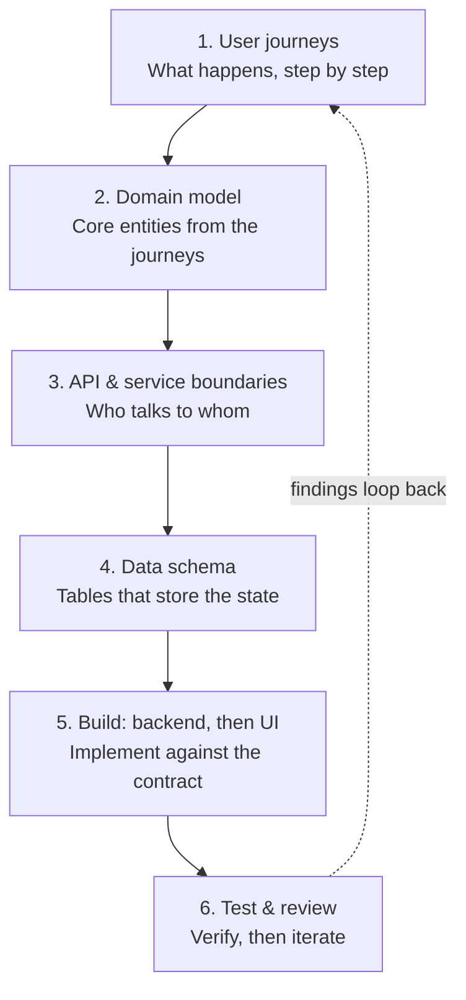
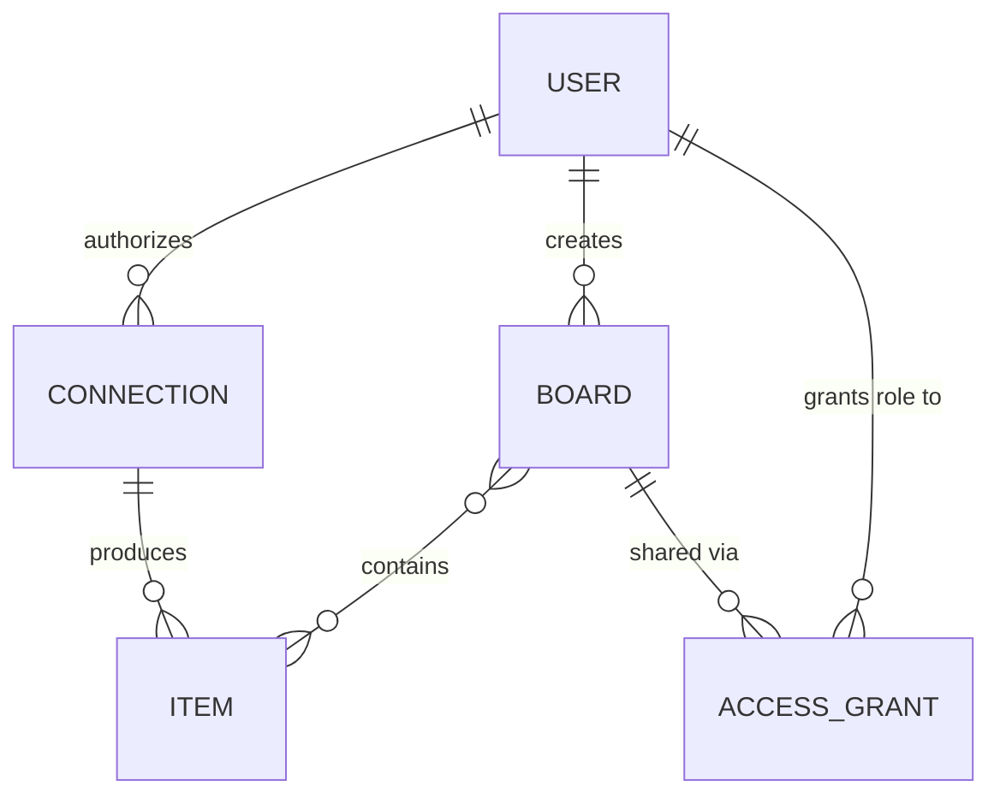
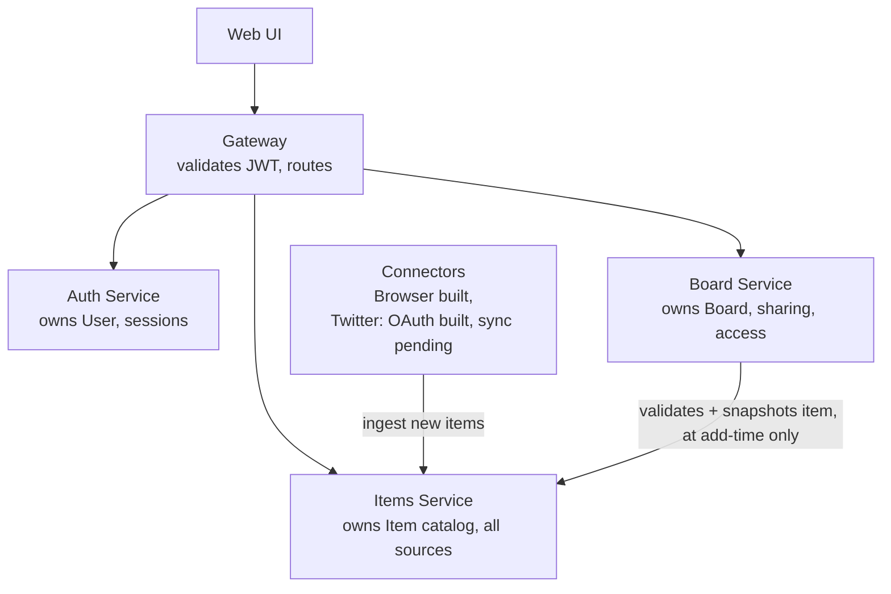
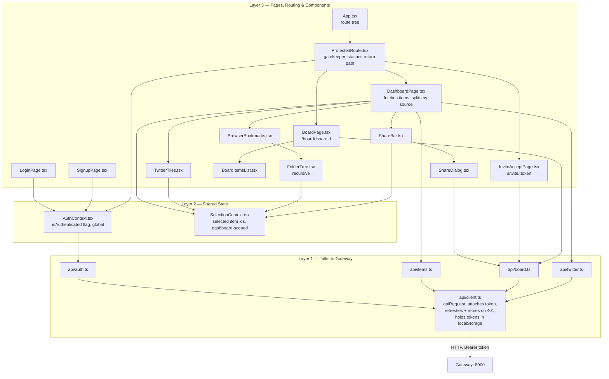

# Study Hub — Architecture & Decision Log

**Purpose of this doc:** A living record of every design decision made while building this project, and why. This is the primary artifact — the goal is to be able to defend each decision in an interview, not just to have working code. Update this doc every time a real decision is made, in Claude chat or in Claude Code.

**Note on this document's history:** this project (now "Mehul's Study Hub") began life as `bookmarks-hub`, a personal bookmark manager, and was forked (full git history preserved, no remote link back) once real hands-on experience with the architecture made clear that a study-resource curation/sharing tool was a more compelling, honest product story for the same underlying engineering — Items and Board were already generic, not actually bookmark-specific. `bookmarks-hub` itself is untouched and continues on its own as a separate personal project. Decisions #1–58 below predate the fork and are kept as-is, unedited; the fork itself is logged as Decision #59.

**Project goal:** A personal, learning-focused project to rebuild hands-on system design fluency (architecture, microservices, auth/authz, RBAC, basic UI) ahead of Senior EM / Director interviews. Not a coding-skill exercise — the point is being able to explain and defend every architectural choice.

---

## Problem Scope

A tool to curate and share system-design/interview-prep learning resources with study partners — save a resource (title, URL, personal notes, tags) via manual entry, browse your own library by tag rather than by where it came from, and share a curated board with someone else under real RBAC. This project's earlier life as a browser/Twitter bookmark manager (`bookmarks-hub`, see the document-history note above) is still visible in the architecture — the browser extension and the Twitter OAuth handshake are both real, working code — even though the active product path today is manual entry and tag-based curation, not source-based capture. The longer-term goal remains growing this into a broader personal toolset once this module is stable (see **Near-Term Direction** below).

**In scope (in build order):**
1. ✅ **Built** — Browser bookmarks (Chrome + Firefox, via a shared WebExtensions-based browser extension) — built first, free, no third-party API cost; now a dormant, secondary capture path, deferred rather than dropped (Decision #60), not the primary way resources get in
2. ✅ **Built** — Tile/list dashboard plus a React web UI (auth, browsing, sharing, receiving)
3. 🟡 **Partially built** — Sharing with real RBAC: **Owner and Viewer are implemented and enforced**; **Editor is a reserved role, not yet assignable** (no role picker exists — see Decision #10)
4. **Retired** — Twitter/X bookmark fetching (OAuth2 + PKCE): the authorization handshake is built and verified (Decision #56) and kept in the codebase as real, demonstrated engineering, but actually fetching tweets was never built and won't be — a pasted tweet/thread URL is now just handled as a normal manually-entered resource instead (Decision #61)
5. ✅ **Built** — Manually-entered study resources: title, URL, personal notes, free-text multi-valued tags, and full create/edit/delete — the primary way resources get into Study Hub today (Decisions #60, #62, #64); the dashboard organizes and filters by tag as a direct result

**Explicitly out of scope:** CVE/vulnerability tracking (dropped in the original `bookmarks-hub` project — kept the personal project personal, separate from work-adjacent content).

## How We're Building This (Process)

1. **User journeys** — what actually happens, step by step, from the user's point of view
2. **Domain model** — the core entities/nouns that fall out of those journeys
3. **API & service boundaries** — which service owns which verb, who talks to whom
4. **Data schema** — tables that store the state, designed only after 1–3 are settled
5. **Build: backend, then UI** — implement against the contract already defined
6. **Test & review** — verify, then loop findings back into step 1

Working style: step by step, one decision at a time. Each decision gets explained (what we chose, what the alternatives were, why) before moving to the next. No large chunks of generated code without understanding checkpoints.



## Hosting / Environment Decisions

- **Current development:** local via Docker Compose. This keeps the learning loop fast and avoids mixing application design with deployment concerns too early.
- **Twitter OAuth testing:** the OAuth callback will need a public HTTPS URL; use a temporary tunnel during local development if needed.
- **Public deployment:** planned as a real learning milestone once the Bookmarks module is stable. The hosting provider is intentionally **TBD** until that phase; the goal is to learn the path from local code → Git/GitHub → deployment → domain/HTTPS rather than optimize prematurely for a specific platform.
- **Tooling:** implementation is currently done in VS Code with Claude Code. Architecture/learning review is documented here and can be reviewed independently of the coding tool.

## Open Design Questions

**Open: a browser profile, not a re-authenticated person, is what's actually trusted by both the extension and the web UI.** The extension's push token (Decision #42) and the web UI's session tokens (Decision #51) both live in that browser profile's local storage, tied to whoever set that connection up or logged in there once — not re-checked per use. Concretely: anyone who can open that same browser profile (any tab, no separate login) can click "Sync Now" and push bookmarks into whichever Study Hub account that profile's push token belongs to, or view an already-logged-in web session's dashboard directly, with no additional authentication either way. Surfaced from a real question about identity: it's easy to assume a browser's own Google/Gmail sign-in is what ties bookmarks to a Study Hub account, but the two are entirely unrelated — the extension reads whatever bookmarks locally exist in that profile regardless of Google sign-in state, and the only thing that actually ties a sync to *your* Study Hub account is the one-time login you did on the extension's options page. Currently an accepted trade-off for a single-user personal project (the same "no real other audience" reasoning behind Decision #8's one-time source setup) — worth revisiting with a device/session list plus revocation (partially already possible via refresh-token revocation, Decision #26), shorter-lived push tokens, or step-up re-authentication, if this project ever moves beyond one person on their own machine.

*(Previously open: "Where should RBAC be enforced — gateway-level only, or also independently per service?" — resolved by Decision #30: both. Gateway does coarse validation, backend services independently re-verify the JWT for fine-grained checks.)*

## Step 1: User Journeys

These were the original design-time journeys; most are now built. Status is marked per journey below — where a journey mixes built and pending pieces (1a, 2), that's called out per step.

### Journey 1a: One-time source setup (done once, by you, as owner — not a polished user-facing flow)
1. ✅ Built — Install and authorize the browser extension locally, pointed at the app
2. 🟡 Partially built — Authorize Twitter via OAuth2 + PKCE, via a real "Connect Twitter" button on the web UI dashboard (not the vaguer "simple internal route" this journey originally sketched — the dashboard didn't exist yet when this was first written). The authorization handshake itself (Decision #56) is built and verified end to end against X's real token endpoint. **Still pending:** actually fetching bookmarks with the resulting token — deferred until X API credits are purchased, since that step (unlike authorization) has a real per-item cost.
3. From this point on, connected sources sync server-side — no "Connect" button, empty state, or retry UX needed, since there's no other audience going through this

### Journey 1b: Everyday login (what happens every time) — ✅ Built
1. Open browser, navigate to the app URL (`localhost:5173` today; a real domain once deployed — see Near-Term Direction)
2. Presented with login — own email/password auth (Google Sign-In deferred to later as an optional method, see Decision #6)
3. After login, dashboard shows two top-level blocks: **Twitter** (empty until the pending connector is built) and **Browser Bookmarks** (populated)
4. Browser Bookmarks expands into **Chrome** / **Firefox** sub-folders, each preserving that browser's native folder structure (Bookmarks Bar, Other, custom folders) — see Decision #7
5. Twitter is a flat list/tile view (no folder concept)

**Note:** users you later share a board with (see Journey 3/4) never go through Journey 1a — they only ever see boards you've already populated, via Viewer access (Editor is reserved but not assignable — see Decision #10).

### Journey 2: Everyday use — browsing
1. 🔲 Pending — **Twitter tab:** default view is tiles, each showing a lightweight preview (tweet text/media — comes free from the API response, no extra fetching)
2. 🔲 Pending — Clicking a Twitter tile opens the original tweet on X in a new tab
3. ✅ Built — **Browser tab:** default view is a collapsible folder tree (not tiles) — bookmark volume makes tiles impractical; each row shows title + URL + favicon only (no full-page preview thumbnails — not worth the extra fetch/caching complexity for a secondary view)
4. ✅ Built — Clicking a browser bookmark opens the original URL in a new tab

### Journey 3: Sharing a board — ✅ Built
1. Select tiles — either "select all" then deselect unwanted ones, or pick individual tiles one at a time
2. Selection always creates a brand-new board (see Decision #9) — named on the spot
3. Enter the recipient's email address
4. An expiring invite link is generated — an opaque, high-entropy token, **not signed, not a JWT** (Decision #36). **No real email is sent** (Decision #38): the link is shown directly in the UI for you to copy and send the recipient yourself, by whatever means.
5. Role is hardcoded to Viewer for v1 — no picker (see Decision #10)

### Journey 4: Receiving a shared board — ✅ Built
1. Recipient opens the invite link (however they received it — not via an automated email)
2. If they don't have an account yet, they set one up; if they do, they're logged in directly
3. They land directly on the shared board — no separate "accept invite" step
4. As Viewer: can see all items on the board and open the underlying links (tweets/bookmarked pages) in a new tab, same as owner browsing
5. Cannot add, remove, edit items, or manage sharing on the board
6. **Known gap:** neither side has a list view back to shared boards afterward — see the high-priority item in Future Extensions/Backlog, earlier in this doc

## Step 2: Domain Model

Entities identified from the four journeys, and why each earns its own table rather than being folded into another:

- **User** — the account table. Appears in two different relationships (the owner who creates boards/connections, and a recipient who receives access) but it's the same entity both times — the relationship differs, not the underlying thing.
- **Connection** — one authorized link to a source (Twitter OAuth tokens + expiry, or the browser extension's registration + last-synced time). Needs its own entity because a background ingestion process reads it again on every future run.
- **Item** — the normalized shape of "one bookmark," regardless of source (title, url, source, folder path if applicable, preview data, saved_at). Lets one UI component render items from any source, and is what a Board actually references.
- **Board** — a purpose-built sharing container, created only when items are explicitly selected and shared. Not the same as the default Twitter/Browser dashboard views, which are just "all your own items, filtered by source" — no Board involved there, since the owner always sees everything directly.
- **Access Grant** — conceptually "a board grants a role to a user." One row represents both stages: first a pending invite keyed by email, then the same row becomes an accepted share by adding `user_id` when the invite is claimed.



Relationships in plain language:
`User` authorizes many `Connection`s → each `Connection` produces many `Item`s → `User` creates many `Board`s → `Board` contains many `Item`s (many-to-many) → `Board` is shared via many `Access Grant`s → each `Access Grant` grants a role to one `User` (the recipient).

This section intentionally stays conceptual; the concrete columns and constraints are documented in Step 4.

## Step 3: API & Service Boundaries

**Five runtime services** — four own data, plus a stateless Gateway in front of them:

- **Gateway** — owns no data. Validates the JWT once per request, attaches user identity, routes to the right service. Coarse-grained auth check only ("is this a valid logged-in user") — fine-grained role checks (can *this* user edit *this* board) live inside Board service, since only it knows the role for that specific board.
- **Auth service** — owns `User`. Verbs: signup, login, issue/refresh JWT.
- **Items service** — owns `Item`. Verbs: ingest (write a new normalized item — called by connectors), list/get items (called by the UI directly, and by Board service when an owner adds an item to a board).
- **Connectors** (Twitter — OAuth authorization built, bookmark fetch/sync pending; Browser — fully built) — own `Connection`. Verbs: authorize, fetch/sync from the external source, normalize, then call Items service's ingest endpoint. Connectors do not store `Item` themselves — they're workers, not data owners, which keeps a single source of truth for items regardless of source.
- **Board service** — owns `Board`, the Board↔Item join, and `Access Grant`. Verbs: create board, add/remove items (validating each against Items at add-time, then storing a display-field snapshot), invite, list board contents (read from Board's own stored snapshot — **current behavior is Decision #37**, which superseded the original live-composition design in Decision #11).



Note what the diagram does *not* show: there is no arrow from viewing a board back to Items. Board reads its own stored snapshot on every view (owner or Viewer) — the only time Board ever calls Items is when an owner adds an item to a board (Decision #37).

**Internal service-to-service auth (resolved):** OAuth2 client-credentials flow — see Decision #12 (design intent) and Decision #41 (actually built).

## Step 4: Data Schema

**Data separation:** one Postgres instance, one schema per service (see Decision #13). **FK rule:** real foreign keys within a service's own schema; cross-schema references are plain UUID columns validated by application code, never a database-level FK (see Decision #14).

### `auth` schema
- **users**: id (uuid, PK, default `gen_random_uuid()` — requires the `pgcrypto` extension), email (text, unique, not null — lowercased by application code before every write/read, not `citext`), password_hash (text, not null — Argon2id via `argon2-cffi`, see Decision #18), created_at (timestamptz, default `now()`), updated_at (timestamptz, default `now()`, maintained by application code on every write)
  - *Migration note: schema creation and table DDL are managed via Alembic, one migration history per service — see Decision #19.*
- **refresh_tokens**: id (uuid, PK, default `gen_random_uuid()`), user_id (uuid, real FK → `users.id`, same schema), token_hash (text, unique, not null — the opaque refresh token is hashed before storage, never stored raw), expires_at (timestamptz, not null), revoked_at (timestamptz, nullable — set on logout *or* on rotation), replaced_by_id (uuid, nullable, real FK → `refresh_tokens.id`, same schema, self-referential — set only when rotation revoked this row), created_at (timestamptz, default `now()`)
  - *Design note: this table is what makes Decision #26 (DB-tracked, revocable refresh tokens) real — `/refresh` looks up the row by hash, checks `revoked_at IS NULL AND expires_at > now()`. `replaced_by_id` is what Decision #28 (rotation + reuse detection) adds: it's the difference between "revoked because rotated" (a theft signal if presented again) and "revoked because the user logged out" (expected).*
- **oauth_clients**: id (uuid, PK, default `gen_random_uuid()`), client_id (text, unique, not null — e.g. `"connectors-service"`), client_secret_hash (text, not null — hashed the same principled way as passwords, never stored raw), client_name (text, not null), created_at (timestamptz, default `now()`)
  - *Design note: this is what makes Decision #41 (OAuth2 client-credentials) real — `POST /oauth/token` verifies `client_id`/`client_secret` against this table and, on success, signs a service token with a `client_id` claim instead of a `sub` claim. One row for v1 (Connectors), created via a one-off setup step rather than a self-service registration API — same "no real audience for a repeatable flow" reasoning as Decision #8.*

### `connectors` schema
- **connections**: id (uuid, PK, default `gen_random_uuid()`), owner_user_id (uuid, soft ref → auth.users), type (`twitter` | `browser_chrome` | `browser_firefox`), push_token_hash (text, unique, nullable — browser push auth, hashed before storage, Decision #42; null for Twitter connections), oauth_access_token / oauth_refresh_token / token_expires_at (Twitter only, nullable, now actually populated by the OAuth callback — Decision #56), last_synced_at (timestamptz, nullable), created_at (timestamptz, default `now()`)
  - *Design note: one table with nullable type-specific columns rather than separate tables per connector type — simpler for v1, at the cost of some always-null columns depending on type.*
  - *Migration note: `POST /connections` creates this row and returns the plaintext `push_token` exactly once (Decision #43) — only `push_token_hash` is ever persisted, same pattern as refresh/invite tokens. A `twitter` row, unlike a browser row, is never created via `POST /connections` at all — only by a successful `/twitter/callback` exchange.*
- **oauth_states**: id (uuid, PK), state (text, unique, not null — the CSRF token handed to X, looked up unhashed since it's short-lived and single-use, not a long-lived credential), owner_user_id (uuid, soft ref → auth.users), code_verifier (text, not null — PKCE's server-held secret, see Decision #56), expires_at (timestamptz, not null — 10 minutes), created_at (timestamptz, default `now()`)
  - *Design note: rows are deleted at callback time regardless of whether the token exchange that follows succeeds — this table only ever needs to answer "is this state genuine and unused," never "what happened with this attempt historically."*

### `items` schema
- **items**: id (uuid, PK, default `gen_random_uuid()` — same Postgres-side generation as `auth.users`, Decision #17), owner_user_id (uuid, soft ref → auth.users), source (`twitter` | `chrome` | `firefox`), external_id (source's own bookmark ID), title, url, folder_path (nullable — browser only), preview_text / preview_media_url (nullable — Twitter), favicon_url (nullable — browser), saved_at (when bookmarked at the source), created_at (when ingested, default `now()`)
  - **Unique constraint:** `(owner_user_id, source, external_id)` — the database still rejects a duplicate INSERT at the constraint level; the app layer catches that and returns the existing item as an idempotent success rather than surfacing the raw rejection to the caller (Decision #33).

### `board` schema
- **boards**: id (uuid, PK, default `gen_random_uuid()`), owner_user_id (uuid, soft ref → auth.users), name, created_at
- **board_items** (many-to-many join): board_id (real FK → boards.id, same schema), item_id (uuid, soft ref → items.items), added_at — composite PK (board_id, item_id)
  - **Denormalized display fields** (Decision #37): title, url, favicon_url, preview_text, preview_media_url — a snapshot copied from Items at add-time, not a live reference. Viewing a board reads these directly; it never calls Items.
- **access_grants**: id (uuid, PK), board_id (real FK → boards.id, same schema), invited_email, user_id (nullable, soft ref → auth.users — filled in once accepted), role (`viewer` | `editor` — **only `viewer` is ever actually assigned today**, see Decision #10), invite_token_hash (unique — a random opaque high-entropy token, hashed before storage; **not signed, not a JWT** — the raw token is returned exactly once, at creation, for manual sharing, see Decision #36), invite_token_expires_at, status (`pending` | `accepted`), created_at, accepted_at
  - *Design note: one table models both states of "Access Grant" from Step 2 (pending-by-email, settled-by-user_id) via nullable `user_id` + `status`, rather than two separate tables — the pending→accepted transition is a single row update.*
  - *FK note: `board_id` is a real FK (same-schema, Board service owns both); `user_id` is a soft reference (crosses into `auth` schema — see Decision #14).*

## Web UI — Structure & Layers

The web UI (`web/`, Decisions #49–52) is organized as three layers, each only trusting the one below it — see `how-it-works.md`'s Web UI section for the plain-English version of what each layer does. This section maps that same model onto the actual files, now covering all three build stages (auth/routing, sharing, receiving).



| Layer | File | Role |
|---|---|---|
| 1 — API | `src/api/client.ts` | The only place that calls `fetch`. Owns token storage (localStorage), attaches the access token to every request, and on a `401` does one refresh-and-retry before giving up. Also the module boundary where a failed refresh fires the `study_hub:logged_out` browser event that layer 2 listens for. |
| 1 — API | `src/api/auth.ts`, `items.ts`, `board.ts`, `twitter.ts` | Thin, specific calls built on `client.ts` — login/signup/logout; listing items; creating boards, adding items, inviting, accepting invites, fetching a board; getting X's OAuth authorize URL. |
| — | `src/types/api.ts` | TypeScript interfaces mirroring the backend's Pydantic response schemas — no logic, just compile-time contract-checking (Decision #50). |
| — | `src/lib/folderTree.ts`, `favicon.ts` | Pure helper functions, not state — turning a flat item list into a nested folder tree, and resolving a favicon from a bookmark's own URL when none was synced. |
| 2 — Shared state | `src/auth/AuthContext.tsx` | The single `isAuthenticated` flag, global (wraps the whole route tree), via React's Context API (Decision #51). Initializes from whatever's already in storage; listens for `study_hub:logged_out`. |
| 2 — Shared state | `src/dashboard/SelectionContext.tsx` | A second, page-scoped Context (only wraps the dashboard) tracking which item ids are checked for sharing — added specifically because `FolderTree` is recursive and several levels deep, where prop-drilling a toggle callback through every folder would be exactly what Context exists to avoid. |
| 3 — Pages/Routing | `src/App.tsx` | The route table: `/login`, `/signup` public; `/`, `/board/:boardId`, `/invite/:token` all nested under the gatekeeper. |
| 3 — Pages/Routing | `src/components/ProtectedRoute.tsx` | The gatekeeper — checks `isAuthenticated`; if false, redirects to `/login` carrying the current location in navigation state (`state={{from: location}}`) so `LoginPage`/`SignupPage` can send the user back afterward instead of always to the dashboard (Decision #55 fixed a gap in this: the cross-links *between* those two pages didn't forward that state). |
| 3 — Pages | `src/pages/LoginPage.tsx`, `SignupPage.tsx` | Auth forms; navigate to the stashed return path on success, `/` by default. |
| 3 — Pages | `src/pages/DashboardPage.tsx` | Fetches all items once, splits by source, renders `TwitterTiles` + `BrowserBookmarks` inside a `SelectionProvider`, with `ShareBar` for the selection-to-share flow. Also has the "Connect Twitter" button (calls `api/twitter.ts`, then a real browser navigation to X) and reads a `?twitter=connected` query param on mount to show a success message after the OAuth callback redirects back here. |
| 3 — Pages | `src/pages/BoardPage.tsx` | `/board/:boardId` — fetches one board (with its denormalized item snapshot and the caller's `role`) and renders it via `BoardItemsList`. Revisitable, not just a one-time landing page. |
| 3 — Pages | `src/pages/InviteAcceptPage.tsx` | `/invite/:token` — by the time this renders, `ProtectedRoute` has already guaranteed the visitor is logged in; its only job is call accept, then redirect straight to `/board/:id`. No manual "accept" step, per Journey 4. |
| 3 — Components | `TwitterTiles.tsx`, `BrowserBookmarks.tsx`, `FolderTree.tsx` | Dashboard rendering — `FolderTree` renders itself recursively, one call per folder-nesting level, each with its own independent collapsed/expanded state. |
| 3 — Components | `BoardItemsList.tsx` | Board's flat item list — no tile/folder split, since Board's denormalized snapshot never stores source or folder_path (Decision #37). |
| 3 — Components | `ShareBar.tsx`, `ShareDialog.tsx` | Selection summary + select-all/clear, and the create-board → add-items → create-invite flow, surfacing the resulting link directly (no real email-sending exists yet). |

**Directory layout, same information as a picture:**

```
web/
├─ src/
│  ├─ types/
│  │  └─ api.ts               # backend response shapes, mirrored
│  ├─ lib/
│  │  ├─ folderTree.ts        # flat items -> nested folder tree
│  │  └─ favicon.ts           # resolve a favicon from a bookmark's URL
│  ├─ api/
│  │  ├─ client.ts            # Layer 1 — fetch, token storage, refresh+retry
│  │  ├─ auth.ts              # Layer 1 — login/signup/getCurrentUser/logout
│  │  ├─ items.ts             # Layer 1 — list items
│  │  ├─ board.ts             # Layer 1 — create/get board, add item, invite, accept
│  │  └─ twitter.ts           # Layer 1 — get X's OAuth authorize URL
│  ├─ auth/
│  │  └─ AuthContext.tsx      # Layer 2 — shared isAuthenticated flag (global)
│  ├─ dashboard/
│  │  ├─ SelectionContext.tsx # Layer 2 — selected item ids (dashboard-scoped)
│  │  ├─ ShareBar.tsx         # Layer 3 — selection summary + share trigger
│  │  └─ ShareDialog.tsx      # Layer 3 — create board -> add items -> invite
│  ├─ components/
│  │  ├─ ProtectedRoute.tsx   # Layer 3 — gatekeeper, stashes return path
│  │  ├─ TwitterTiles.tsx     # Layer 3 — flat tile grid
│  │  ├─ BrowserBookmarks.tsx # Layer 3 — per-source folder trees
│  │  ├─ FolderTree.tsx       # Layer 3 — recursive folder rendering
│  │  └─ BoardItemsList.tsx   # Layer 3 — flat board item list
│  ├─ pages/
│  │  ├─ LoginPage.tsx        # Layer 3
│  │  ├─ SignupPage.tsx       # Layer 3
│  │  ├─ DashboardPage.tsx    # Layer 3 — real content: items + sharing
│  │  ├─ BoardPage.tsx        # Layer 3 — /board/:boardId
│  │  └─ InviteAcceptPage.tsx # Layer 3 — /invite/:token
│  ├─ App.tsx                 # Layer 3 — route tree, wraps AuthProvider
│  ├─ main.tsx                 # entry point, mounts <App />
│  └─ index.css                 # shared styling
└─ package.json
```

## Architectural Learnings

A compact record of the strongest lessons from real decisions and real trial-and-error while building this — not a general system-design syllabus, just what actually happened here and why it mattered. Full reasoning for each lives in the Decision Log; this is the condensed, teachable version.

### Why separate services, not a simpler modular monolith?
**Problem:** This project exists partly to build real hands-on fluency in service boundaries and microservices. A modular monolith (one codebase, clean internal module boundaries) would be faster to build and would work fine for a single-user app.
**Options considered:** (a) a modular monolith with disciplined internal boundaries; (b) genuinely separate services behind a Gateway.
**Decision:** Real separate services (Auth, Items, Board, Connectors), each independently deployable, each owning its own data.
**Why:** A monolith can't teach what this project needs to teach — real network boundaries, independent deployability, service-to-service authentication, partial failure. Those only show up when services are truly separate processes, not modules in one codebase.
**Trade-off:** Meaningfully more operational overhead (more moving parts, more repeated boilerplate — see Decision #40) than a single-user app structurally needs. Accepted deliberately, because that overhead is the point of the exercise here.

### Why one Postgres instance with a separate schema per service?
**Problem:** True database-per-service (a separate physical database per service) is the "textbook" microservices pattern, but running several separate Postgres containers locally is heavier to operate than a learning project needs.
**Options considered:** (a) fully separate Postgres instance per service; (b) one shared schema, no real separation; (c) one instance, one schema per service, no cross-schema foreign keys.
**Decision:** Option (c) — Decisions #13 and #14.
**Why:** Schema-per-service keeps the discipline that actually matters (each service owns its own tables; no reaching into another service's data via a foreign key) without the operational cost of multiple database containers. This exact middle ground is also used by real companies in production, not just as a learning shortcut.
**Trade-off:** It's enforced by convention and code discipline, not by the infrastructure itself — nothing physically stops a cross-schema join the way separate databases would.

### Why Board stores an item snapshot instead of a live Items lookup on every view
**Problem:** The original design had Board call Items live, every time anyone viewed a board, to fetch each item's current display details.
**Options considered:** (a) keep the live per-view call, with a timeout/fallback if Items is unreachable (original Decision #11); (b) give Items a special service-only endpoint Board could call to read *any* user's items; (c) copy the display fields onto Board's own row once, when the item is added.
**Decision:** Option (c) — Decision #37.
**Why:** Items correctly scopes every read to "your own items only," which is exactly right for the owner but breaks the moment someone the board was *shared with* tries to view it — they're not asking about their own items. Building a whole new service-to-service read path to fix that was disproportionate, especially since nothing in the system ever edits a bookmark after it's saved, so a stale snapshot is a theoretical cost today, not a real one.
**Trade-off:** If a bookmark's title changed at the source after being added to a board, the board's copy wouldn't know. Acceptable now; worth revisiting if that ever becomes real.

### Why backend services re-verify JWTs even though Gateway already checked them
**Problem:** Gateway already validates a caller's JWT before forwarding a request. Should the destination service just trust that and skip checking it again?
**Options considered:** (a) trust Gateway's word (e.g. via a forwarded "this is user X" header, no re-verification); (b) every service independently re-verifies the token itself.
**Decision:** Option (b) — Decision #30.
**Why:** Trusting a request just because of where it came from ("it went through Gateway, so it must be fine") is exactly the assumption Zero Trust security rejects. Independent verification means no single service's security depends on every other piece of the system being configured correctly.
**Trade-off:** Small duplicated verification logic in every service, and a little repeated work per request — a deliberately cheap cost for a materially stronger guarantee.

### Why Connectors uses a real service identity instead of pretending to be a logged-in user
**Problem:** A background sync job needs to write bookmarks into Items on a real user's behalf, with no human present to provide a login session.
**Options considered:** (a) have Connectors hold and refresh a normal user access/refresh token, like a borrowed login session; (b) give Connectors its own distinct machine identity (`client_id`/`client_secret`, exchanged for a short-lived service token).
**Decision:** Option (b) — Decision #41.
**Why:** A background job impersonating a user session blurs who actually did what. A distinct service identity keeps that honest, and matches how real systems authenticate machine callers — this is literally SailPoint/IdentityIQ's own domain (a connector provisioning into a target system under its own credential, not a borrowed user's).
**Trade-off:** A second, different credential type to build, store, and eventually rotate — genuinely more work than reusing an existing session type.

### Why bookmark ingestion is idempotent
**Problem:** A sync can re-encounter a bookmark it already sent before — routine, expected, not a mistake. What should happen?
**Options considered:** (a) reject the duplicate as an error (`409 Conflict`); (b) silently overwrite the existing row with the new data (upsert); (c) recognize it's already there and return the existing item as a success, unchanged.
**Decision:** Option (c) — Decision #33.
**Why:** Repeat syncs are completely normal; treating every one as an error would make ordinary use look broken. Overwriting was considered but deferred — nothing today actually changes a bookmark's details after saving it, so there's no real scenario yet that needs update-on-duplicate behavior.
**Trade-off:** If a bookmark's title genuinely changed at the source, re-ingesting it today does not pick that change up — deliberately deferred, not an oversight.

### The real large-browser-sync timeout incident
**Problem:** A real user's first sync of an actual, long-used browser profile (hundreds of bookmarks) failed with a confusing client-side JSON-parsing error.
**Options considered:** once root-caused — fix only the visible symptom (the confusing error message), or fix the whole chain that was actually wrong.
**Decision:** Fixed all three real causes together (Decision #48): Connectors now syncs a batch concurrently instead of one bookmark at a time; Gateway now returns a proper error response if a backend call times out, instead of letting it leak through as an unhandled, non-JSON error page; the extension now reads an error response as text before assuming it's JSON.
**Why:** The real chain was: a slow, fully sequential sync → exceeded Gateway's timeout → Gateway's unhandled timeout produced a non-JSON error page → the extension crashed trying to parse it as JSON, surfacing a confusing, unrelated-looking error. Fixing only the visible symptom would have left the actual slow-sync problem in place for the next large batch.
**Trade-off:** None of the three fixes were free (a concurrency limit had to be chosen deliberately; defensive parsing is extra code for a case that ideally never happens) — but none of this was caught by any automated test beforehand. It only surfaced from real use with a realistically large dataset, which is itself the lesson: a test suite proves the logic is right, not that it survives real-world scale.

### Why an OAuth2 "Authorization Code" flow needs its own short-lived server-side storage (PKCE)
**Problem:** Building Twitter's OAuth2 login handoff, the browser leaves this app entirely (a real navigation to x.com) and comes back minutes later to a *different* endpoint, with no session or Bearer token attached at all. Two secrets need to survive that gap: PKCE's `code_verifier` (proves the app completing the exchange is the same one that started it) and "which of our users actually asked for this."
**Options considered:** (a) an in-process memory dictionary keyed by a random state value; (b) encode `code_verifier` directly inside a signed `state` parameter, avoiding server storage entirely; (c) a small database table, same shape as this project's other short-lived opaque tokens.
**Decision:** Option (c) — a new `oauth_states` table (state → user id + code_verifier), row deleted the moment the callback consumes it, whether the exchange that follows succeeds or fails.
**Why:** This project had already answered "how do we hold a short-lived, single-use, server-side secret" three times before — refresh tokens, invite tokens, push tokens — always the same shape: opaque value, DB-tracked, checked once, then done. Reusing that shape here rather than inventing a fourth mechanism was the more consistent choice, and it survives a service restart between the two steps, which in-memory storage wouldn't.
**Trade-off:** One more small table to maintain, and a bit of manual cleanup reasoning (expired-but-never-used rows just age out rather than being actively swept) — a real but minor cost, consistent with how this project already treats invite tokens the same way.

## Near-Term Direction

This is not a full system-design roadmap — just the next few steps, roughly in order:

1. Clean up and stabilize the Bookmarks functionality (this documentation cleanup included).
2. Finish Twitter/X sync and OAuth2 + PKCE integration.
3. Complete useful sharing/RBAC functionality where a real need shows up (the board-visibility gap above is the current best example) — not a full Editor role just because it's technically possible to build.
4. Deploy the application properly, and learn the real Git/GitHub/deployment flow by actually doing it, rather than simulating it locally indefinitely.
5. Then gradually add other personal-hub modules — for example: Writing/Articles, personal activity/habit tracking, weekly/monthly summaries.

**Standing rule:** a new technology or architectural pattern (a cache, a message queue, container orchestration, sharding, a different database, etc.) gets introduced only when a real feature or a real problem in this project creates an actual reason for it — never because it's a common system-design interview topic. `sailpoint-prep-coverage-map.md`'s "Topics to study separately later" section already names several such technologies deliberately left unbuilt, precisely so they don't get forced in artificially.

## Future Extensions / Backlog (deliberately out of v1 — captured here so nothing gets lost)

- **HIGH PRIORITY — Board visibility/audit views, on both sides of a share.** Surfaced testing Stage 3 (receiving) end to end with a real second account: after accepting an invite and clicking "Back to dashboard," there is currently no way for that recipient to find their way back to the board again — no list, nothing. The only way back is re-visiting the original invite link, which still works (invites don't expire for 7 days, re-accepting is idempotent, Decision #39) but isn't a real answer. Two distinct views are needed, neither built yet:
  - **Recipient side — "Shared with me":** a list, on the dashboard, of every board this user has accepted an invite to (name, link to `/board/:id`).
  - **Owner side — "Boards I've shared":** a read-only view of every board this user owns that has active grants — board name, the items on it, who it's shared with, and when (invited-at / accepted-at timestamps). Right now an owner has *no visibility at all* into who has access to what they've shared, beyond remembering it themselves.
  Both need real backend work first — Board service currently has no "list my boards" endpoint at all (only create-one, get-one-by-id, add/remove item, invite, accept). 📚 SailPoint Prep — Topic 11 (IAM): the owner-side view in particular is a small-scale version of exactly what SailPoint IdentityIQ does — access visibility / entitlement review, "who has access to what, granted when" — worth explicitly building out as a real talking point, not just noting as a gap.
- **Books-read module**: track books read, with personal summaries/notes. Different in kind from the Twitter/Browser connectors — this needs an actual content *editor* (writing original text), not just an ingestion pipeline pulling from an external source. Will likely need its own entity (e.g. `ReadingEntries`: title, author, summary body, rating, date) and a text-editing UI, not a tile-preview UI. Worth revisiting whether "Board" stays generic enough to hold this, or whether it becomes its own module — decide when we get here.
- **Editor role at invite time** (see Decision #10) — role picker deferred, hardcoded Viewer for v1.
- **Add selection to an existing shared board** (see Decision #9) — deferred, v1 always creates a new board.
- **Google Sign-In as an additional login method** (see Decision #6) — deferred, own auth built first.
- **Real-time live sync + in-app alerts**: e.g. bookmarking a tweet in another tab should show up automatically with a notification, without a page refresh. Undecided whether this belongs in v1. Technical nuance worth remembering: browser bookmarks *can* genuinely be real-time (the extension can listen to native events like `chrome.bookmarks.onCreated` and push instantly), but Twitter *cannot* — X's API has no bookmark webhook, so any "live" Twitter updates would really be periodic polling made to look real-time, not a true push. Would also need a push channel to the open browser tab (WebSocket or Server-Sent Events) to deliver the alert.

---

## Decision Log

| # | Decision | Alternatives Considered | Rationale |
|---|----------|--------------------------|-----------|
| 1 | Personal bookmarks hub (browser bookmarks + Twitter, plugin-style connectors) instead of a compliance/CVE-focused SaaS | CVE/vulnerability tracker SaaS (multi-tenant) | Personal project stays authentically personal; connector/plugin pattern still gives strong microservices story |
| 2 | RBAC via a real (small) sharing feature — Owner/Editor/Viewer on boards | Leave RBAC as a design-only talking point | Real enforced code is more defensible in interviews than a stub. *Status: Owner and Viewer are built and enforced; Editor was deferred at invite-time — see Decision #10.* |
| 3 | Browser bookmarks (Chrome + Firefox via extension) built before Twitter | Twitter first | Free, no developer account/approval friction, proves the pipeline end-to-end before spending money |
| 4 | CVE tracking dropped entirely from scope | Keep CVE as a later "branch" | Kept the project focused and personal |
| 5 | Start local with Docker Compose; defer cloud deployment until the application is stable enough to make deployment itself the next learning step | Deploy early while core architecture is still changing | Local-first kept the early learning loop simple. **Current direction:** public deployment is now an explicit learning milestone (Git/GitHub → hosting → domain/HTTPS), not merely an optional demo. |
| 6 | Build own auth first (email/password, self-managed sessions); add Google Sign-In later as an optional additional sign-in method | Start with Google OAuth as primary login | Own auth teaches password hashing, session/JWT design, and invalidation — skills OAuth doesn't touch. Google OAuth would be redundant right now since the Twitter connector already requires building OAuth2+PKCE from scratch later. |
| 7 | Dashboard shows two top-level blocks: Twitter and Browser Bookmarks. Browser Bookmarks expands into Chrome/Firefox sub-folders, each preserving that browser's native folder structure (Bookmarks Bar, Other, custom folders). Twitter is a flat list (no folder concept). | Merge Chrome+Firefox into one flat block; or three flat top-level blocks | Chrome and Firefox are separate, unsynced bookmark stores (Chrome Sync uses Google account, Firefox Sync uses a separate Mozilla account — not the same data). Nesting reflects the real structure without losing it. |
| 8 | Source connection (browser extension install, Twitter OAuth) is a one-time owner/developer setup step, not a polished repeatable user-facing "Connect" flow with empty states | Build a general-purpose connection UX for arbitrary future users | Single-user app for source data; people boards get shared with never connect their own sources, so there's no real audience for a repeatable onboarding flow — building one would be scope for its own sake |
| 9 | Sharing works by selecting tiles (select-all + deselect, or individual picks) and always creates a brand-new board from that selection | Allow adding selection to an existing already-shared board | Keeps v1 simple — one sharing mechanism, no second "add to existing board" flow to design/build yet |
| 10 | Invite by email with a signed, expiring magic link; role is hardcoded to Viewer for v1 (no role picker) | Show a Viewer/Editor picker at invite time | Keeps v1 scope tight; Editor picker deferred to v2 since Viewer alone already proves the RBAC enforcement mechanism. *("Signed" was this decision's original, imprecise wording, written before Decision #36 settled the invite token's actual design — it's an opaque hashed token, not signed/JWT. "By email" was also aspirational — no real email-sending exists; see Decision #38.)* |
| 11 | ~~Board service composes item details by calling Items service internally (server-to-server), with a short timeout and graceful fallback — if Items is unreachable, return the board (name, item IDs, sharing info) with affected items flagged "preview_unavailable" rather than failing the whole request~~ **Superseded by Decision #37** | (a) Frontend calls both services and composes client-side, isolating failures naturally; (b) naive backend composition with no fallback | Keeps the frontend simple (one call to Board) while avoiding the cascading-failure trap where an Items outage would otherwise take down board rendering entirely, even though board metadata itself is unaffected. *Revisited once Board was actually built: a live per-view call to Items can't work for a Viewer reading a board they don't own, since Items correctly scopes every read to the requesting JWT's own user — see Decision #37.* |
| 12 | **Design intent:** use OAuth2 client credentials when a backend service needs to act as itself rather than as a logged-in user | (a) Static shared secret; (b) full mTLS/service mesh; (c) trusted network/no internal auth | The principle is short-lived, verifiable service identity without trusting network location. **Current implementation:** this is built for Connectors → Items (Decision #41). Not every internal call uses a service token: Board → Items at add-time deliberately forwards the owner's user JWT because Items is validating that owner's item. |
| 13 | One Postgres instance, separate schema per service (auth, items, connectors, board) | (a) Fully separate physical database per service; (b) single shared schema, no enforced separation | Approximates the real database-per-service pattern (logical ownership, no cross-service joins) without running four separate Postgres containers locally — a proportionate middle ground several real companies also use in production |
| 14 | Foreign keys are used normally *within* a service's own schema (e.g. `access_grants.board_id` → `boards.id`, both owned by Board service); references that cross into another service's schema (e.g. `access_grants.user_id` → `auth.users.id`) are plain UUID columns validated by application code, never a real FK | Use real FKs everywhere, including cross-schema | A database-per-service split literally couldn't have a cross-database FK — keeping that discipline here (even though everything happens to share one Postgres instance) avoids a coupling the architecture isn't supposed to have. Within one service's own schema, a real FK is correct and desirable — that's what referential integrity is for. |
| 15 | Backend services built in Python with FastAPI | Node.js/Express; Java/Spring Boot | FastAPI gets built-in interactive API docs generated from code — useful given Step 3's contracts. Less ceremony than Spring Boot (faster to iterate, more time on decisions than boilerplate). Likely closer to existing daily-vulns automation experience than Node. |
| 16 | Dev environment: WSL2 + Ubuntu 24.04 on the personal Windows laptop, with Docker Desktop's WSL2 integration, and Node.js installed natively via nvm (not the Windows-side Node install, which was leaking into WSL's PATH via interop and causing a broken node/npm mismatch) | Work natively in Windows PowerShell; use the Windows-side Node install as-is | WSL2 matches the Linux-first tooling this whole stack assumes (bash scripts, Docker, Postgres) without fighting Windows path/tooling differences. A Windows-side Node install crossing into WSL via interop caused a real, confirmed bug (npm resolved, node did not) — nvm gives a clean, fully Linux-native runtime that takes PATH priority. |
| 17 | Finalized `auth.users` schema: `id` is a Postgres-generated UUID (`gen_random_uuid()` as the column default, via the `pgcrypto` extension) rather than app-generated; `email` uniqueness/lookup is case-insensitive by lowercasing in application code before every write/read, not the `citext` extension; `updated_at` is maintained by application code on every write, not a DB trigger | (a) App-generated UUIDv4/UUIDv7 instead of DB-generated; (b) `citext` column type for email; (c) a Postgres trigger to auto-update `updated_at` | Postgres-side UUID generation means the row's ID exists the instant it's INSERTed, no extra app step; UUIDv7's time-ordered-index benefit isn't worth the added complexity at this table's scale, but is the named "how this scales" answer. App-level email lowercasing avoids a second extension dependency and is easy to point to as "where is this invariant enforced" in an interview. App-side `updated_at` avoids a DB trigger for a single, simple, always-app-driven write path. |
| 18 | Password hashing via Argon2id (`argon2-cffi` in Python) | bcrypt; scrypt; PBKDF2 | OWASP's current first recommendation for new systems. Memory-hard by design (tunable memory cost, not just time cost) — the actual technical improvement over bcrypt, which is not memory-hard and more parallelizable on GPU/ASIC cracking rigs. Trade-off: three tunable parameters (memory cost, time cost, parallelism) vs. bcrypt's one cost factor, but OWASP publishes concrete recommended baselines, so this isn't guesswork. |
| 19 | Schema migrations managed via Alembic, with one independent migration history per service (not a single shared migration repo, and not plain SQL run once via `docker-entrypoint-initdb.d`) | (a) Plain SQL init script, run once at container creation; (b) one shared Alembic project across all services | A raw init script has no versioning or rollback story and can't safely evolve a table that already has data — "how do you manage schema migrations across environments" is a real, common interview question this needed an actual answer for, not just a working table. Per-service migration history mirrors the schema-per-service ownership from Decision #13 — Auth's migrations only ever touch the `auth` schema, which is what a true database-per-service split would require anyway. |
| 20 | `POST /signup` creates the account only and returns `{id, email, created_at}` (never the hash) with `201` — no JWT is issued. A separate `POST /login` call is required afterward to obtain a token. | Auto-issue a JWT on signup (auto-login UX in one call) | Matches the Step 3 verb split, which already treats signup, login, and issue/refresh JWT as three distinct Auth service verbs, not one combined action. Keeps JWT-issuance logic built and tested exactly once, inside `/login`, instead of duplicated across two endpoints. Trade-off: one extra round trip for the client right after signup, in exchange for a cleaner separation between "create an identity" and "establish a session." |
| 21 | Duplicate email at signup is handled by attempting the INSERT directly and catching the unique-constraint violation (`IntegrityError`), translated to `409` | Check-then-insert: `SELECT` by email first, return `409` if found, then insert | Insert-and-catch is race-free by construction — Postgres is the single source of truth for uniqueness, so there's no separate check that can go stale between the check and the write. Check-then-insert has a genuine TOCTOU race under concurrent signups with the same email, and a correct implementation still needs the same `IntegrityError` handling as a fallback, making it strictly more code for a worse guarantee. |
| 22 | Signup password validation is length-only (minimum 8 characters), no composition rules | Add uppercase/lowercase/digit/symbol rules; or raise the minimum length | **Implemented state:** 8-character minimum, no composition rules. The no-composition-rule choice remains aligned with modern guidance. **Standards note:** current NIST SP 800-63B-4 requires 15 characters when a password is the sole authentication factor (8 may be used when it is part of MFA), so the current minimum should be revisited when Auth is next changed rather than silently presented as current best practice. |
| 23 | App layer (signup/login) talks to Postgres via SQLAlchemy ORM (declarative model classes + `Session`) | (a) SQLAlchemy Core (explicit `Table` objects + `engine.execute`, no model classes); (b) raw SQL via psycopg directly, no query-building layer | ORM is the most productive fit for CRUD-shaped endpoints like signup/login, keeping the code short and readable. This is independent of Decision #19/#17's choice to hand-write Alembic migrations as raw SQL (`target_metadata = None` in `env.py`) — migrations and the app's query layer are allowed to make different trade-offs, since Alembic autogenerate diffing was never a goal here. |
| 24 | User-facing JWTs (issued by Auth service, verified by Gateway) are signed with RS256 (asymmetric) — Auth holds the private key and signs; Gateway and other verifying services hold only the public key | HS256 (symmetric): one shared secret signs and verifies, distributed to both Auth and Gateway | Auth is the only service that should be able to *mint* a valid session; Gateway (and any other verifier) only needs to *check* one. A shared HS256 secret would give every verifying service forgery capability, not just verification — a real coupling that cuts against the least-privilege/Zero Trust reasoning already established in Decision #12 for service-to-service auth. RS256 also matches how real identity providers operate (SailPoint/IdentityIQ, Okta, Auth0: private key held by the issuer, public key/JWKS published for verifiers), at the cost of a key pair generation/distribution/rotation story HS256 wouldn't need. |
| 25 | Login issues a short-lived access JWT (minutes-scale) plus a separate, longer-lived refresh token, with a `/refresh` endpoint to mint new access tokens without re-entering credentials | A single long-lived JWT (e.g. 7 days), no refresh token or `/refresh` endpoint | Standard OAuth2-style pattern, already implied by Step 3's Auth service verb list ("issue/refresh JWT"). Continues the same short-lived-credential principle already applied to service-to-service auth in Decision #12, now applied to user sessions: if an access token leaks, the exposure window is minutes, not the token's full lifetime. Trade-off: a second token type and a `/refresh` endpoint to build, versus one simpler token with a much harder revocation story. |
| 26 | Refresh tokens are DB-tracked: a random opaque token (not a JWT), stored hashed in a new `auth.refresh_tokens` table keyed by `user_id`, with `expires_at` and `revoked_at` | Stateless refresh token: another JWT, verified the same way as the access token, no DB row | Revocation/logout is real IAM territory — "what does logging out actually invalidate" needs an honest answer. A stateless refresh JWT can't be invalidated before its natural expiry, so there's no working logout or "log out everywhere." DB-tracked makes logout a real operation (mark the row revoked) at the cost of a DB lookup per refresh and a new table — proportionate here since Postgres is already the datastore. |
| 27 | Auth service tests are a hybrid: pure unit tests for `security.py` (hashing, JWT encode/decode — no I/O), plus integration tests hitting real endpoints via FastAPI's `TestClient` against a dedicated test database | Fully mocked unit tests: fake the DB session and ORM objects, no real Postgres involved | Much of what this service actually does is database behavior by design — Decision #21's insert-and-catch relies on a real unique-constraint violation, Decision #26's revocation relies on a real row's `revoked_at`/`expires_at`. A fully mocked test would validate assumptions about a mock, not whether Postgres actually enforces what was designed. Testing against a real (dedicated, disposable) database costs setup/teardown complexity and slower test runs, in exchange for tests that mean what they claim to mean. |
| 28 | `/refresh` rotates the refresh token on every use: a new token is issued, the presented one is marked revoked with `replaced_by_id` pointing at its replacement. Presenting a token that's already been revoked *via rotation* (not via logout) is treated as evidence of theft and revokes every active token for that user, forcing full re-login | Leave refresh tokens unrotated: same token stays valid until natural 30-day expiry or explicit `/logout` | Surfaced by code review as a real, undocumented gap in Decision #26 rather than an intentional trade-off. Standard OAuth2 refresh token rotation pattern — the only way to actually *detect* a stolen refresh token (not just wait out its lifetime). `replaced_by_id` is what distinguishes "revoked because rotated" (a real theft signal — the legitimate client should already have the replacement, so this token should never be presented again) from "revoked because the user logged out" (expected, not suspicious) — same table, different meaning of `revoked_at`, disambiguated by whether `replaced_by_id` is set. |
| 29 | Gateway obtains Auth's public key via a JWKS-style HTTP endpoint on Auth service (`GET /.well-known/jwks.json`, publishing the key in JWK format), fetched by Gateway rather than read from a shared file | Shared key file: copy `public_key.pem` into Gateway's own directory or a Docker volume both services mount | Matches how real identity providers publish verification keys (SailPoint/IdentityIQ, Okta, Auth0 all expose a JWKS endpoint). Decouples the two services completely — Gateway never touches Auth's filesystem — and means a future key rotation on Auth's side doesn't require redeploying or reconfiguring Gateway, unlike a shared file which has to be manually redistributed everywhere it's used. |
| 30 | Gateway forwards the original JWT unchanged to backend services after its own coarse-grained validation; backend services independently re-verify it for their own fine-grained checks (resolves the previously-open "gateway-only vs. also per-service" RBAC question) | Gateway extracts the user identity and forwards it via a trusted internal header (e.g. `X-User-Id`); backend services trust it outright, never re-verify the JWT | Defense in depth, and consistent with Decision #12's Zero Trust premise that network location is never itself a trust signal — a trusted-header approach would mean backend services trust the network path rather than a verifiable credential. Also matches what Step 3 already implies: Board service doing fine-grained role checks ("can *this* user edit *this* board") requires it to independently verify identity, not just trust whatever Gateway forwarded. Cost: every backend service needs its own JWT-verification logic (holding the public key, calling a decode function) rather than trusting a header — small, since it's the same verification logic Gateway already has. |
| 31 | Gateway is a generic reverse proxy driven by a small routing table (`{path_prefix, target_service_url, auth_required}`) with one catch-all handler, rather than a hand-written route per backend endpoint | Explicit per-endpoint handlers in Gateway, each manually relaying to the right backend service | 📚 SailPoint Prep — Topic 17 (Load Balancer / API Gateway): this is genuinely how real API gateways route (Kong, Envoy, AWS API Gateway — declarative config, not hand-written glue per route). Matches Step 3's framing of Gateway ("owns no data... routes to the right service") — a generic proxy never needs to know Auth/Items/Board's request or response shapes. Adding Items or Board later is just new rows in the routing table; Gateway's code itself doesn't change. |
| 32 | ~~Items service's `ingest` endpoint authenticates with the same user access token as `list`/`get`, writing `owner_user_id` from the token's `sub` claim ("ingest an item for yourself") — not Decision #12's OAuth2 client-credentials flow~~ **Superseded by Decision #41** | Build Decision #12's client-credentials flow for real now: a service-token type, client registration in Auth, ingest verifies a service token instead of a user token | No real Connector exists yet to call ingest as a service on a user's behalf — building the client-credentials flow now would have nothing genuine to prove itself against, the same problem Gateway had before `/me` existed, except substantially more work to fix. Proportionate to where the project actually is: Decision #8 already established source-connection as a one-time personal setup, not a real multi-tenant concern yet. Deferred, explicitly: client-credentials auth for ingest becomes its own decision once a real Connector (Twitter or Browser) is actually being built. *Resolved: that Connector is now being built — see Decision #41.* |
| 33 | `ingest` is idempotent: calling it again with an `(owner_user_id, source, external_id)` that already exists returns `200` with the existing, unchanged item — not an error, not an update | (a) `409 Conflict` on duplicate, matching signup's duplicate-email pattern; (b) upsert — update the existing row's fields to the newly ingested values | Correct idempotent-API design: a connector re-encountering a bookmark it already ingested during routine syncing is expected, benign behavior, not a conflict — treating it as `409` would make ordinary repeat syncs look like errors. Upsert was considered (a bookmark's title/folder genuinely can change at the source between syncs) but adds complexity around which fields are mutable. The Browser Connector now exists, but repeat syncs still deliberately return the existing item unchanged; update-on-resync remains a future decision if preserving source-side edits becomes important. |
| 34 | Each service's Alembic `env.py` scopes its own version-tracking table to its own schema (`version_table_schema="auth"`, `"items"`, etc.) instead of the unscoped default `public.alembic_version`, and creates that schema itself (`CREATE SCHEMA IF NOT EXISTS`) before Alembic tries to touch the version table — so no manual bootstrap step is needed for a fresh database | Leave the default unscoped `public.alembic_version` (one shared table for every service) | Real bug, caught by actually running a second service's migration against the shared Postgres instance: with the unscoped default, Auth's and Items' Alembic histories collided on the *same* table — Auth's migrations had already advanced it to `0003`, so Items' Alembic saw `0003` and had no idea what that meant in a history that only goes up to `0001`. This is Decision #19's "one independent migration history per service" not actually being independent at the version-tracking level. Schema-scoping the version table hits a chicken-and-egg problem on a truly fresh database (Alembic ensures the version table exists *before* running the first migration, which is what would otherwise create the schema) — solved by having `env.py` itself create the schema first, so the fix is fully self-contained rather than relying on a human remembering a setup step. |
| 35 | All three app services (Auth, Items, Gateway) are containerized in `docker-compose.yml` alongside Postgres — each with its own `Dockerfile`, healthcheck, and `depends_on: condition: service_healthy` to sequence startup (Postgres → Auth → Items → Gateway) — so the whole stack starts with one `docker compose up`, on a completely fresh volume, with no manual setup step | (a) Containerize only Items, leave Auth/Gateway on manual `uvicorn`; (b) leave all three on manual `uvicorn`, Compose stays Postgres-only | Manual per-service `uvicorn` commands don't scale as more services get added, and leaving the stack half-containerized (only Postgres, or only one app service) would be a more inconsistent state than the fully-manual starting point. `depends_on` alone (without a health condition) only waits for a container to *start*, not for the app inside it to actually be ready — since Items and Gateway both fetch Auth's JWKS during their own startup lifespan, a real healthcheck-gated dependency is what prevents a crash-loop on a cold start, not just container-start ordering. Verified by a full `docker compose down -v` + `up --build` from a completely empty Postgres volume, confirming Decision #34's auto-bootstrap actually delivers a true zero-manual-steps clone experience. *Historical milestone: this decision was recorded when the system had three application services; Board and Connectors were added later.* |
| 36 | Board's invite ("magic link") token is a DB-tracked opaque token — a random high-entropy string, hashed before storage, looked up by hash against the `access_grants` row — not a signed JWT | Signed JWT: board_id/role/invited_email baked into signed claims, verified via Auth's public key like access tokens | Same reasoning as Decision #26 (refresh tokens), applied consistently: the invite's validity always requires a real DB lookup anyway (to check `status` — has it already been accepted or revoked?), so a signed JWT's self-contained-verification property doesn't actually buy anything here. Also avoids making Auth's private key sign a second, differently-scoped kind of token it doesn't currently sign for anything but user access tokens. Revisits the original schema draft's vague "signed" wording for `invite_token`, written before Decision #26 set a real precedent to follow. |
| 37 | Board denormalizes a display-data snapshot (title, url, favicon_url, etc.) onto `board_items` at add-time, fetched via a normal, already-correctly-scoped call to Items using the *owner's own* token. Viewing a board (owner or viewer) never calls Items — it reads Board's own stored copy. **Supersedes Decision #11.** | Build Decision #12's OAuth2 client-credentials flow for real: Items gets a new internal, non-user-scoped endpoint only Board can call with a genuine service credential, keeping Decision #11's live-composition-with-fault-tolerance design intact | Discovered while actually building Board's view-a-shared-board path: Items correctly scopes every read to the requesting JWT's own user, which means a live per-view call to Items — Decision #11's original design — literally cannot work for a Viewer reading a board they don't own, without something else changing first. The client-credentials option is the architecturally "correct" fix and was seriously considered, but it's substantial new infrastructure (a second credential type, client registration, a carefully-guarded unscoped endpoint) built for a staleness scenario the system still cannot trigger today — the Browser Connector can ingest items, but Decision #33 deliberately returns an existing item unchanged rather than updating it on re-sync. Denormalizing removes the cross-service read entirely, so there's no live call left to build fault tolerance around; the cost is that a board's copy of an item's display fields can drift from Items' live data if the source item is later edited, which today never happens. Worth revisiting if a connector later starts updating existing item display data. |
| 38 | `POST /{board_id}/invite` returns the raw invite link/token directly in the API response — no real email is sent | Build actual email delivery now (SMTP or a provider API like SendGrid) so the invite is genuinely emailed | No email-sending infrastructure exists anywhere in this project, and building one now would be a meaningfully different kind of work (external service integration) than the backend architecture this project is actually tracking against the SailPoint prep plan. Something has to hand the recipient the URL regardless of whether it's emailed or not, so returning it in the response is necessary either way — real delivery (or a UI-phase mail integration) can be layered on top later without changing this endpoint's actual logic. |
| 39 | Accepting an invite requires only being logged in and possessing the (secret, high-entropy) invite token — Board does not verify the accepting user's email matches `invited_email` | Require an exact email match between the authenticated user and `invited_email`, rejecting otherwise | The unguessable token is already the real access control (same entropy reasoning as Decisions #26/#36) — matches how link-based sharing commonly works elsewhere (e.g. Google Docs' "anyone with the link"). An email-match check would need Board to resolve the accepting user's actual email, which the access token doesn't carry (only `sub`/user id) — a new cross-service lookup for a check the token's own secrecy already provides. Once a token is claimed by a user, it stays locked to that same user (a different user presenting the same token afterward is rejected) — so this isn't "anyone, forever," just "whoever gets there first." |
| 40 | Every service stays fully independent (its own venv, its own copy of the JWT-verification bootstrap, `db.py`, the Alembic schema-bootstrap, and test-subprocess-supervision code) — duplication across services is accepted, not centralized into a shared internal package | Introduce a shared internal package for the repeated boilerplate (JWT verification, `db.py`, Alembic bootstrap, test fixtures) | Surfaced explicitly by code review (three independent passes converged on the same duplication). Keeping services independent is consistent with the genuine microservices-independence principle this project has followed throughout — no shared deployable artifact, no coupling beyond the network. The real cost, named plainly rather than ignored: a fix to shared logic (e.g. Decision #34's migration-path bug, immediately below) has to be manually reapplied to every copy and can silently drift. Revisit if a fourth or fifth service makes the duplication cost clearly outweigh the independence benefit. |
| 41 | Items' `ingest` moves to Decision #12's OAuth2 client-credentials flow for real: Auth gains a client registry (`auth.oauth_clients`) and a `POST /oauth/token` endpoint that exchanges a `client_id`/`client_secret` for a short-lived **service token** (claims `{client_id, iat, exp}` — no `sub`, since there's no user); Items' `ingest` branches on which claim is present — a `sub` means a user token (ingest for yourself, existing behavior), a `client_id` means a service token, and `owner_user_id` must then be supplied explicitly in the request body, since the token itself carries no user identity. Connectors holds its `client_id`/`client_secret` and fetches its own service tokens before calling `ingest`. | Keep using a normal user access token for Connectors, refreshed like any client session | Resolves Decision #32's explicit deferral now that a real Connector is being built. Matches the project's Zero Trust framing in Step 3 and Decision #12 — a background sync process authenticating as a genuine service identity, not borrowing a user's login session, which is exactly the distinction Zero Trust reasoning cares about. No refresh-token analog is needed for the client secret itself — unlike a user's password, a client secret is already a long-lived, securely-stored credential, so the client can just re-request a token with the same secret whenever needed; the equivalent "how does this get revoked" story here is client-secret rotation, not token rotation. 📚 SailPoint Prep — Topic 11 (IAM): this is the closest this project gets to SailPoint's own product domain — real machine-to-machine API clients authenticating to provision/sync with a target system, the same pattern IdentityIQ/IdentityNow connectors use. |
| 42 | The browser extension authenticates its pushes to Connectors with a dedicated, per-connection push token — a random high-entropy string, hashed before storage on the `connections` row, separate from any real login credential | The extension holds and uses real login credentials (email/password, or a user refresh token) to authenticate as the account owner on every push | Same entropy/hashing reasoning as refresh tokens (Decisions #26/#36), applied to a genuinely different trust boundary: a browser extension runs in a far less controlled environment than a server, so a leaked push token should only grant push access to one connection, never full account access. Also avoids the extension having to handle 15-minute access token refresh entirely client-side — the push token doesn't expire the way a login session does, only revokes. |
| 43 | `POST /connections` is a real API endpoint, protected by a normal user access token — the extension's options page has you log in once with real credentials, immediately registers the connection, and receives the push token; the real login is never needed again afterward | A manual admin script (same pattern as `create_oauth_client.py`) that inserts the row directly and prints the token to paste in by hand | A `Connection` is fundamentally tied to a specific account owner choosing to authorize it — unlike an OAuth client (infrastructure, registered by whoever deploys the system), there's a real user behind this action, so using their actual login to authorize it is the more honest mechanism. Matches Journey 1a's own "install and authorize the browser extension" framing as a real, if minimal, flow rather than an out-of-band script — and it's barely more work, since Auth's login endpoint already exists. |
| 44 | The extension's sync endpoint (`POST /connections/{id}/sync`) accepts a batch of bookmarks in one request, looping through them internally and reporting per-item success/failure independently in the response — not a single all-or-nothing outcome | One bookmark per push call, mirroring Items' `ingest` shape 1:1, no partial-failure semantics to design | A first sync of a real, existing bookmark collection could easily be hundreds of items — one HTTP round trip per bookmark from the extension would be slow and needlessly chatty. Partial failure has to be answered honestly once batching exists: one malformed bookmark in a batch of 200 must not block the other 199, so each item's outcome is reported independently rather than the whole batch succeeding or failing together. Real, defensible bulk-endpoint design question (interview-relevant on its own), not just a Connectors-specific detail. |
| 45 | Gateway skips its own coarse-grained JWT check for a specific pattern of paths (`OPAQUE_CREDENTIAL_PATH_PATTERNS`, currently just `/connectors/connections/{id}/sync`) where the real credential is a resource-scoped opaque push token (Decision #42), never an Auth-issued JWT — these paths still require a real credential, just not one Gateway itself can verify | Extend `PUBLIC_PATHS` to cover `/sync` too | Real bug, caught by testing the Connectors flow through the actual running Gateway rather than assuming the routing table's addition was sufficient: Gateway's coarse check always tries to JWT-decode the bearer token, so a legitimately-presented push token failed that decode and got rejected with `401` before ever reaching Connectors, where the correct verification already existed and passed its own tests. `PUBLIC_PATHS` (exact-string match, "no credential needed at all") can't express this case honestly — the path has a dynamic `connection_id` segment, and more importantly this isn't public, it's authenticated with a different credential type Gateway has no way to check (it only ever holds Auth's public key). A regex-matched exemption list says precisely that: "don't attempt verification here, defer entirely to the destination service" — confirmed the endpoint still rejects a request with no token at all, since Connectors' own auth still runs. |
| 46 | The browser extension's v1 sync is a manual "Sync Now" button — no background listeners, no automatic event-driven syncing | Real-time, event-driven sync via `chrome.bookmarks.onCreated` etc. in a persistent background service worker | Same staged approach used for every other service this session (Auth: signup → login/refresh → me; Board: core → sharing) — get the simplest version working and proven end to end (browser → Connectors → Items) before adding complexity. Real-time sync is a genuine, technically-sound v2 enhancement already named in the Future Extensions backlog (browsers, unlike Twitter, can actually push bookmark events instantly) — deferred deliberately, not because it's a bad idea, but because a persistent background context with its own listener-lifecycle and offline/retry story is meaningfully more to get right on a first pass. |
| 47 | The browser extension is plain vanilla JS/HTML/CSS, Manifest V3, no build step — no bundler, no TypeScript, no npm tooling | A bundler (Vite/webpack) with TypeScript compilation | Same proportionate-tooling reasoning as Decision #15 (FastAPI over Spring Boot): the extension is a popup, an options page, and one script calling a REST API already fully understood — real build infrastructure would be disproportionate to that scope. A useful side effect of Decision #46 (manual sync, no background listeners): the manifest needs no `background` service worker at all for v1, which also sidesteps the Chrome/Firefox MV3 background-syntax differences entirely. Calls go through Gateway (`http://localhost:8000/connectors/...`), not directly to Connectors — the extension is a genuine external client, same as a future web UI, consistent with the reasoning already established when Connectors was wired into Gateway's routing table. |
| 48 | Connectors processes a sync batch concurrently (bounded to 10 at a time via a semaphore), not sequentially; Gateway wraps its upstream proxy call in real error handling (`504`/`502` with a JSON body on timeout/failure, not an unhandled exception) and its timeout moved from 10s to 30s; the extension's fetch wrappers read an error body as text before attempting `JSON.parse`, so a non-JSON error response produces a readable message instead of crashing on the parse itself | Leave the sequential loop and the 10s timeout as they were, and let clients handle malformed error bodies themselves | Real bug, found by an actual user syncing an actual long-used browser profile — no test caught it, because no test used a large enough batch to make the sequential loop slow enough to exceed Gateway's timeout. The failure mode was a genuinely bad one: an unhandled `httpx.TimeoutException` in Gateway produced Starlette's default plain-text 500 page, which the extension's `response.json()` call then crashed trying to parse, surfacing as a cryptic "Unexpected token" error with no indication of the real cause. Three layers each got a real fix, not just the one that happened to be visible: Connectors' concurrency addresses the root cause (a slow batch), Gateway's error handling addresses "an upstream failure should never leak as an unparseable page" as a general robustness property (not specific to this one cause), and the extension's defensive parsing means the next unanticipated error shape still surfaces a readable message instead of a crash. |
| 49 | The web UI is built with React + Vite | (a) Vanilla JS, no framework, same philosophy as the browser extension; (b) another framework (Vue, Svelte, htmx) | The extension stayed vanilla because it was genuinely simple (three small pages, no shared state, no routing). The web UI is a different shape: a login screen, a dashboard with two source blocks, tile-vs-list rendering per source (Decision #7), a board view with owner/viewer-aware controls, and a sharing flow — all sharing one login session, with real client-side navigation between views. Hand-rolling routing/state management at that scale costs more than it teaches, unlike backend auth/RBAC which was itself the point. React is also the most standard, most transferable choice — the one most likely to match what "full-stack" means to an interviewer. |
| 50 | The React UI is written in TypeScript | Plain JavaScript, matching the extension's choice | Consistent with how the whole backend was built — Pydantic schemas and SQLAlchemy `Mapped[...]` annotations mean every API contract is already strongly typed on the server side. TypeScript interfaces mirroring those response shapes catch a frontend/backend contract mismatch at compile time rather than as a runtime bug discovered by clicking around. No OpenAPI-to-TypeScript codegen in this pass — interfaces are hand-written to mirror the Pydantic schemas, which is its own future decision if the two start drifting. |
| 51 | The web UI's supporting stack, chosen together as one proportionality pass: `react-router-dom` for client-side routing; React's built-in Context API (not Redux/Zustand) for auth state; plain `fetch` wrapped in a small `apiRequest` helper (not TanStack Query) for data fetching; plain CSS (not a component library or Tailwind); access/refresh tokens in `localStorage` (not httpOnly cookies) | Redux/Zustand for state; TanStack Query for server-state caching/fetching; a component library or Tailwind for styling; httpOnly cookies for token storage | Same proportionality thread as Decision #15 (FastAPI over Spring Boot) and #47 (vanilla-JS extension): each alternative solves a real problem this app doesn't have yet — Redux/Zustand earn their weight with state shared across many disconnected parts of a tree, TanStack Query earns its weight with complex caching/invalidation across many endpoints, a component library earns its weight with a large, visually complex surface. The UI here is one auth flag plus a handful of `fetch` calls — routing is the only piece with no reasonable hand-rolled substitute, hence the one real dependency. localStorage over httpOnly cookies isn't a security-first choice, it's a consequence of Auth's actual response shape (Decision #24): tokens come back in a JSON body today, not `Set-Cookie`, so something client-side has to hold them; revisiting this is its own future decision if Auth's response shape ever changes. |
| 52 | Gateway gets real CORS support — FastAPI's `CORSMiddleware`, allowed origins read from a `CORS_ALLOWED_ORIGINS` env var (set in `docker-compose.yml`, currently just `http://localhost:5173`), `allow_credentials` left off since the web UI authenticates via an `Authorization` header, not cookies | A wildcard origin (`allow_origins=["*"]`); hardcoding the origin directly in `main.py` instead of an env var | Real bug, caught immediately on the first actual browser login attempt through the real UI: signing in failed with a generic "Failed to fetch," which is the browser's error for a CORS-blocked request, not a network failure — confirmed by checking Gateway's response headers directly with curl and finding no `Access-Control-Allow-Origin` at all. The browser extension (Decision #47) never hit this because Manifest V3's `host_permissions` exempts extension code from CORS entirely *in Chrome* — a plain webpage on its own origin (`localhost:5173`, a different port than Gateway's `8000`, hence a different origin) gets no such exemption. (**Correction, see Decision #54:** this Chrome-only exemption was assumed to hold in Firefox too — it doesn't. Firefox still sends a real CORS preflight from an extension page, so the extension needed its own allowlist entry after all.) Wildcard was ruled out on top of being unnecessarily broad: browsers reject a wildcard origin combined with a credentialed request outright, so it wouldn't even satisfy the immediate need. Env var over hardcoding, to match how Gateway already receives every other service URL (`AUTH_SERVICE_URL`, etc.) — and because the origin will need to change again once the UI is actually deployed somewhere other than localhost. |
| 53 | The extension's Chrome-vs-Firefox detection (`shared.js`'s `CONNECTION_TYPE`) checks for `browser.runtime.getBrowserInfo`, a real WebExtensions API Firefox implements and Chrome never has — not `typeof browser !== "undefined"` | Keep the broad `typeof browser` check; detect via `navigator.userAgent` instead | Real bug, found from an actual user's real Chrome browser mislabeling every synced bookmark as Firefox — confirmed by inspecting the live database directly (`connectors.connections.type` was `browser_firefox` for a connection authorized from real Chrome, and all 970 of that account's `items` rows carried `source: 'firefox'`). Root cause: the original heuristic assumed only Firefox defines a global `browser` object, which was true when Decision #47 was written but is no longer true — Chrome now defines one too, so `typeof browser !== "undefined"` stopped being Firefox-specific. The bug wasn't in the sync loop itself — `CONNECTION_TYPE` is computed once, at connection-authorization time, then stored on the `connections` row and applied to every item in every subsequent sync batch from that connection, which is exactly why one bad detection silently mislabeled hundreds of items over multiple real syncs before being noticed. Fixed by checking a *feature* only Firefox actually implements instead of an object whose mere presence is no longer browser-specific — same feature-detection philosophy as before (Decision #47's own comment), just pointed at a signal that's still true. `navigator.userAgent` was passed over as the classic string-sniffing approach this codebase had otherwise avoided; a feature check stays consistent with how `browserApi` itself is already chosen one line above. Existing mislabeled data (the one connection's `type`, all 970 `items` rows) was corrected directly against the running database — a one-time backfill, not something the running services needed to handle going forward, since the mistake can no longer happen once new connections stop being created wrong. |
| 54 | Gateway's CORS config adds `allow_origin_regex=r"^(chrome\|moz)-extension://.*$"` alongside the exact-match `CORS_ALLOWED_ORIGINS` allowlist from Decision #52 — so the browser extension's own origin is always allowed, no matter which browser or which random per-install UUID it gets | Add each specific `moz-extension://<uuid>` origin to `CORS_ALLOWED_ORIGINS` by hand; broaden to `allow_origins=["*"]` | Real bug, found testing the extension in actual Firefox for the first time: Decision #47 assumed `host_permissions` fully exempts extension-page fetches from CORS, which holds in Chrome but turned out false in Firefox — Gateway's own access logs showed a genuine preflight `OPTIONS /auth/login` arriving with `Origin: moz-extension://<uuid>`, rejected with `400 Bad Request: "Disallowed CORS origin"` since only `localhost:5173` was allowlisted. An exact-match entry per extension install doesn't work here: a temporarily-loaded (unsigned, dev-mode) add-on gets a fresh random UUID in its `moz-extension://` origin on every reload, so today's allowed origin would already be wrong tomorrow. A regex matching any `chrome-extension://` or `moz-extension://` origin is narrower than a full wildcard despite looking broad: an extension origin is only reachable by code the browser has already let the user install and grant `host_permissions` to — a fundamentally different, much smaller threat surface than "any website," which is what `allow_origins=["*"]` would actually open up. Verified with three cases against the live Gateway: a `moz-extension://` origin (now allowed), the web UI's real origin (still allowed), and an arbitrary untrusted origin (still rejected). |
| 55 | `LoginPage`'s "Sign up" link and `SignupPage`'s "Log in" link both pass `state={location.state}` to `<Link>`, forwarding whatever `from` ProtectedRoute stashed there rather than dropping it | Leave the cross-links as plain `<Link to="/signup">`/`<Link to="/login">` with no state | Real bug, found testing the invite-accept flow with an actual second account for the first time: pasting an invite link while logged out correctly redirected to `/login` with `from` set to the invite URL — the return-path mechanism itself worked — but the recipient had no account yet and clicked "Sign up" — a plain `<Link>` with no `state` prop, which silently dropped `from` on that hop. Signup then succeeded but landed on the plain dashboard instead of the shared board, since `SignupPage` had nothing left to return to. The return-path mechanism was only tested as "logged out, has an account, logs in" — the "logged out, no account yet, signs up" branch goes through an extra hop (`/login` → `/signup`) that a first pass missed entirely. General lesson: a state-passing mechanism between two routes needs checking at every link that connects them, not just the ones on the direct path first tested. |
| 56 | Twitter's OAuth2 + PKCE authorization handshake: two new Connectors endpoints (`GET /twitter/authorize`, authenticated; `GET /twitter/callback`, public) and a new `connectors.oauth_states` table (state token → owner_user_id + PKCE code_verifier, 10-minute expiry, deleted on first use whether the exchange succeeds or fails) | Hold the PKCE `code_verifier` and CSRF `state` in an in-process memory dict instead of a DB table; encode `code_verifier` inside a signed `state` param instead of storing it server-side at all | The browser leaves this app entirely (a real navigation to x.com) and returns minutes later to a *different* endpoint with no Bearer token attached — `code_verifier` and "which user asked for this" both have to survive that gap somewhere. A DB table matches this project's own established pattern for every other short-lived, opaque, server-side-tracked secret (refresh tokens #26, invite tokens #36, push tokens #42) rather than introducing a new, less consistent mechanism. In-memory was rejected for the same reason Decision #26 rejected a stateless refresh token: a restart between authorize and callback would silently lose it, and DB storage costs almost nothing extra since Postgres is already the datastore. X requires PKCE's S256 method on *every* app, confidential or public — not only the "public client can't hold a secret" case PKCE is usually taught for; this project's confidential client (Connectors holds `TWITTER_CLIENT_SECRET` server-side) still has to do the full PKCE dance. Verified live: an authorize call produces a correctly-shaped URL and a real pending row; a callback with an unknown state cleanly 400s; a callback with a valid state but a fake code reaches X's real token endpoint (confirmed by getting a genuine rejection back, not a connection error) and still deletes the state row — proving single-use holds even on failure. |
| 57 | X's OAuth client secret lives in a new, gitignored root `.env` file, referenced from `docker-compose.yml` via `${TWITTER_CLIENT_SECRET}` substitution — not hardcoded in `docker-compose.yml` the way the project's own internal `OAUTH_CLIENT_SECRET` already is | Hardcode it directly in `docker-compose.yml`, matching the existing internal secret's precedent | The two secrets have genuinely different risk profiles, even though they look similar: the internal `OAUTH_CLIENT_SECRET` (Decision #41) is one this project generated itself, fully controls, and can rotate freely — it only grants access to this project's own Items ingest endpoint. X's client secret is issued by a third party, tied to a real external developer account, and leaking it could let someone act as that app against X's real API (and real pay-per-use billing) on the account owner's behalf. Not every secret in a codebase needs the same handling — the right call depends on what it actually protects and who else's stakes are attached to it. |
| 58 | `start-dev.sh` starts the backend stack (`docker compose up -d`) and the web UI's Vite dev server together, in one idempotent command | Keep them as two separate manual steps, relying on `daily-startup.md`'s documentation alone | Real gap, not hypothetical: mid-session, the web UI dev server had quietly died (most likely a WSL/Docker restart) while the backend stack and ngrok tunnel were both fine — the Twitter OAuth test failed with a generic "unable to reach that url" before we found the actual cause. The step to restart it was already correctly documented in `daily-startup.md`, but documentation alone didn't prevent the miss, because Vite is deliberately separate from Compose (Decision #49) and nothing ties restarting one to restarting the other — it's easy to check "is Docker healthy" and stop there. One script that starts both removes the need to remember two independent things instead of one. |
| 59 | Forked `bookmarks-hub` (via `git clone`, full history preserved, no remote link back) into a new, independent project — "Mehul's Study Hub," a tool to curate and share system-design/interview-prep learning resources with study partners — reusing the same architecture (five services, RS256 JWTs, OAuth2, RBAC, schema-per-service Postgres) under a different product story | (a) Keep building `bookmarks-hub` as-is and present it to interviewers as a personal bookmark manager; (b) start a brand-new repo from scratch for the study-hub idea | "Personal bookmark manager" doesn't read as a compelling CV/portfolio project on its own, even though the engineering underneath (real service boundaries, Zero Trust-style auth, RBAC) is genuinely deep — Items and Board were already generic, not actually bookmark-specific, so almost nothing about the architecture needed to change, only the product framing. Forking (not starting over) preserves the full Decision Log as real, defensible history rather than losing it; starting fresh would have meant re-deriving decisions already made and tested. `bookmarks-hub` stays untouched as a separate, ongoing personal project. |
| 60 | Study Hub's resource-input mechanism: manual entry via the web UI is the primary path (staged first); browser-extension-style capture is deliberately deferred to a real later phase, not dropped | (a) Keep the browser extension's full-bookmark-tree sync as the primary/only input path, unchanged; (b) design and build both manual entry and a reworked capture extension together before shipping either | Manual entry fits "curate and share" far better than passively mirroring an entire existing bookmark collection ever did, and is mechanically cheap here: Items' `ingest` endpoint already accepts a normal user JWT, not just a connector's service token (Decision #41), so this is close to "add a web UI form + widen the `source` enum," not new backend infrastructure. Staging (manual first, capture later) keeps with this project's established "simplest version working end to end before adding complexity" pattern (same reasoning as Decisions #46/#49) rather than blocking the demo-ready product on a heavier extension rework. **Trade-off:** the existing browser extension only knows how to sync a whole bookmark tree (Decision #44), not capture an individual page/article — repurposing it into a "save this page as a study resource" clipper is real, undesigned future work, not a relabel. |
| 61 | Twitter/X repurposed as generic link-paste (any URL, including a tweet/thread link, goes through manual entry) instead of building live X API bookmark-fetching; the already-built, verified OAuth2+PKCE handshake (Decision #56) and its `TWITTER_CLIENT_SECRET` handling (Decision #57) are left in place, unused, rather than removed | (a) Finish the X API integration as originally planned, now under the study-hub framing (Twitter threads on system design are legitimate study resources); (b) delete the OAuth connector code and `oauth_states` table entirely since nothing will call them going forward | Live X API fetching was already blocked on purchasing API credits and unbuilt (Decision #56's own notes); link-paste covers the identical end-user need — saving a tweet/thread as a study resource — without that cost or the OAuth complexity, so there's no real reason left to finish the connector. Keeping the existing code rather than deleting it: it's real, verified, working engineering (a full OAuth2+PKCE handshake tested end to end against X's real token endpoint) with genuine interview value, and this project's own standing rule is to mark decisions superseded, not erase them. **Trade-off:** dead code sits in the `connectors` service indefinitely (`twitter_client.py`, the `/twitter/authorize`/`/callback` endpoints, the `oauth_states` table) — acceptable since it's small, self-contained, and already tested; revisit deletion if it ever becomes actively confusing rather than just unused. `TWITTER_CLIENT_SECRET` drops out of Phase 3's secrets-hygiene scope as a result — it's no longer part of the live credential surface. |
| 62 | Study resources get free-text, multi-valued tags rather than a single category field: a new `items.item_tags` join table (`item_id` real FK → `items.items.id`, `tag` text, composite PK `(item_id, tag)`) — no separate `tags` identity table. Tags are lowercased by application code before every write, mirroring how `auth.users.email` is already handled (Decision #17). The existing `folder_path` column is left untouched — still browser-specific and dormant pending Decision #60's deferred capture-extension rework, not repurposed into "category" | (a) Rename/repurpose `folder_path` into a single `category` column; (b) a new single-valued `category` column (flat, one per item), separate from `folder_path`; (c) a fixed enum of categories, DB-enforced; (d) a fully normalized `tags` table (own `id`) plus a `item_id`/`tag_id` join table | Tags fit "curate by topic" better than a literal folder-path mirror or one flat category — a resource like "designing a URL shortener" genuinely spans multiple topics (System Design *and* Distributed Systems), which a single-valued field can't express without picking one arbitrarily. Free text (over a fixed enum) avoids a schema migration every time a new topic comes up, consistent with not designing for hypothetical future needs; the web UI will autocomplete from previously-used tags (`SELECT DISTINCT tag`) rather than enforcing a controlled vocabulary at the DB level. A separate `tags` identity table was passed over as unneeded structure — nothing here needs tag metadata or an atomic rename-everywhere operation, so the extra table and join would be built ahead of an actual need. Lowercasing before storage reuses an already-established, working pattern (Decision #17) instead of inventing a new one, and avoids `"System Design"` and `"system design"` silently becoming two different tags in autocomplete and browse-by-tag grouping. **Trade-off:** tags always display lowercase (no `"System Design"`, only `"system design"`) unless the UI re-capitalizes cosmetically; a simple join table means renaming a tag everywhere is a bulk `UPDATE` by string match, not a single-row edit — acceptable at this scale, revisit if it becomes a real pain point. |
| 63 | Manually-entered items use `source="manual"` with `external_id` set to the pasted URL itself, exact string — reusing the existing `(owner_user_id, source, external_id)` unique constraint for duplicate-URL protection with no new logic. `"twitter"` is retired as a `source` value going forward (a pasted tweet/thread link is just `source="manual"` like any other URL); this is a clean-slate choice since no item has ever actually been created with `source="twitter"` — tweet-fetching was never built (Decision #56) | (a) Generate a synthetic id (e.g. a UUID) for `external_id` on manual items, no dedup; (b) keep `"twitter"` as a distinct `source` value for pasted tweet/thread links even though they go through the same manual-entry endpoint | Using the URL as `external_id` fits the column's existing meaning ("the source's own id for this thing") more naturally than inventing a synthetic id, and gets free duplicate-URL protection from a constraint that already exists rather than writing new dedup logic. Retiring `"twitter"` as a source keeps the source axis meaning "how did this item get ingested" (connector vs. manual) rather than trying to also encode "what kind of URL is this," which categorization/tags (Decision #62) already covers better. **Trade-off:** exact-string matching on `external_id` won't catch near-duplicate URLs (trailing slash, a different tracking query param) as the same resource — accepted for now, matches this project's general pattern of deferring refinement until a real duplicate actually causes friction (same reasoning as Decision #33's deferred update-on-resync). |
| 64 | Items service gains real `PATCH`/`DELETE` endpoints, scoped to the caller's own items (same JWT-`sub` scoping as existing `ingest`/`list`), alongside a new nullable `notes` text column for personal commentary on a resource | (a) Add `DELETE` only, no edit — fix a mis-saved item by removing and re-adding it; (b) create-only for this pass, defer all editing to a later phase | Manual entry without the ability to fix a mistake is a half-finished feature — re-pasting a resource to correct a typo is a real, expected workflow, not a hypothetical one. This differs from why connector re-ingest was deliberately left as an immutable idempotent upsert (Decision #33): that was about a *background sync* re-encountering the same item, with no user-facing "edit" concept in play at all; manual entry is a human directly authoring and revising their own data, a genuinely different scenario. Building PATCH/DELETE now, while Items is already being touched for Decisions #62/#63, is more proportional than a second pass later. `notes` gets its own nullable column — same shape as the schema's other optional per-source fields — since it's the first field with no precedent: pure user-authored commentary, distinct from a resource's own title or preview text. **Trade-off, flagged not resolved:** this quietly invalidates part of Decision #37's own reasoning — Board's denormalized item snapshot was deliberately not kept live specifically because nothing in the system ever edited an item after saving it; that stops being true the moment `PATCH` exists, so a board's copy of an edited item's notes/tags/title can now genuinely drift from Items' live data. Not addressed here — worth revisiting once Board and editable items actually interact (Phase 2+), not before. |
| 65 | Full naming-consistency pass, requested after Phase 2's UI was confirmed working: renamed every remaining "Bookmarks Hub"/`bookmarks_hub` reference that means *this* project — including the Postgres user/database itself (`bookmarks_hub` → `study_hub` in `docker-compose.yml`, every service's test `conftest.py`, `run-tests.sh`, `.env`/`.env.example`), the web UI's localStorage keys and `study_hub:logged_out` event, the browser extension's manifest/HTML titles, `web/package.json`'s `name`, `check-dev-env.sh`, and doc titles | (a) Rename only user-facing/product branding (web UI text, extension), leave internal infrastructure identifiers (the DB user/name) as `bookmarks_hub` since nobody outside the project ever sees a Postgres username | Chose full consistency (option not listed above, i.e. everything) at the user's explicit request over the narrower, lower-risk option — even though the DB identifier itself has zero product or interview-story value, leaving one deliberately-inconsistent internal name after an otherwise-complete rebrand was judged worse than the cost of fixing it. Also fixed a genuine pre-existing bug surfaced while auditing every reference: `daily-startup.md`'s own copy (in this repo) still told you to `cd /home/mehul/projects/bookmarks-hub` and referenced a `bookmarks-hub-postgres-1` container — both wrong for this repo, leftover from the clone, now corrected to this project's own path/container name. Every reference to `bookmarks-hub` that actually names the real, separate sibling project (`CLAUDE.md`, `start-dev.sh`'s sibling-detection logic, the fork note, Decision #59) was deliberately left untouched — renaming those would make the docs describe a project that doesn't exist. Decisions #1–58 and the Problem Scope section's original "personal bookmarks hub" framing were also left untouched — those are historical record and a content rewrite respectively, neither of which this naming pass was meant to touch. Option (a) was rejected as a real trade-off, not a non-choice: it would have left the project's own Decision Log (#13/#19, schema-per-service Postgres) describing a database that no longer matches what the rest of the project calls itself, a small but real inconsistency for a project whose whole point is being defensible in detail. **Trade-off:** required recreating the Postgres container and volume (`docker compose down -v` + `up`), wiping all dev data that existed at the time — acceptable here since the database held nothing but disposable test/smoke-test accounts from Phase 1/2 testing; the same rename attempted after Phase 4 seeds real demo data would need an actual in-place migration (`ALTER USER`/`ALTER DATABASE` plus a data copy) instead of a fresh volume, a meaningfully more careful operation. |

---
